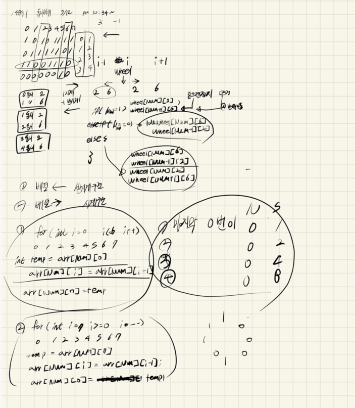

## 2021년09월12일_14891-톱니바퀴

## 소스코드 | before

```c++
#include<stdio.h>
#include<string.h>
using namespace std;
#define KS 101
char gear[5][10];
int gearDir[5];
struct gearStart {
	gearStart() {
		for (int i = 1; i <= 4; i++)
			scanf("%s", gear[i]);
		int k;
		scanf("%d", &k);
		for (int ki = 0; ki < k; ki++) {
			gearR();
		}
		int sum=0;
		for (int idx = 1,two=1; idx <= 4; idx++,two*=2) {
			if (gear[idx][0] == '1') {
				sum += two;
			}
		}
		printf("%d\n",sum);
	}
	void gearR() {
		int num, dir;
		memset(gearDir, 0, sizeof(gearDir));
		scanf("%d %d", &num, &dir);
		gearDir[num] = dir;
		for (int i = num; i >= 2; i--) {//<<<<---
			if (gear[i][6] != gear[i - 1][2]) {
				gearDir[i - 1] = gearDir[i] * -1;
			}
		}

		for (int i = num; i <= 3; i++) {//--->>>>
			if (gear[i][2] != gear[i + 1][6]) {
				gearDir[i + 1] = gearDir[i] * -1;
			}
		}
		for (int i = 1; i <= 4; i++) {
			if (gearDir[i] == -1) {
				reclockRotation(i);
			}
			else if (gearDir[i] == 1) {
			clockRotation(i);
			}
		}
	}
	void clockRotation(int idx) {
		char num;
		num = gear[idx][7];
		for (int i = 6; i >= 0; i--) {
			gear[idx][i+1] = gear[idx][i];
		}
		gear[idx][0]= num;
	}
	void reclockRotation(int idx) {
		char num;
		num = gear[idx][0];
		for (int i = 1; i <= 7; i++) {
			gear[idx][i-1] = gear[idx][i];
		}
		gear[idx][7] = num;
	 }
}gearRa;
int main(void) {

	return 0;
}
```

## 소스코드 | after

```c++
#include<stdio.h>
#include<iostream>
#include<vector>
#include<string.h>
using namespace std;
#define MAX_Y 5
#define MAX_X 9
int wheel[MAX_Y][MAX_X];// 톱니바퀴 정보 저장 배열
int K;// 회전 횟수
void init();//초기화
int answer;//결과값
void clockRotate(int num);//시계방향 회전
void rClockRotate(int num);//반시계방향 회전
void rotate();//실제 회전을 하는 공간
int main(void) {
	int testCase = 1;
	for (int tc = 1; tc <= testCase; tc++) {
		init();
		rotate();
		printf("%d\n", answer);
	}
	return 0;
}
void rotate() {
	for (int k = 0; k < K; k++) {
		int num, dir;// 해당 톱니 바퀴 숫자, 방향
		scanf("%d %d", &num, &dir);
		int rotateData[8] = { 0, };
		rotateData[num] = dir;
		for (int i = num; i > 1; i--) {//왼쪽 탐색
			if (wheel[i][7] != wheel[i - 1][3]) {
				rotateData[i - 1] = rotateData[i] * -1;
			}
			else break;
		}
		for (int i = num ; i < 8; i++) {//오른쪽 탐색
			if (wheel[i][3] != wheel[i + 1][7]) {
				rotateData[i + 1] = rotateData[i] * -1;
			}
			else break;
		}
		for (int i = 1; i <= 8; i++) {
			if (rotateData[i] == -1) {
				rClockRotate(i);
			}
			else if (rotateData[i] == 1) {
				clockRotate(i);
			}
		}
	}

	int two = 1;
	for (int y = 1; y <= 4; y++) {
		answer += wheel[y][1] == 1 ? two : 0;
		two *= 2;
	}
}
void init() {
	memset(wheel, 0, sizeof(wheel));
	K = answer = 0;
	for (int y = 1; y <= MAX_Y - 1; y++) { //톱니바퀴 정보 저장
		for (int x = 1; x <= MAX_X - 1; x++) {
			scanf("%1d", &wheel[y][x]);
		}
	}
	scanf("%d", &K);
}
void clockRotate(int num) {
	int temp = wheel[num][8];
	for (int i = 8; i >= 2; i--) {
		wheel[num][i] = wheel[num][i - 1];
	}
	wheel[num][1] = temp;
}
void rClockRotate(int num) {
	int temp = wheel[num][1];
	for (int i = 1; i <= 7; i++) {
		wheel[num][i] = wheel[num][i + 1];
	}
	wheel[num][8] = temp;
}
```

## 설계



- 처음에 설계를 했던게 사실 잘못 되서 좀 배열에 저장하는 식으로 저장하고
- 회전하는 방식으로 설계를 바꿈
- 단순하게 어려운것은 아니고 해당 숫자에서 양옆을 검사하면서 회전 가능 유무에 대한 데이터를 rotateData 배열에 넣고 확인 부분과 돌리는 부분 나눠서 구현함

## 실수 

- 그리고 처음에 0 -7 까지 하다가 헷갈릴것 같아서 1-8로 바꾼게 오히려 꼬여서 조금 시간을 더 소비한 것 같다.
- 이런 실수를 줄이기 위해서 제대로 기준을 세우는 것이 중요하다. 

## 문제 사이트

[14891-톱니바퀴](https://www.acmicpc.net/problem/14891)

