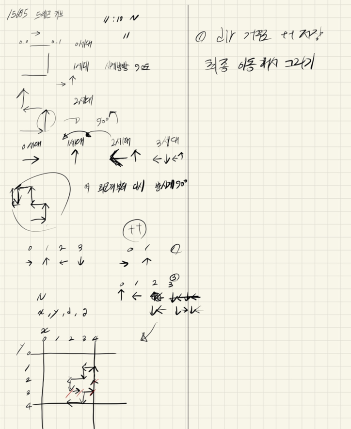

## 2021.09.16_15685-드래곤커브

## 소스코드

```c++
#include <stdio.h>
#include <iostream>
#include <vector>
#include <string.h>

using namespace std;
#define MAX_SIZE 104
int board[MAX_SIZE][MAX_SIZE];
int dy[] = { 0,-1,0,1 };
int dx[] = { 1,0,-1,0 };

int N;
int answer;


void init();// 초기화
void dragon();//드래곤 커브
int main(void) {
	int testCase = 1;
	for (int tc = 1; tc <= testCase; tc++) {
		init();
		dragon();
		printf("%d\n", answer);
	}
	return 0;
}

void init() {
	memset(board, 0, sizeof(board));
	N = answer=0;

	scanf("%d", &N);
}

void dragon() {
	for (int n = 0; n < N; n++) {
		int x, y, d, g;
		scanf("%d %d %d %d", &x, &y, &d, &g);
		vector<int>dir;
		dir.push_back(d);
		for (int generationIdx = 0; generationIdx < g; generationIdx++) {
			for (int dir_idx = dir.size()-1;dir_idx>=0; dir_idx--) {
				dir.push_back((dir[dir_idx]+1) % 4);
			}
		}
		board[y][x] = 1;
		for (int dir_idx = 0; dir_idx < dir.size(); dir_idx++) {
			board[y + dy[dir[dir_idx]]][x + dx[dir[dir_idx]]] = 1;
			y += dy[dir[dir_idx]];
			x += dx[dir[dir_idx]];
		}
	}
	for (int i = 0; i <= 100; i++) {
		for (int j = 0; j <= 100; j++) {
			if (board[i][j] == 1 && board[i][j + 1] == 1 && board[i + 1][j] == 1 && board[i + 1][j + 1] == 1) {
				answer++;
			}
		}
	}
}
```

## 설계



## 실수

- 사실 문제 자체는 어렵지는 않지만 어느정도 센스가 필요함

- 어느정도 구현 능력이 있으면 쉽게 구현하니 걱정하지 말것

## 문제링크

[15685-드래곤커브](https://www.acmicpc.net/problem/15685)

## 원본

