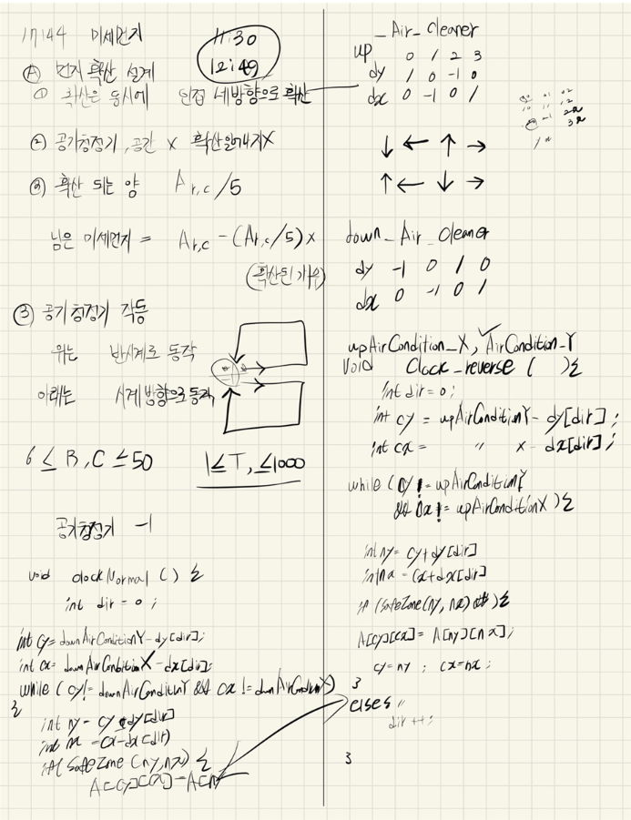

## 2021.09.21_17144-미세먼지

## 소스코드

```c++
#include <stdio.h>
#include <iostream>
#include <vector>
#include <string.h>
using namespace std;
#define SIZE 51

int R, C, T;//가로 세로 , 시간(초)
int answer;//결과 값 저장

int upCleanDy[] = { 1,0,-1,0 };
int upCleanDx[] = { 0,-1,0,1 };
int downCleanDy[] = { -1,0,1,0 };
int downCleanDx[] = { 0,-1,0,1 };

struct Data {
	int y, x;
}upAirCleaner, downAirCleaner;

int A[SIZE][SIZE];
void init();//초기화
void upAreaClean();// 위쪽 공기 청소
void downAreaClean();//아래쪽 공기 청소
void cleanArea();//시뮬레이션 시작

bool safeZone(int y, int x);// 범위 체크

int main(void) {
	int testCase = 1;
	for (int tc = 1; tc <= testCase; tc++) {
		init();
		cleanArea();
		printf("%d\n", answer);
	}
	return 0;
}
void init() {
	memset(A, 0, sizeof(A));
	R = C = T = 0;
	answer = 0;
	scanf("%d %d %d", &R, &C, &T);
	int flag = 0;
	for (int i = 0; i < R; i++) {//변수 입력 및 저장
		for (int j = 0; j < C; j++) {
			scanf("%d", &A[i][j]);
			if (A[i][j] == -1&&flag==0) {
				upAirCleaner.y = i;
				upAirCleaner.x = j;
				flag++;
			}
			if (A[i][j] == -1 && flag == 1) {
				downAirCleaner.y = i;
				downAirCleaner.x = j;
			}

		}
	}
}
void upAreaClean() {
	int dir = 0;
	Data c;
	c.y = upAirCleaner.y - upCleanDy[dir];
	c.x = upAirCleaner.x - upCleanDx[dir];
	while (upAirCleaner.y != c.y||upAirCleaner.x!=c.x) {
		Data n;
		n.y= c.y - upCleanDy[dir];
		n.x = c.x - upCleanDx[dir];
		if (safeZone(n.y, n.x)&&upAirCleaner.y>=n.y) {
			if (A[n.y][n.x] == -1)A[c.y][c.x] = 0;
			else {
				A[c.y][c.x] = A[n.y][n.x];
			}
			c = n;
		}
		else {
			dir++;
		}
	}
}
void downAreaClean() {
	int dir = 0;
	Data c;
	c.y = downAirCleaner.y - downCleanDy[dir];
	c.x = downAirCleaner.x - downCleanDx[dir];
	while (downAirCleaner.y != c.y||downAirCleaner.x != c.x) {
		Data n;
		n.y = c.y - downCleanDy[dir];
		n.x = c.x - downCleanDx[dir];
		if (safeZone(n.y, n.x)&&downAirCleaner.y<=n.y) {
			if (A[n.y][n.x] == -1)A[c.y][c.x] = 0;
			else {
				A[c.y][c.x] = A[n.y][n.x];
			}
			c = n;
		}
		else {
			dir++;
		}
	}
}
bool safeZone(int y, int x) {//범위 체크
	return 0 <= y && y < R && 0 <= x && x < C;
}
void cleanArea() {
	while (T--) {
		int copyA[SIZE][SIZE] = { 0, };
		for (int i = 0; i < R; i++) {
			for (int j = 0; j < C; j++) {
				if (A[i][j] != -1 && A[i][j] != 0) {
					int num = A[i][j] / 5;
					int cnt = 0;// 확산 개수 체크
					for (int dir = 0; dir < 4; dir++) {
						Data n;
						n.y = i + upCleanDy[dir];
						n.x = j + upCleanDx[dir];
						if (safeZone(n.y, n.x) && A[n.y][n.x] != -1) {
							cnt++;
							copyA[n.y][n.x] += num;
						}
					}
					copyA[i][j] += A[i][j] - (num*cnt);
				}
			}
		}
		for (int i = 0; i < R; i++) {
			for (int j = 0; j < C; j++) {
				if (A[i][j] != -1)
					A[i][j] = copyA[i][j];
			}
		}
		upAreaClean();
		downAreaClean();
	}
	for (int i = 0; i < R; i++) {
		for (int j = 0; j < C; j++) {
			if (A[i][j] != -1) {
				answer += A[i][j];
			}
		}
	}
}
```

## 설계



## 실수

- 위아래 반시계 시계방향으로는 설계를 잘했는데 기준점이 다르다.
  - 이점에서 실수함 -1을 기준으로 위 아래 이기 때문에 그 점까지 위 아래 영역이 다르게 해서 범위를 체크해야하는데 그것을 하지 못해서 설계에 실패함
- 전반적으로 미세먼지가 확산되는것은 설계를 하지 않고 했지만 그냥 머리속에 있는걸 구현해서 운이 좋게 맞았다고 생각한다. 절대 그런일이 없도록 하자.

## 문제링크

[17144-미세먼지](https://www.acmicpc.net/problem/17144)

## 원본

