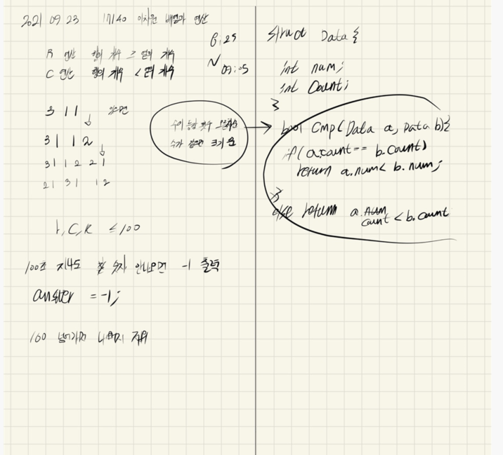

## 2021.09.23_17140-이차원배열과연산

## 소스코드

```c++
#include<stdio.h>
#include<iostream>
#include<vector>
#include<string.h>
#include<algorithm>
using namespace std;
#define SIZE 101
struct Data {
	int number;
	int count;
};

int time;
int r, c, k;//확인해야하는 A[r][c]==k 값
int y, x;
int answer;//결과값
int A[SIZE][SIZE];//저장배열 
void init();//초기화
void R();//R연산
void C();//C연산
bool cmp(Data a, Data b);//오름차순 정렬
int main(void) {
	int testCase = 1;
	for (int tc = 1; tc <= testCase; tc++) {
		init();
		while (time<=101) {
			if (A[r][c] == k)break;
			if (y >= x) R();
			else if (y < x)C();
			time++;
		}
		if (time != 102)answer = time;
		printf("%d\n", answer);
	}
	return 0;
}

void init() {
	r = c = k = time=0;
	y = x = 3;
	answer = -1;
	memset(A, 0, sizeof(A));
	scanf("%d %d %d", &r, &c, &k);
	for (int i = 1; i <= 3; i++) {
		for (int j = 1; j <= 3; j++) {
			scanf("%d", &A[i][j]);
		}
	}
}
void R() {
	//구조체 배열에 숫자, 개수 저장
	// 정렬
	// 최대 c의 개수 저장
	int maxC = 0x80000000;
	for (int i = 1; i <= y; i++) {
		Data num[101] = { 0, };
		for (int j = 1; j <= x; j++) {
			num[A[i][j]].number = A[i][j];
			num[A[i][j]].count++;
			A[i][j] = 0;
		}
		vector<Data>sortNumber;
		for (int n = 1; n <= 100; n++) {
			if (num[n].number != 0) {
				sortNumber.push_back({ n,num[n].count });
			}
		}
		sort(sortNumber.begin(), sortNumber.end(),cmp);
		int size = sortNumber.size() * 2;
		if (maxC < size) maxC = size;// 최대 행 수
		int idx = 1;
		for (int s = 0; s < sortNumber.size();s++) {//배열 연산결과 저장
			A[i][idx++] = sortNumber[s].number;
			A[i][idx++] = sortNumber[s].count;
		}
	}
	x = maxC;
}
void C() {
	//구조체 배열에 숫자, 개수 저장
	// 정렬
	// 최대 c의 개수 저장
	int maxR = 0x80000000;
	for (int j = 1; j <= x; j++) {
		Data num[101] = { 0, };
			for (int i = 1; i <= y; i++) {
			num[A[i][j]].number = A[i][j];
			num[A[i][j]].count++;
			A[i][j] = 0;
		}
		vector<Data>sortNumber;
		for (int n = 1; n <= 100; n++) {
			if (num[n].number != 0) {
				sortNumber.push_back({ n,num[n].count });
			}
		}
		sort(sortNumber.begin(), sortNumber.end(), cmp);
		int size = sortNumber.size() * 2;
		if (maxR < size) maxR = size;// 최대 행 수
		int idx = 1;
		for (int s = 0; s < sortNumber.size(); s++) {//배열 연산결과 저장
			A[idx++][j] = sortNumber[s].number;
			A[idx++][j] = sortNumber[s].count;
		}
	}
	y = maxR;
}
bool cmp(Data a, Data b) {
	if (a.count == b.count)return a.number < b.number;
	return a.count < b.count;
}
```

## 설계



## 실수

- r,c는 고정이어야 하는데 처음에 y,x를 따로 지정안하고 해서 정말 시간 낭비할뻔
- 좀더 꼼꼼히 파악하기 하지만 이문제는 어렵지 않기때문에 쉽게 해결 가능

## 문제링크

[17140-이차원배열과연산](https://www.acmicpc.net/problem/17140)

## 원본

