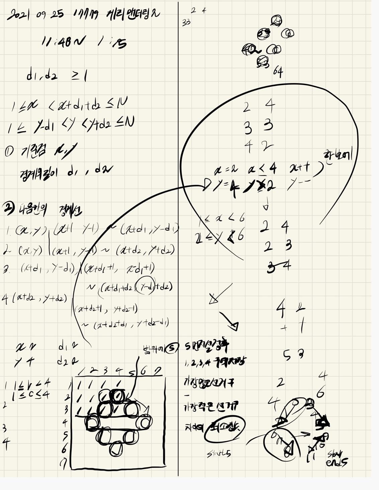

## 2021.09.25_17779-게리맨더링2

## 소스코드

```C++
#include<stdio.h>
#include<iostream>
#include<vector>
#include<algorithm>
#include<string.h>
using namespace std;
#define SIZE 21
struct Data {
	int x, y;
};

int A[SIZE][SIZE];// 선거구 입력 배열
int B[SIZE][SIZE] = { 0, };
int N;//배열 크기
int answer;//최소값의결과

void init();//초기화
void elect();//선거구 선정
void oneArea(int X, int Y, int D1, int D2);//일번 선거구
void twoArea(int X, int Y, int D1, int D2);//이번 선거구
void treeArea(int X, int Y, int D1, int D2);//삼번 선거구
void fourArea(int X, int Y, int D1, int D2);//사번 선거구 
void fiveArea(int X, int Y, int D1, int D2);//오번 선거구
void five(int X, int Y, int D1, int D2);//오번 선거구
bool safeZone(int y, int x);// 범위체크
void result();//결과값 산출

int main(void)
{
	int testCase = 1;
	for (int tc = 1; tc <= testCase; tc++) {
		init();
		elect();
		printf("%d\n", answer);
	}
	return 0;
}
void init() {
	N = 0;
	answer = 0x7fffffff;
	memset(A, 0, sizeof(A));
	memset(B, 0, sizeof(B));
	scanf("%d", &N);
	for (int i = 1; i <= N; i++) {
		for (int j = 1; j <= N; j++) {
			scanf("%d", &A[i][j]);
		}
	}
}
void elect() {
	for (int d1 = 1; d1 <= N; d1++) {
		for (int d2 = 1; d2 <= N; d2++) {

			for (int x = 1; x <= N; x++) {
				for (int y = 1; y <= N; y++) {
					if (x + d1 + d2 <= N && y - d1 < y&&y + d2 <= N) {

						memset(B, 0, sizeof(B));
						fiveArea(x, y, d1, d2);
						oneArea(x, y, d1, d2);
						twoArea(x, y, d1, d2);
						treeArea(x, y, d1, d2);
						fourArea(x, y, d1, d2);
						result();
					}
				}//for y=1
			}//for x=1

		}//for d2 
	}//for d1 
}
void fiveArea(int X, int Y, int D1, int D2) {
	vector<Data> fiveStart;
	for (int x = X, y = Y; x <X + D1, y > Y - D1; x++, y--) {
		if (safeZone(x, y))
			fiveStart.push_back({ x, y });
	}
	for (int x = X + D1, y = Y - D1; x <= X + D1 + D2, y <= Y - D1 + D2; x++, y++) {
		if (safeZone(x, y))
			fiveStart.push_back({ x, y });
	}
	vector<Data> fiveEnd;
	for (int x = X, y = Y; x < X + D2, y < Y + D2; x++, y++) {
		if (safeZone(x, y))
			fiveEnd.push_back({ x,y });
	}
	for (int x = X + D2, y = Y + D2; x <= X + D2 + D1, y >= Y + D2 - D1; x++, y--) {
		if (safeZone(x, y))
			fiveEnd.push_back({ x,y });
	}
	for (int i = 0; i < fiveStart.size(); i++) {
		int x = fiveStart[i].x;
		for (int y = fiveStart[i].y; y <= fiveEnd[i].y; y++) {
			B[x][y] = 5;
		}
	}
	int a;
}
void oneArea(int X, int Y, int D1, int D2) {
	for (int r = 1; r < X + D1; r++) {
		for (int c = 1; c <= Y; c++) {
			if (B[r][c] == 0)B[r][c] = 1;
		}
	}
}

void twoArea(int X, int Y, int D1, int D2) {
	for (int r = 1; r <= X + D2; r++) {
		for (int c = Y + 1; c <= N; c++) {
			if (B[r][c] == 0)B[r][c] = 2;
		}
	}
}
void treeArea(int X, int Y, int D1, int D2) {
	for (int r = X + D1; r <= N; r++) {
		for (int c = 1; c < Y - D1 + D2; c++) {
			if (B[r][c] == 0)B[r][c] = 3;
		}
	}
}
void fourArea(int X, int Y, int D1, int D2) {
	for (int r = X + D2 + 1; r <= N; r++) {
		for (int c = Y - D1 + D2; c <= N; c++) {
			if (B[r][c] == 0)B[r][c] = 4;
		}
	}
}
bool safeZone(int x, int y) {
	return 1 <= x && x <= N && 1 <= y && y <= N;
}
void result() {
	int num[7] = { 0, };//내용저장
	for (int i = 1; i <= N; i++) {
		for (int j = 1; j <= N; j++) {
			num[B[i][j]] += A[i][j];
		}
	}
	int peopleMin = 0x7fffffff;
	int peopleMax = 0x80000000;
	for (int i = 1; i <= 5; i++) {
		peopleMin = min(peopleMin, num[i]);
		peopleMax = max(peopleMax, num[i]);
	}
	answer = min(answer, peopleMax - peopleMin);
}
```

## 설계



## 실수

- 이부분은 조건이 엄청 많다 그렇기 때문에 조건을 쓸때 실수하면 안된다
- 그리고 테스트한다고 x y d1 d2를 설정해놓은 부분이 있었는데 그 부분을 제거를 안해서 답이 한번 이상하게 나옴 그부분항상 테스트 하는 부분 잘 지우고 제대로 설계를 해야하는 문제이다.

## 문제링크

[17779-게리맨더링2](https://www.acmicpc.net/problem/17779)

## 원본

