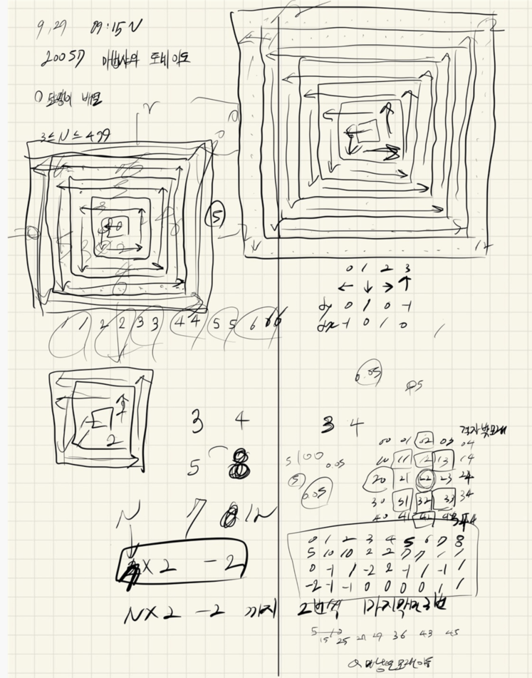
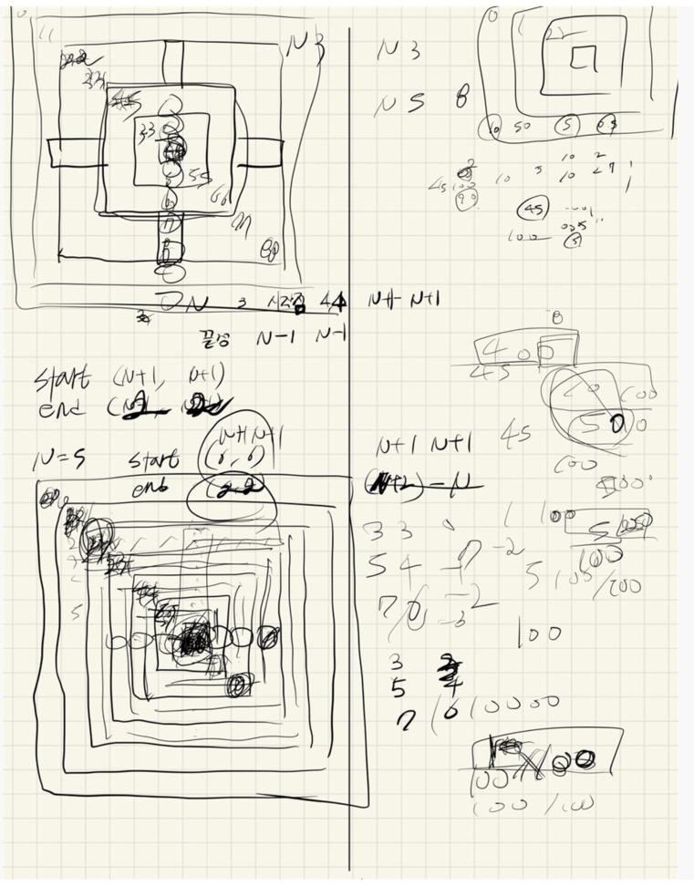
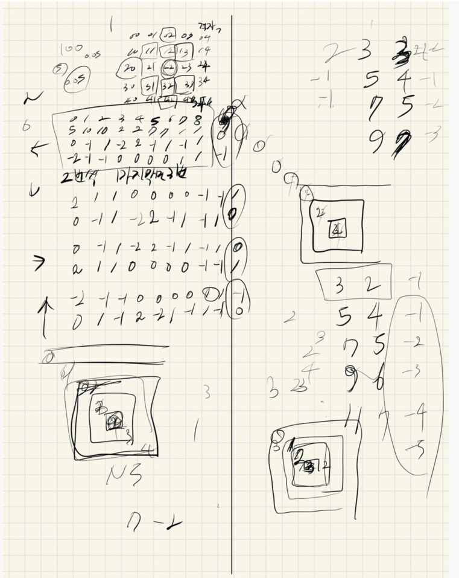

## 2021.09.29_20057-마법사상어와토네이도

## 소스코드

```c++
#include<stdio.h>
#include<iostream>
#include<string.h>
#include<vector>]
using namespace std;
#define SIZE 1000
int N;
int answer;//결과 값
int dy[] = { 0,1,0,-1 };
int dx[] = { -1,0,1,0 };
int dustY[4][9] = {
{ 0,-1,1,-2,2,-1,1,-1,1},
{2,1,1,0,0,0,0,-1,-1},
{0,-1,1,-2,2,-1,1,-1,1},
{-2,-1,-1,0,0,0,0,1,1}
};
int dustX[4][9] = {
{ -2,-1,-1,0,0,0,0,1,1 },
{0,-1,1,-2,2,-1,1,-1,1},
{2,1,1,0,0,0,0,-1,-1},
{0,1,-1,2,-2,-1,1,-1,1}
};
double percent[] = {0.05,0.10,0.10,0.02,0.02,0.07,0.07,0.01,0.01 };
int board[SIZE][SIZE];// 모래먼지저장소
int safeBoard[SIZE][SIZE];//나중에 계산 안하는 부분 체크
void init();//초기화
void wind();//태풍 시작
int main(void) {
	int testCase = 1;
	for (int tc = 1; tc <= testCase; tc++) {
		init();
		wind();
		printf("%d\n", answer);
	}
	return 0;

}
void init() {
	N = answer = 0;
	memset(board, 0, sizeof(board));
	memset(safeBoard, 0, sizeof(safeBoard));
	scanf("%d", &N);
	int sum = 0;
	for (int i = 2; i <= N + 1; i++) {
		for (int j = 2; j <= N + 1; j++) {
			scanf("%d", &board[i][j]);
			safeBoard[i][j] = 1;
			//sum += board[i][j];
		}
	}
}
void wind() {
	int y; int x;
		y = N - ((N / 2) - 1);
		x = N - ((N / 2) - 1);

	
	int num = 1;
	int cnt = 2;//나머지 두번 이동
	int dir = 0;
	while (1) {
		if (y == 2 && x == 2)break;
		if (N -1 == num) {
			cnt = 3;//마지막만 세번 이동
		}
		for (int c = 0; c < cnt; c++) {
			for (int n = 0; n < num; n++) {
				int ny = y + dy[dir];
				int nx = x + dx[dir];
				int sum = 0;
				for (int d = 0; d < 9; d++) {
					int num1 = (int)(board[ny][nx] * percent[d]);
					sum += num1;
					board[ny + dustY[dir][d]][nx + dustX[dir][d]] += num1;
				}
				board[ny][nx] -= sum;
				board[ny + dy[dir]][nx + dx[dir]] += board[ny][nx];
				board[ny][nx] = 0;
				y = ny;
				x = nx;
			}
			dir++;
			if (dir == 4)dir = 0;
		}
		num++;

	}
	int sum = 0;
	for (int i = 0; i <= N+3; i++) {
		for (int j = 0; j <= N+3; j++) {
			if (1 != safeBoard[i][j]) {
				answer += board[i][j];
				//printf("%2d ", board[i][j]);
			}
			//sum += board[i][j];
			//else printf("%2d",0);
		}
		//printf("\n");
	}
}
```

## 설계







## 실수

- 이문제 설계할것은 많지만 쉬운 문제이다.
- 중심값을 잡는걸 실수 했었고,
- 방향이 많다보니 중간에 방향 부분에 실수한것 같다
- 그리고  double형을 퍼센트 구할때 캐스팅해서 해도 되는데 순간 오랜만에 하다보니 그부분을 좀 어렵게 구현했던 것 같다 그부분만 잘 하고 그냥 달팽이 배열만 규칙 잘찾으면 완벽하게 풀 수 있다.

## 문제 링크

[20057-마법사상어와토네이도](https://www.acmicpc.net/problem/20057)

## 원본

