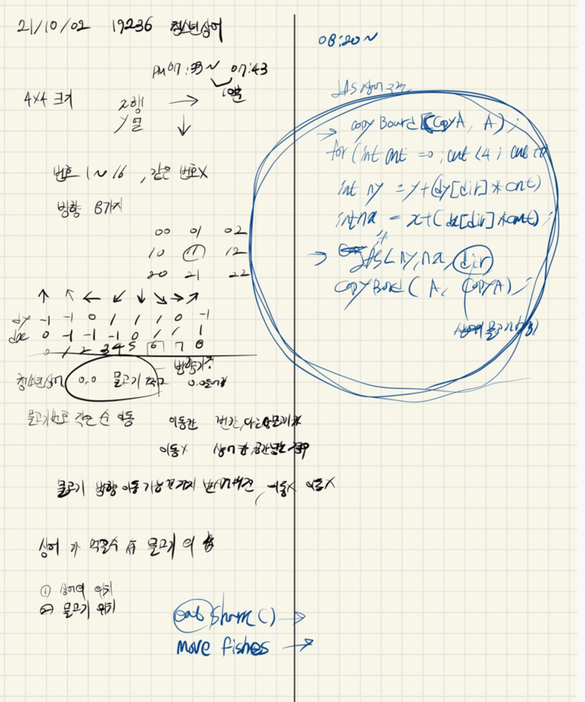

## 2021.10.02_19236-청소년상어

## 소스코드

```c++
#include<stdio.h>
#include<iostream>
#include<string.h>
#include<vector>
#include<algorithm>
using namespace std;
#define SIZE 4
#define FISHES_SIZE 17
struct Data {
	int y, x, dir;
};

Data fishes[FISHES_SIZE];
Data shark;//상어 정보

int dy[] = { -1,-1,0,1,1,1,0,-1 };
int dx[] = { 0,-1,-1,-1,0,1,1,1 };
int board[SIZE][SIZE];//입력 
int answer;//결과값

void init();//초기화 및 입력
bool safeZone(int y, int x);//보드 범위 체크
void moveShark(int y, int x, int sum);//상어의 움직임
void moveFishes();//물고기 움직임
void copyArr(int copyBoard[SIZE][SIZE], int Board[SIZE][SIZE]);
void copyFish(Data copyFishes[FISHES_SIZE], Data fishes[FISHES_SIZE]);
void fishMove(int y, int x);
int eat(int y, int x);
int main(void) {
	int testCase = 1;
	for (int tc = 1; tc <= testCase; tc++) {
		init();
		moveShark(0, 0, 0);
		printf("%d\n", answer);
	}
	return 0;
}
void copyFish(Data copyFishes[FISHES_SIZE], Data fishes[FISHES_SIZE]) {
	for (int num = 1; num < FISHES_SIZE; num++) {
		copyFishes[num] = fishes[num];
	}
}
bool safeZone(int y, int x) {
	return 0 <= y && y < SIZE && 0 <= x && x < SIZE;
}
void moveFishes() {
	for (int num = 1; num < FISHES_SIZE; num++) {
		if (fishes[num].dir == -1)continue;

		Data c = fishes[num];
		int dir = c.dir;
		while (1) {
			Data n;
			n.y = c.y + dy[dir]; n.x = c.x + dx[dir];
			if (!safeZone(n.y, n.x) || (shark.y == n.y&&shark.x == n.x)) {
				dir = (dir + 1) % 8;
				continue;
			}
			else if (board[n.y][n.x] == -1) {
				int a = board[n.y][n.x];
				board[n.y][n.x] = board[c.y][c.x];
				board[c.y][c.x] = a;
				fishes[num].y = n.y;
				fishes[num].x = n.x;
				fishes[num].dir = dir;
				break;
			}
			else {//물고기 있는 경우
				int a1 = board[n.y][n.x];
				board[n.y][n.x] = board[c.y][c.x];
				board[c.y][c.x] = a1;
				fishes[board[c.y][c.x]].y = c.y;
				fishes[board[c.y][c.x]].x = c.x;
				fishes[num].y = n.y;
				fishes[num].x = n.x;
				fishes[num].dir = dir;
				break;
			}

		}
	}
}
void fishMove(int y, int x) {
	for (int i = 1; i <= 16; i++) {
		if (fishes[i].y == -1)continue;
		//상어가 있거나 벗어나는 경우
		Data c = fishes[i];
		Data n; n.dir = c.dir;
		n.y = c.y + dy[c.dir]; n.x = c.x + dx[c.dir];
		while (!safeZone(n.y, n.x) || (y == n.y&&x == n.x)) {
			n.dir++;
			if (n.dir == 8)n.dir = 0;
			n.y = c.y + dy[n.dir]; n.x = c.x + dx[n.dir];
		}
		//다른 물고기가 있는 경우
		if (board[n.y][n.x] != -1) {
			int t = board[n.y][n.x];
			fishes[t].y = c.y; fishes[t].x = c.x;
			fishes[i].y = n.y; fishes[i].x = n.x; fishes[i].dir = n.dir;
			board[c.y][c.x] = t;
			board[n.y][n.x] = i;
		}
		//빈칸인 경우
		else {
			fishes[i].y = n.y; fishes[i].x = n.x; fishes[i].dir = n.dir;
			board[c.y][c.x] = -1;
			board[n.y][n.x] = i;
		}
	}
}
int eat(int y, int x) {
	int a = board[y][x];
	fishes[board[y][x]].dir = -1;
	fishes[board[y][x]].x = -1;
	fishes[board[y][x]].y = -1;
	board[y][x] = -1;
	return a;
}
void moveShark(int y, int x, int sum) {
	int sharkD = fishes[board[y][x]].dir;
	
	sum += eat(y, x);
	answer = max(answer, sum);//최댓값 저장
	//moveFishes();
	fishMove(y, x);

	for (int cnt = 1; cnt < 4; cnt++) {

		Data n;
		n.y = y + dy[sharkD] * cnt;
		n.x = x + dx[sharkD] * cnt;
		if (safeZone(n.y, n.x) && board[n.y][n.x] != -1) {
			int copyBoard[SIZE][SIZE] = { 0, };
			Data copyFishes[FISHES_SIZE] = { 0, };
			copyArr(copyBoard, board);
			copyFish(copyFishes, fishes);
			moveShark(n.y, n.x, sum);
			copyFish(fishes, copyFishes);
			copyArr(board, copyBoard);

		}


	}
}
void copyArr(int copyBoard[SIZE][SIZE], int board[SIZE][SIZE]) {
	for (int i = 0; i < SIZE; i++) {
		for (int j = 0; j < SIZE; j++) {
			copyBoard[i][j] = board[i][j];
		}
	}
}
void init() {
	answer = 0x80000000;
	//shark = { 0,0,0 };
	memset(fishes, 0, sizeof(fishes));
	memset(board, 0, sizeof(board));
	for (int y = 0; y < SIZE; y++) {
		for (int x = 0; x < SIZE; x++) {
			int num, dir;
			scanf("%d %d", &num, &dir);
			board[y][x] = num;
			fishes[num].y = y;
			fishes[num].x = x;
			fishes[num].dir = dir - 1;
		}
	}
}
```

## 설계



## 실수

- 이문제의 경우도 다시 풀어봐야하고 설계할때 어떻게 시작할지 제대로 명시

- 그리고 물고기 이동할때 좀더 효율적으로 구현하기

- 단순 구현의 경우 오래걸리면 안됨

- 위의 문제는 우선 재귀 백트래킹으로 이동을 할 수 있는가 를 물어보는 어찌보면 쉽지만 구현내용 많으면

  틀릴수 있으니 조심

## 문제링크

[19236-청소년상어](https://www.acmicpc.net/problem/19236)

## 원본