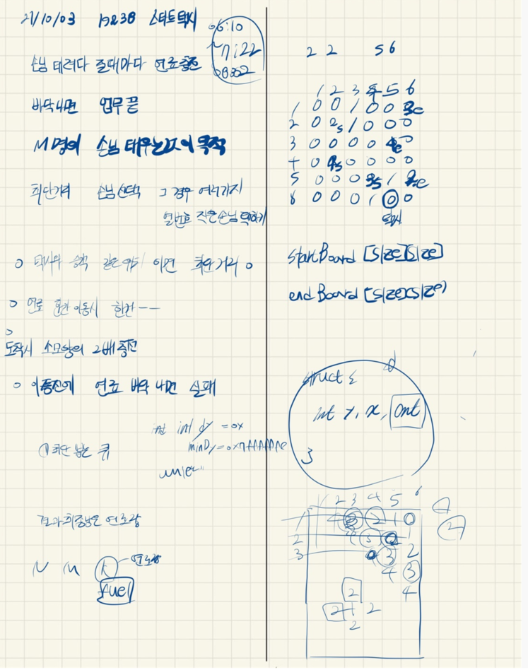

## 2021.10.03_19238-스타트택시

## 소스코드

```c++
#include<stdio.h>
#include<iostream>
#include<string.h>
#include<queue>
#include<vector>
using namespace std;
#define SIZE 21
struct Data {
	int y, x, cnt, fuel, num;
};
int N, M, Fuel, answer;
int r = 0;
int startBoard[SIZE][SIZE];//승객 위치
int endBoard[402][SIZE][SIZE];// 승객 도착위치
int dy[] = { 0,1,0,-1 };
int dx[] = { 1,0,-1,0 };
queue<Data>taxi;
int visit[SIZE][SIZE];//방문체크
void init();//초기화 및 초기 입력
void startTaxi();// 택시 주행
void searchPeople();// 최소 거리 승객 찾기
void searchFinish();//도착지 찾기
int main(void) {
	int testCase = 1;
	for (int tc = 1; tc <= testCase; tc++) {
		init();
		startTaxi();
		printf("%d\n", answer);
	}
	return 0;
}

bool safeZone(int y, int x) {
	return 1 <= y && y <= N && 1 <= x && x <= N;
}
void searchPeople() {
	Data min;

	min.y = min.x = min.cnt = 0x7fffffff;
	while (!taxi.empty()) {//최소 거리 승객 찾기

		Data c = taxi.front(); taxi.pop();

		if (startBoard[c.y][c.x] != 0 && startBoard[c.y][c.x] != 1) {
			if (c.cnt <= min.cnt) {
				min.cnt = c.cnt;
				if (c.y < min.y||(c.y==min.y&&c.x<min.x)) {
					min = c;
					min.num = startBoard[c.y][c.x];
				}
			}
		}// if startBoard != 0 !=1
		for (int dir = 0; dir < 4; dir++) {
			Data n;
			n.y = c.y + dy[dir]; n.x = c.x + dx[dir]; n.cnt = c.cnt + 1; n.fuel = c.fuel - 1;
			n.num = startBoard[n.y][n.x];
			if (safeZone(n.y, n.x) && visit[n.y][n.x] == 0 && startBoard[n.y][n.x] != 1) {
				visit[n.y][n.x] = 1;
				taxi.push(n);
			}
		}
	}
	if (min.y == 0x7fffffff) {
		Fuel = -1;
		return;
	}
	Fuel = min.fuel;
	min.cnt = 0;
	startBoard[min.y][min.x] = 0;
	while (!taxi.empty())taxi.pop();
	memset(visit, 0, sizeof(visit));
	taxi.push(min); 
	return;
}
void searchFinish() {
	while (!taxi.empty()) {
		Data c = taxi.front(); taxi.pop();
		if (endBoard[c.num][c.y][c.x] == c.num) {
			r++;
			Fuel = c.fuel;
			if (c.fuel < 0)return;
			Fuel += c.cnt * 2;
			c.cnt = 0;
			c.num = 0;
			c.fuel = Fuel;
			endBoard[c.num][c.y][c.x] = 0;
			while (!taxi.empty())taxi.pop();
			memset(visit, 0, sizeof(visit));
			taxi.push(c);
			return;
		}
		for (int dir = 0; dir < 4; dir++) {
			Data n;
			n.y = c.y + dy[dir]; n.x = c.x + dx[dir]; n.cnt = c.cnt + 1;
			n.fuel = c.fuel - 1;  n.num = c.num;
			if (safeZone(n.y, n.x) && visit[n.y][n.x] == 0 && endBoard[c.num][n.y][n.x] != 1) {
				visit[n.y][n.x] = 1;
				taxi.push(n);
			}
		}
	}
}
void startTaxi() {
	for (int m = 1; m <= M; m++) {
		searchPeople();
		if (Fuel < 0) {
			answer = -1; break;
		}
		searchFinish();
		if (Fuel < 0) {
			answer = -1; break;
		}
	}
	if (r != M)answer = -1;
	else if (answer != -1) {
		answer = Fuel;
	}
}
void init() {
	N = M = Fuel =r= 0;
	memset(startBoard, 0, sizeof(startBoard));
	memset(endBoard, 0, sizeof(endBoard));
	memset(visit, 0, sizeof(visit));
	scanf("%d %d %d", &N, &M, &Fuel);
	for (int i = 1; i <= N; i++) {
		for (int j = 1; j <= N; j++) {
			scanf("%d", &startBoard[i][j]);
			for (int m = 1; m <= M+1; m++) {
				endBoard[m][i][j] = startBoard[i][j];
			}
		}
	}
	Data Taxi = { 0,0,0,Fuel };
	scanf("%d %d", &Taxi.y, &Taxi.x);

	taxi.push(Taxi);
	visit[Taxi.y][Taxi.x] = 1;
	for (int m = 1; m <= M; m++) {
		int sy, sx, ey, ex;
		scanf("%d %d %d %d", &sy, &sx, &ey, &ex);
		startBoard[sy][sx] = endBoard[m+1][ey][ex] = m + 1;
	}
}
```

## 설계



## 실수

- 같은 도착지인 경우가 있을 수있는데 따로 체크 안함

- 도착지에 도달 못하는경우 예외 안함

- 도착지 같은 경우 체크했을때 마지막 M이아니고 M+1인거 체크 안함

- 최소값 구하는 부분에서 y가 작고 y가 같을때 x가 작은 경우로 안함

  ```c++
  			if (c.cnt <= min.cnt) {
  				min.cnt = c.cnt;
  				if (c.y < min.y||(c.y==min.y&&c.x<min.x)) {
  					min = c;
  					min.num = startBoard[c.y][c.x];
  				}
  			}
  ```

  - 아기 상어와 비슷

- 아기 상어 문제와 많이 비슷하다. 조금 대신 연료를 소비하는 것 이있어서 어렵다고 생각들겠지만

- 결국은 기출응용이다. 잘 풀어보길

## 문제링크

[19238-스타트택시](https://www.acmicpc.net/problem/19238)

## 원본

