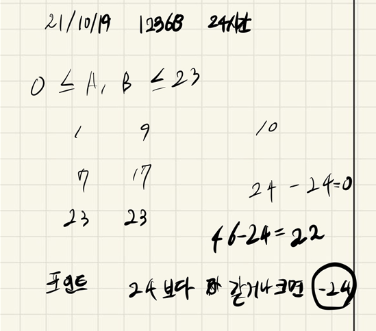

## 2021.10.19_12368-24시간

## 소스 코드

```c++
#include<iostream>
#include<stdio.h>
using namespace std;
int answer;
int A, B;
void init();//초기화 및 초기입력
void clock24();//시계 측정
int main()
{
	int test_case;
	int T;
	scanf("%d", &T);
	for (test_case = 1; test_case <= T; ++test_case)
	{
		init();
		clock24();
		printf("#%d %d\n", test_case, answer);
	}
	return 0;//정상종료시 반드시 0을 리턴해야합니다.
}
void init() {
	answer = A = B = 0;
	scanf("%d %d", &A, &B);
}
void clock24() {
	if (A + B >= 24) {
		answer = A + B - 24;
	}
	else answer = A + B;
}
```

##  설계



- 문제의 포인트는 24이상인경우 어떻게 처리를 할것인지이다.
  - 여기서 24이상인경우 -24만 해주면 문제가 통과한다. 쉬운 문제인데  흠 100퍼가 아닌건 기분탓인가보다.

## 실수

- 실수 없음 D3수준이면 쉬운건지 생각이 들지만 꾸준히 풀자

## 문제링크

[12368-24시간](https://swexpertacademy.com/main/code/problem/problemDetail.do?problemLevel=3&contestProbId=AXsEBlLqedsDFARX&categoryId=AXsEBlLqedsDFARX&categoryType=CODE&problemTitle=&orderBy=FIRST_REG_DATETIME&selectCodeLang=ALL&select-1=3&pageSize=10&pageIndex=1)

## 원본

