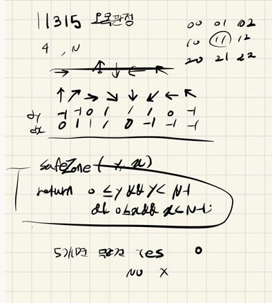

##  21.10.20_11315-오목판정

## 소스 코드

```c++
#include<iostream>
#include<stdio.h>
#include<string.h>
using namespace std;
#define SIZE 21
int N;// 바둑판 크기
char board[SIZE][SIZE];
int dy[] = { -1,-1,0,1,1,1,0,-1 };
int dx[] = { 0,1,1,1,0,-1,-1,-1 };
int answer;
void init();//초기 화면 및 초기 입력
bool safeZone(int y, int x);//범위 체크
void playGame();//게임 시작
int main()
{
	int test_case;
	int T;
	scanf("%d", &T);
	for (test_case = 1; test_case <= T; ++test_case)
	{
		init();
		playGame();
		printf("#%d %s\n", test_case, answer == 1 ? "YES" : "NO");
	}
	return 0;//정상종료시 반드시 0을 리턴해야합니다.
}
bool safeZone(int y, int x) {
	return 0 <= y && y < N && 0 <= x && x < N;
}
void init() {
	N = answer = 0;
	memset(board, 0, sizeof(board));
	scanf("%d", &N);
	for (int i = 0; i < N; i++) {
		scanf("%s",board[i]);
	}
}void playGame() {
	for (int i = 0; i < N; i++) {
		for (int j = 0; j < N; j++) {
			if (board[i][j] == 'o') {
				for (int dir = 0; dir < 8; dir++) {
					int count = 1;
					int cy = i + dy[dir];
					int cx = j + dx[dir];
					while (safeZone(cy, cx) && board[cy][cx] == 'o'){
						count++;
						cy = cy + dy[dir];
						cx = cx + dx[dir];
					}
					if (count >= 5) {
						answer = 1; return;
					}
				}
			}
		}
	}
}
```

## 설계



- 완전 탐색으로 구현하면됨 일단 o 이라는 문자를 만나면 거기서 8방향으로 검사를 진행
  - 진행을 하면서 일단 범위 체크를 해야함 왜냐하면 범위를 넘을 수 있기때문
- 범위를 체크하면서 무조건 5이상인거 나오면 YES이므로 그거 그냥 출력하면됨

## 실수

- 실수 할것이 없었음

## 문제 링크

[11315-오목판정](https://swexpertacademy.com/main/code/problem/problemDetail.do?problemLevel=3&contestProbId=AXaSUPYqPYMDFASQ&categoryId=AXaSUPYqPYMDFASQ&categoryType=CODE&problemTitle=&orderBy=FIRST_REG_DATETIME&selectCodeLang=ALL&select-1=3&pageSize=10&pageIndex=2)

## 원본

