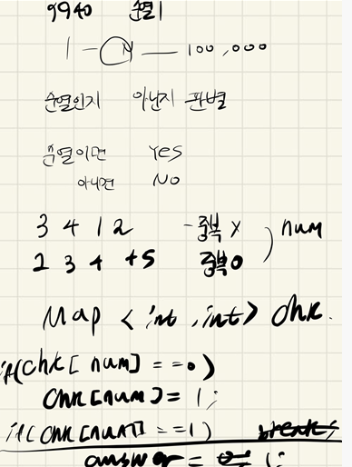
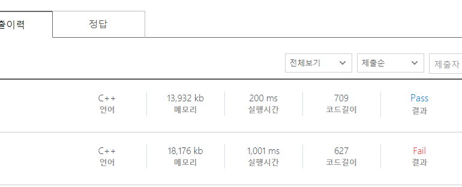

## 2021.10.21_9940-순열1

## 소스코드

```c++

#include<iostream>
#include<map>
#include<stdio.h>
#include<string.h>
using namespace std;
//map<int, int>chk;
int chk[100001];
int answer;
int N;
void init();//초기화 및 초기입력
void checkNumRow();//수열 확인
int main()
{
	int test_case;
	int T;

	scanf("%d",&T);

	for (test_case = 1; test_case <= T; ++test_case)
	{
		init();
		checkNumRow();
		printf("#%d %s\n", test_case, answer==1?"No":"Yes");

	}
	return 0;//정상종료시 반드시 0을 리턴해야합니다.
}
void init() {
	answer = 0;
	memset(chk, 0, sizeof(chk));
	scanf("%d", &N);
}
void checkNumRow() {
	for (int n = 0; n < N; n++) {
		int num;
		scanf("%d", &num);
		if (chk[num] == 1) {
			answer = 1;
			continue;
		}
		else {
			chk[num] = 1;
		}
	}
}
```

## 설계



## 실수

- 설계를 할때 map함수로 설계 했는데 이게 시간초과의 원인이 됨
- 

- map함수를 했을때 10001은 그이상이 된다는것
- 그냥 int 배열을 했을때 최소 5배나 속도 차이가 생김
- 이것 이외에는 실수 하지 않음

## 문제 링크

[99440-순열1](https://swexpertacademy.com/main/code/problem/problemDetail.do?contestProbId=AXHx23oq0REDFAXR)

## 원본

