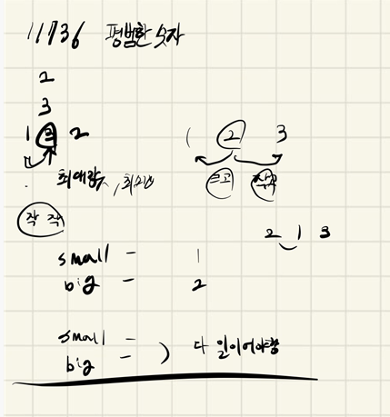

## 2021.10.22_11736-평범한숫자

## 소스코드

```c++

#include<iostream>
using namespace std;
int N;
int answer;
int arr[21];//숫자 저장
void init();//초기화 및 초기 입력
void normalNumber();//평범한 숫자 확인
int main(int argc, char** argv)
{
	int test_case;
	int T;

	scanf("%d", &T);

	for (test_case = 1; test_case <= T; ++test_case)
	{
		init();
		normalNumber();
		printf("#%d %d\n", test_case, answer);
	}
	return 0;//정상종료시 반드시 0을 리턴해야합니다.
}

void init() {
	N = answer=0;
	scanf("%d", &N);
	for(int n = 0; n < N; n++) {
		scanf("%d",&arr[n]);
	}
}
void normalNumber() {
	for (int i = 1; i < N - 1; i++) {
		int  small = 0,big = 0;
		if (arr[i - 1] < arr[i])small++;
		if (arr[i + 1] < arr[i]) small++;
		if (arr[i - 1] > arr[i])big++;
		if (arr[i + 1] > arr[i]) big++;
		if (small == 1 && big == 1)answer++;
	}
}
```

## 설계



- 사실 문제가 너무 쉽긴한데 위의 방식처럼 사이값이 숫자인가 판별만 하면되는듯 
- 그래서  중간 수라면 조건이 한개보다는 작아야하고 한개보다는 커야하는것을 생각해서 풀이 진행

## 실수

- 실수 없음

## 문제 링크

[11736-평범한숫자](https://swexpertacademy.com/main/code/problem/problemDetail.do?contestProbId=AXhh-H-KwUcDFARQ)

## 원본

