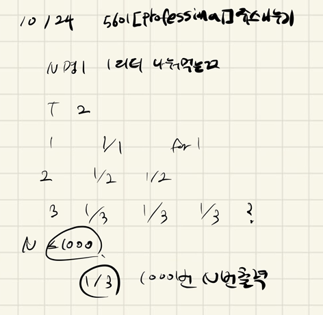

## 2021.10.24_5601-쥬스나누기

## 소스코드

```c++
#include<iostream>
#include<stdio.h>
using namespace std;
int N;
void initData();//초기화
int main(int argc, char** argv)
{
	int test_case;
	int T;

	scanf("%d", &T);

	for (test_case = 1; test_case <= T; ++test_case)
	{
		initData();
		printf("#%d ", test_case);
		for (int i = 0; i < N; i++) {
			printf("1/%d ", N);
		}
		printf("\n");
	}
	return 0;//정상종료시 반드시 0을 리턴해야합니다.
}
void initData() {
	N = 0;
	scanf("%d", &N);
}
```

## 설계



## 실수

- 이게 왜 D3문제인지 의문이다. 
- 정말 그냥 N은 1/N을 몇번 출력할지만 해주면 된다.

## 문제 링크

[5601-쥬스나누기](https://swexpertacademy.com/main/code/problem/problemDetail.do?problemLevel=3&contestProbId=AWXGAylqcdYDFAUo&categoryId=AWXGAylqcdYDFAUo&categoryType=CODE&problemTitle=&orderBy=PASS_RATE&selectCodeLang=ALL&select-1=3&pageSize=10&pageIndex=2)

## 원본

