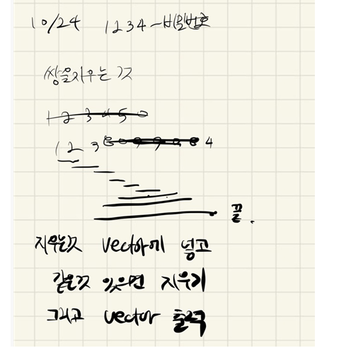

## 2021.10.24_1234-비밀번호

## 소스코드

```c++
#include<iostream>
#include<stdio.h>
#include<vector>
#include<string>
using namespace std;
int N;//개수 입력
vector<char>password;
void initData();// 초기화 및 초기 입력
void openPassword();//패스워드 풀기
int main(int argc, char** argv)
{
	int test_case;
	int T;


	for (test_case = 1; test_case<=10; ++test_case)
	{
		initData();
		openPassword();
		printf("#%d ", test_case);
		for (int i = 0; i < password.size(); i++ ) {
			printf("%c", password[i]);
		}
		printf("\n");
	}
	return 0;
}
void initData() {
	N = 0;
	password.clear();
	scanf("%d", &N);
	for (int i = 0; i < N; i++) {
		char num;
		scanf(" %1c", &num);
		password.push_back(num);
	}
}
void openPassword() {
	while (1) {
		int flag = 0;
		for (int i = 0; i < password.size() - 1; i++) {
			if (password.size() == 0) break;
			if (password[i] == password[i + 1]) {
				password.erase(password.begin() + i, password.begin() + i + 2);
				i -= 2;
				flag = 1;
			}
		}
		if (flag == 0)break;
	}
}
```

## 설계



- 백터를 이용해서 2개씩 지우는식으로 진행 그렇게 해서 그냥 출력하면됨

## 실수

- 그냥 한번만 하면 알아서 지워질 줄 알았는데 그런경우가 아닐 때가 있음
  - 그래서 무한 반복 시키면서 지워지는게 있으면 지우는 식으로 진행 

## 문제 링크

[1234-비밀번호](https://swexpertacademy.com/main/code/problem/problemDetail.do?problemLevel=3&contestProbId=AV14_DEKAJcCFAYD&categoryId=AV14_DEKAJcCFAYD&categoryType=CODE&problemTitle=&orderBy=PASS_RATE&selectCodeLang=ALL&select-1=3&pageSize=10&pageIndex=2)

## 원본

