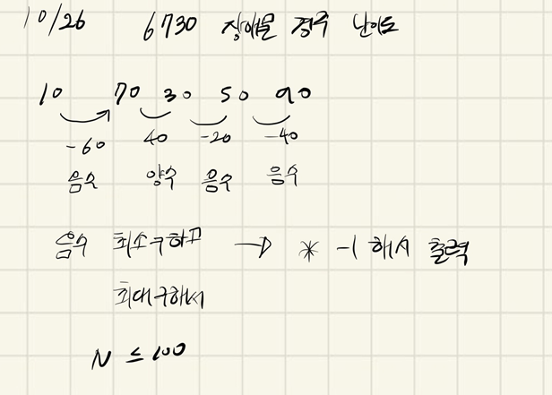

## 2021년10월26일_6730-장애물경주난이도

## 소스코드

```c++
#include<iostream>
#include<stdio.h>
#include<string.h>
using namespace std;
#define SIZE 101
int N, minNum, maxNum;
int block[SIZE];
void initData();// 초기화 및 초기 입력
void upDownTest();//올라가기, 내려오기
int main(int argc, char** argv)
{
	int test_case;
	int T;
	scanf("%d", &T);
	for (test_case = 1; test_case <= T; ++test_case)
	{
		initData();
		upDownTest();
		printf("#%d %d %d\n", test_case, minNum*-1, maxNum);
	}
	return 0;//정상종료시 반드시 0을 리턴해야합니다.
}

void initData() {
	N = 0;
	minNum = 0;
	maxNum = 0;
	memset(block, 0, sizeof(block));
	scanf("%d", &N);
	for (int n = 0; n < N; n++) {
		scanf("%d", &block[n]);
	}
}
void upDownTest(){
	for (int i = 0; i < N-1; i++) {
		int num = block[i] - block[i + 1];
		if(num<=0)minNum = minNum > num ? num : minNum;
		else if(num>=0) maxNum = maxNum < num ? num : maxNum;
	}
}
```

## 설계



- 기본적으로 올라가는 수는 음수로 나오고
- 내려가는 수는 양수로 나오는 점을 판별함
- 그것을 기준으로 대소 비교해서 데이터를 뽑아냄
  - 음수의 경우 오르막수
  - 양수의 경우 내리막수

## 실수

- 실수 없음

## 문제 링크

[6730장애물경주난이도](https://swexpertacademy.com/main/code/problem/problemDetail.do?problemLevel=3&contestProbId=AWefy5x65PoDFAUh&categoryId=AWefy5x65PoDFAUh&categoryType=CODE&problemTitle=&orderBy=PASS_RATE&selectCodeLang=ALL&select-1=3&pageSize=10&pageIndex=1)

## 원본

