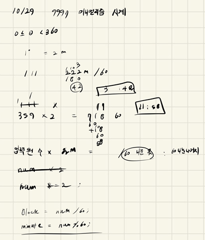

## 2021.10.29_9997-미니멀리즘시계

## 소스코드

```c++

#include<iostream>
#include<stdio.h>

using namespace std;
int num;
void initData();//초기화 및 초기입력
int main(int argc, char** argv)
{
	int test_case;
	int T;
	scanf("%d", &T);
	for (test_case = 1; test_case <= T; ++test_case)
	{
		initData();

		printf("#%d %d %d\n", test_case, (num * 2) / 60, (num * 2) % 60);
		

	}
	return 0;//정상종료시 반드시 0을 리턴해야합니다.
}

void initData() {
	num = 0;
	scanf("%d", &num);
}
```

## 설계



- 설계라고 하기에는 웃기지만, 입력으로 들어오는 수에 *2를 해주고
- 60으로 나눈 몫은 시간, 60으로 나눈 나머지는 분으로 출력하면 됨

## 실수

- 실수 없음 너무 쉬운 문제

## 문제 링크

[9997-미니멀리즘시계](https://swexpertacademy.com/main/code/problem/problemDetail.do?problemLevel=3&problemLevel=4&contestProbId=AXIvNBzKapEDFAXR&categoryId=AXIvNBzKapEDFAXR&categoryType=CODE&problemTitle=&orderBy=PASS_RATE&selectCodeLang=ALL&select-1=4&pageSize=10&pageIndex=2)

## 원본