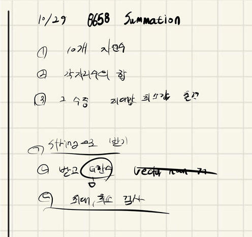

## 2021.10.29_8658-Summation

## 소스 코드 

```c++
#include<iostream>
#include<string>
#include<vector>
using namespace std;
int maxNum, minNum;
void initData();
int main(int argc, char** argv)
{
	int test_case;
	int T;
	
	scanf("%d", &T);

	for (test_case = 1; test_case <= T; ++test_case)
	{
		initData();
		printf("#%d %d %d\n", test_case, maxNum, minNum);

	}
	return 0;//정상종료시 반드시 0을 리턴해야합니다.
}
void initData() {
	maxNum = 0x80000000;
	minNum = 0x7fffffff;
	string firstNumber;
	for (int i = 0; i < 10; i++) {
		cin >> firstNumber;
		int sumNumber = 0;
		for (int i = 0; i < firstNumber.size(); i++) {
			sumNumber += firstNumber[i] - '0';
		}
		if (sumNumber > maxNum)maxNum = sumNumber;
		if (sumNumber < minNum)minNum = sumNumber;
	}
}
```

## 설계



- D3 수준이 아직 쉬운것 위주로 풀어서 그런지 모르겠지만 너무 수준이 낮다.
- 우선 string으로 데이터를 받고 그러면 각 인덱스 별로 문자형인 숫자를 받게 되는데
  - 이때 -'0' 해주면 인트형으로 변환이 된다고 생각하면된다.
  - 이것은 아스키코드를 사용하는것인데 아스키 코드가 0이 예를들어 10이라고 했을때 1이 11이라고 치면
  - 11 - 10 이 되는거라서 1이라는 것으로 만든다고 생각하면 쉽다.

- 그리고 그수를 더해서, 최솟값, 최댓값을 출력하면된다.

## 실수 

- 실수 없음

## 문제 링크

[8658-Summation](https://swexpertacademy.com/main/code/problem/problemDetail.do?problemLevel=3&problemLevel=4&contestProbId=AW1lwyh6WPwDFARC&categoryId=AW1lwyh6WPwDFARC&categoryType=CODE&problemTitle=&orderBy=PASS_RATE&selectCodeLang=ALL&select-1=4&pageSize=10&pageIndex=3)

## 원본

