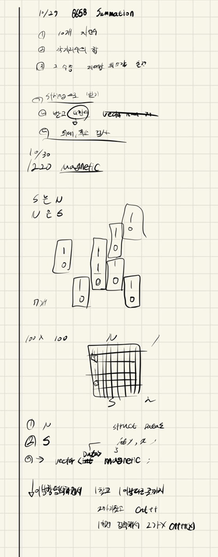

## 2021.10.30_1220-Magnetic

## 소스코드

```c++
#include<iostream>
#include<stdio.h>
#include<vector>
#include<string.h>
using namespace std;
#define SIZE 100
struct Data {
	int y, x;
};
int answer;
int board[SIZE][SIZE];
vector<Data>magnetic;
void initData();//초기화 및 초기 입력
void moveMagnetic();//마그네틱 이동
int main()
{
	int test_case;
	int T;
	for (test_case = 1; test_case <= 10; ++test_case)
	{
		scanf("%d", &T);
		initData();
		moveMagnetic();
		printf("#%d %d\n", test_case, answer);
	}
	return 0;
}
void initData() {
	answer = 0;
	memset(board, 0, sizeof(board));
	for (int i = 0; i < SIZE; i++) {
		for (int j = 0; j < SIZE; j++) {
			scanf("%d", &board[i][j]);
		}
	}
}
void moveMagnetic() {
	int flag = 1;
	while (1) {
		if (flag == 0)break;
		flag = 0;
		for (int j = 0; j < SIZE; j++) {
			for (int i = 0; i < SIZE; i++) {
				if (board[i][j] == 1) {
					if (i + 1 >=SIZE) {
						board[i][j] = 0;
						continue;
					}
					if (board[i+1][j] == 0) {
						board[i][j] = 0;
						board[i+1][j] = 1;
						i++;
						flag = 1;
					}
				}
				else if(board[i][j] == 2) {
					if (i - 1 < 0) {
						board[i][j] = 0;
						continue;
					}
					if (board[i - 1][j] == 0) {
						board[i][j] = 0;
						board[i - 1][j] = 2;
						flag = 1;
					}
				}
			}
		}
	}
	for (int x = 0; x < SIZE; x++) {
		for (int y = 0; y < SIZE; y++) {
			if (board[y][x] == 1) {
				while (1) {
					y++;
					if (y >= SIZE)break;
					if (board[y][x] == 2) {
						answer++;
						y--;
						break;
					}
				}
			}
		}
	}
}
```

## 설계



- 간단한 시뮬레이션이다. 사실 어렵다기 보다는 그냥 배열에 이동만 시키고 
- 교착상태는 1이 무조건 시작이고 다른것 까지 그니까 2까지 1개로 치고 카운트해서 결과를 출력함

## 실수

- 실수는 없었지만 생각보다 오래걸린듯 
- 절대 이러면 안됨 무조건 빠르고 정확하게 풀어야함

## 문제 링크

[1220-Magnetic](https://swexpertacademy.com/main/code/problem/problemDetail.do?problemLevel=3&problemLevel=4&contestProbId=AV14hwZqABsCFAYD&categoryId=AV14hwZqABsCFAYD&categoryType=CODE&problemTitle=&orderBy=PASS_RATE&selectCodeLang=ALL&select-1=4&pageSize=10&pageIndex=3)

## 원본

