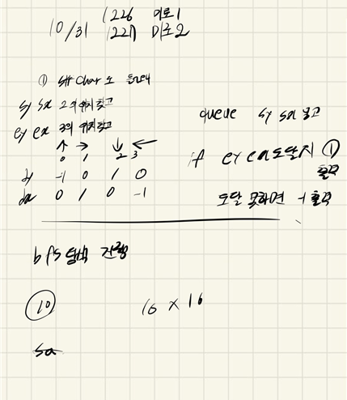

## 2021.10.31_1226-미로1,1227-미로2

## 소스코드

``` c++
#include<iostream>
#include<stdio.h>
#include<string.h>
#include<queue>
using namespace std;
#define SIZE 16 //미로1
//#define SIZE 100//미로2
char board[SIZE][SIZE];
int visit[SIZE][SIZE];
int dy[] = { -1,0,1,0 };
int dx[] = { 0,1,0,-1 };
int answer;
void initData();//초기화 및 초기입력
void miroSearch();//미로 탐색
struct Data {
	int y, x;
}s,e;
int main()
{
	int test_case;
	int T;
	
	for (test_case = 1; test_case <= 10; ++test_case)
	{
		cin >> T;
		initData();
		miroSearch();
		printf("#%d %d\n",test_case, answer);
	}
	return 0;//정상종료시 반드시 0을 리턴해야합니다.
}
void miroSearch() {
	queue<Data>q;
	q.push({ s.y,s.x });
	visit[s.y][s.x] = 1;

	while (!q.empty()) {
		Data c = q.front(); q.pop();
		if (c.y == e.y&&c.x == e.x) {
			answer = 1;
			break;
		}
		for (int dir = 0; dir < 4; dir++) {
			Data n;
			n.y = c.y + dy[dir];
			n.x = c.x + dx[dir];
			if (visit[n.y][n.x] == 0 && board[n.y][n.x] != '1') {
				visit[n.y][n.x] = 1;
				q.push(n);
			}
		}
	}
}
void initData() {
	answer = 0;
	memset(board, 0, sizeof(board));
	memset(visit, 0, sizeof(visit));
	for (int y = 0; y < SIZE; y++) {
		for (int x = 0; x < SIZE; x++) {
			scanf(" %1c", &board[y][x]);
			if (board[y][x] == '2') {//출발 위치
				s.y = y;
				s.x = x;
			}
			else if (board[y][x] == '3') {//끝나는 위치
				e.y = y;
				e.x = x;
			}
		}
	}
}
```

## 설계



- 정말 단순한 bfs 수준이다.
- 미로 1과  미로2의 차이는 이런문제를 왜 냈는지 모르겠지만 SIZE가 16 이고 100이고 차이이다.

## 실수

- 실수 없음
- 이런 문제는 실수 자체가 부끄럽다.

## 문제 링크

[1226-미로1](https://swexpertacademy.com/main/code/problem/problemDetail.do?contestProbId=AV14vXUqAGMCFAYD)

[1227-미로2](https://swexpertacademy.com/main/code/problem/problemSolver.do?contestProbId=AV14wL9KAGkCFAYD)

## 원본

