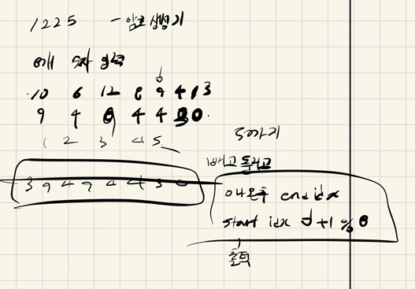

## 2021.11.05_1225암호생성기

## 소스코드

```c++
#include<iostream>
#include<stdio.h>
#include<string.h>

using namespace std;
int password[8];
int startIdx, endIdx;
void init();
void searchPassword();
int main(int argc, char** argv)
{
	int test_case;
	int T;
;

	/*
	   여러 개의 테스트 케이스가 주어지므로, 각각을 처리합니다.
	*/
	for (test_case = 1; test_case <= 8; ++test_case)
	{
		cin >> T;
		init();
		searchPassword();
		printf("#%d ", test_case);
		int idx = startIdx;
		while(1){
			printf("%d ", password[idx++]);
			idx = idx % 8;
			if (idx == endIdx) {
				printf("%d\n", password[idx]);
				break;
			}
		}

	}
	return 0;//정상종료시 반드시 0을 리턴해야합니다.
}
void searchPassword() {
	int idx = 0;
	int num = 1;
	while (1) {
		if (password[idx] - num <= 0) {
			password[idx] = 0;
			startIdx = idx+1; 
			endIdx = idx ;
			if (startIdx == 8) startIdx = 0;
			break;
		}
		password[idx] -= num;
		num++;
		idx++;
		if (num == 6)num = 1;
		if (idx == 8)idx = 0;
	}
}
void init() {
	startIdx = endIdx = 0;
	memset(password, 0, sizeof(password));
	for (int i = 0; i < 8; i++) {
		scanf("%d", &password[i]);
	}
}
```

## 설계



- 일단 무조건 반복해서 포인트는 인덱스의 경우 %8로 0인덱스로 보내고
  - 숫자빼는것의 경우 6이되면 1이되게 해서 반복 시켜주고
  - 0이나오면 그곳은 마지막 인덱스 그 앞은 시작 인덱스로해서 출력 진행

## 실수

- 실수 없음
- D3문제 이상한게 왜 받는 형식이 무조건 10개고 다른지 이해할 수 없음 sw 문제해결 기본 문제가 그런듯

## 문제 링크

[1225-암호생성기](https://swexpertacademy.com/main/code/problem/problemDetail.do?problemLevel=3&contestProbId=AV14uWl6AF0CFAYD&categoryId=AV14uWl6AF0CFAYD&categoryType=CODE&problemTitle=&orderBy=PASS_RATE&selectCodeLang=ALL&select-1=3&pageSize=10&pageIndex=1)

## 원본

