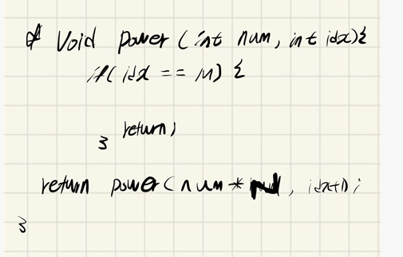

## 2021.11.06_1217-거듭제곱

## 소스코드

```c++
#include<iostream>
using namespace std;
int N, M;
long long answer = 0;
void initData();
int power(int num, int idx);
int main()
{
	int test_case;
	int T;
	
	for (test_case = 1; test_case <= 10; ++test_case)
	{
		cin >> T;
		initData();
		answer=power(N, 0);
		printf("#%d %d\n", test_case, answer);

	}
	return 0;//정상종료시 반드시 0을 리턴해야합니다.
}

void initData() {
	scanf("%d %d", &N, &M);
}
int power(int num, int idx) {
	if (idx == M-1) {
		return num;
	}
	return power(num*N, idx + 1);
}
```

## 설계



- 재귀를 처음에 이렇게 설계했지만 int로 그냥 넘기는게 더 좋다고 생각함 그래서int로 변경해서 진행

## 실수

- 실수 없음

## 문제 링크

[1217-거듭제곱](https://swexpertacademy.com/main/code/problem/problemDetail.do?problemLevel=3&problemLevel=4&contestProbId=AV14dUIaAAUCFAYD&categoryId=AV14dUIaAAUCFAYD&categoryType=CODE&problemTitle=&orderBy=PASS_RATE&selectCodeLang=ALL&select-1=4&pageSize=10&pageIndex=2)

## 원본

