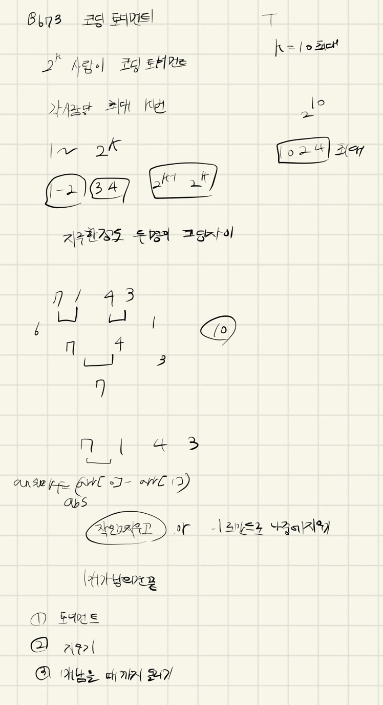

## 2021.11.07_8673-코딩토너먼트1

## 소스코드

```c#
#include<iostream>
#include<stdio.h>
#include<vector>
#include<algorithm>
using namespace std;
void initData();//초기화
int K;
int answer;
vector<int>num;
void codingTest();//코딩 테스트 대결
int main(int argc, char** argv)
{
	int test_case;
	int T;

	cin >> T;
	/*
	   여러 개의 테스트 케이스가 주어지므로, 각각을 처리합니다.
	*/
	for (test_case = 1; test_case <= T; ++test_case)
	{
		initData();
		codingTest();
		printf("#%d %d\n", test_case, answer);

	}
	return 0;//정상종료시 반드시 0을 리턴해야합니다.
}
void codingTest() {
	while (1) {
		if (num.size() == 1)break;
		for (int i = 0; i < num.size() - 1; i++) {
			answer += abs(num[i] - num[i + 1]);
			if (num[i] < num[i + 1]) {
				num.erase(num.begin() + i);
			}
			else {
				num.erase(num.begin() + i + 1);
			}
		}
	}
}
void initData() {
	K = answer = 0;
	num.clear();
	scanf("%d", &K);
	int kMax = 1 << K;

	for (int i = 0; i < kMax; i++) {
		int number = 0;
		scanf("%d", &number);
		num.push_back(number);
	}
}
```

## 설계



- 두개 비교를 하면서 작은것 지우고 그것의 차이를 answer에 저장

## 실수

- 실수 없음

## 문제 링크

[8673-코딩토너먼트1](https://swexpertacademy.com/main/code/problem/problemDetail.do?problemLevel=3&contestProbId=AW2Jldrqlo4DFASu&categoryId=AW2Jldrqlo4DFASu&categoryType=CODE&problemTitle=%ED%86%A0%EB%84%88%EB%A8%BC%ED%8A%B8&orderBy=PASS_RATE&selectCodeLang=ALL&select-1=3&pageSize=10&pageIndex=1&&&&&&&&&&)

## 원본

