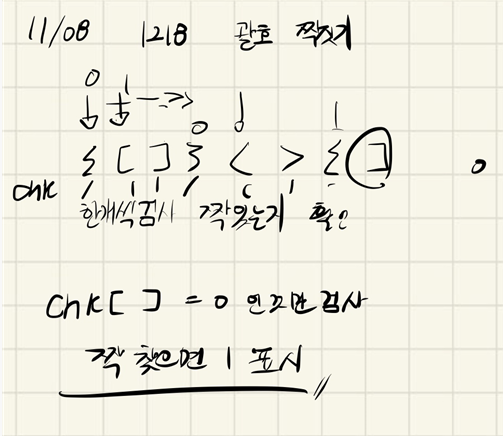

## 2021.11.08_1218-괄호짝짓기

## 소스코드

```c++
#include<iostream>
#include<stdio.h>
#include<string>
#include<string.h>
using namespace std;
int N, answer;
int chk[300];
string friends;
void initData();
void chkFriends();
int main(int argc, char** argv)
{
	int test_case;
	/*
	   여러 개의 테스트 케이스가 주어지므로, 각각을 처리합니다.
	*/
	for (test_case = 1; test_case <= 10; ++test_case)
	{
		initData();
		chkFriends();
		printf("#%d %d\n", test_case, answer);

	}
	return 0;//정상종료시 반드시 0을 리턴해야합니다.
}
void chkFriends() {
	int cnt = 0;
	for (int i = 0; i < friends.size()-1; i++) {
		if (chk[i] == 1)continue;
		chk[i] = 1;
		cnt++;
		int flag = 0;
		for (int j = i + 1; j < friends.size(); j++) {
			if (friends[i] == 40) {
				if (chk[j] == 0 && friends[i] == friends[j] - 1) {
					cnt++;
					chk[j] = 1;
					flag = 1;
					break;
				}
			}
			else {
				if (chk[j] == 0 && friends[i] == friends[j] - 2) {
					cnt++;
					chk[j] = 1;
					flag = 1;
					break;
				}
			}
		}
		if (flag == 0) {
			answer = 0;
			break;
		}
		if (cnt == N)break;
	}
}
void initData() {
	N = 0; answer = 1;
	memset(chk, 0, sizeof(chk));
	scanf("%d", &N);
	cin >> friends;
}
```

## 설계



- 사실 그냥 짝이 있는지 검사 한것이라 어려운것 없었음
- 원래는 제대로 하려면 스택으로 해야함 내생각이지만

## 실수

- ()의 경우 -1 차이 나는것 제대로 체큰 안한 실수
- chk를 0으로 초기화 안한 실수 함

## 문제 링크

[1218-괄호짝짓기](https://swexpertacademy.com/main/code/problem/problemDetail.do?problemLevel=4&contestProbId=AV14eWb6AAkCFAYD&categoryId=AV14eWb6AAkCFAYD&categoryType=CODE&problemTitle=&orderBy=PASS_RATE&selectCodeLang=ALL&select-1=4&pageSize=10&pageIndex=2)

## 원본

