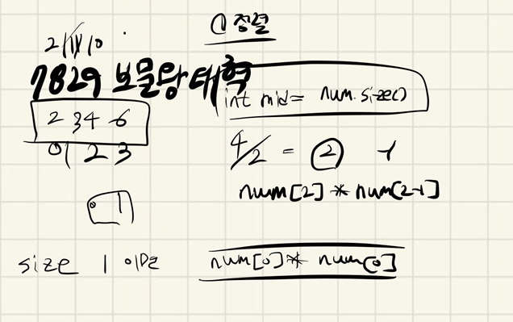

## 2021.11.10_7829-보물왕태혁

## 소스코드

```c++
#include<iostream>
#include<algorithm>
#include<stdio.h>
#include<vector>
using namespace std;
int answer;
int N;
void initData();
void password();
vector<int>num;
int main(int argc, char** argv)
{
	int test_case;
	int T;

	cin >> T;

	for (test_case = 1; test_case <= T; ++test_case)
	{
		initData();
		password();
		printf("#%d %d\n", test_case, answer);
	}
	return 0;//정상종료시 반드시 0을 리턴해야합니다.
}
void initData() {
	num.clear();
	answer = 0;
	N = 0;
	scanf("%d", &N);
	for (int i = 0; i < N; i++) {
		int n = 0;
		scanf("%d",&n);
		num.push_back(n);
	}
	sort(num.begin(), num.end());
}
void password() {
	if (N == 1) {
		answer = num[0] * num[0];
		return;
	}
	if (N % 2 == 0) {
		int mid = N / 2;
		answer = num[mid] * num[mid - 1];
		return;
	}
	else {
		int mid = N / 2;
		answer = num[mid] * num[mid];
	}
}
```

## 설계



- 우선 정렬한다.
- 정렬해서 중간 위치를 찾는다.
  - 한개인 경우는 자기자신을 곱하면되고
  - 짝수인 경우 mid * mid-1
  - 홀수인 경우 mid * mid 하면됨

## 실수

- 실수 없음

## 문제 링크

[7829-보물왕태혁](https://swexpertacademy.com/main/code/problem/problemDetail.do?problemLevel=4&contestProbId=AWtInr3auH0DFASy&categoryId=AWtInr3auH0DFASy&categoryType=CODE&problemTitle=&orderBy=PASS_RATE&selectCodeLang=ALL&select-1=4&pageSize=10&pageIndex=1)

## 원본

