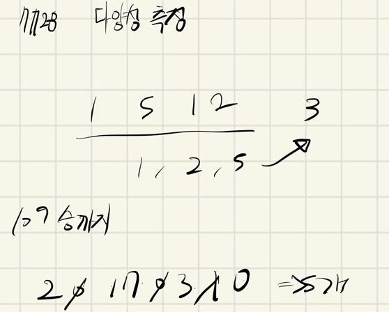

## 2021.11.11_7728-다양성측정

## 소스 코드

``` c++
#include<iostream>
#include<string>
#include<string.h>
using namespace std;
string num;
int answer;
int visitNumber[10];
void initData();
void checkNum();
int main(int argc, char** argv)
{
	int test_case;
	int T;

	cin >> T;

	for (test_case = 1; test_case <= T; ++test_case)
	{
		initData();
		checkNum();
		printf("#%d %d\n", test_case, answer);
	}
	return 0;//정상종료시 반드시 0을 리턴해야합니다.
}
void initData() {
	answer = 0;
	num.clear();
	memset(visitNumber, 0, sizeof(visitNumber));
	cin >> num;
}
void checkNum() {
	for (int i = 0; i < num.size(); i++) {
		if (visitNumber[num[i] - '0'] == 1)continue;
		visitNumber[num[i]-'0'] = 1;
		answer++;
	}
}
```

## 설계



- 다양성 측정이라고 되어 있는데 결국 숫자는 0-9 일뿐
- 그렇기 때문에 배열에 0-9를 기록하면됨 그래서 0이아닌 것을 출력하면됨

## 실수

- 실수한점 
- visitNumber배열을 초기화 하지 않음
- 그리고 visitNumber[num[i]-'0']으로 해야하는데 
  - visitNumber[i]로만해서 에러가 있었음

## 문제 링크

[7728-다양성측정](https://swexpertacademy.com/main/code/problem/problemDetail.do?problemLevel=3&contestProbId=AWq40NEKLyADFARG&categoryId=AWq40NEKLyADFARG&categoryType=CODE&problemTitle=&orderBy=PASS_RATE&selectCodeLang=ALL&select-1=3&pageSize=10&pageIndex=2)

## 원본

