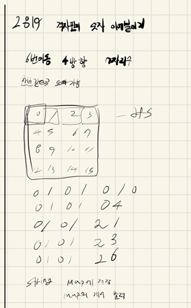

## 2021.12.07_2819격자판의숫자이어붙이기

## 소스코드

```c++
#include<iostream>
#include<stdio.h>
#include<string.h>
#include<vector>
#include<map>
using namespace std;
int dy[] = { 0,1,0,-1 };
int dx[] = { 1,0,-1,0 };
int N, ret;
char board[4][4];
vector<string> D;
map<string, int>check;
bool safe(int y, int x) {
	return 0 <= y && y < 4 & 0 <= x && x < 4;
}
void connectNumber(int y,int x) {
	D.push_back({ board[y][x] });
	if (D.size() == 7) {
		string number;
		for (int i = 0; i < D.size(); i++) {
			number += D[i];
		}
		if (check[number] == 0) {
			check[number] = 1;
		}
		return;
	}
	for (int dir = 0; dir < 4; dir++) {
		int ny = y + dy[dir];
		int nx = x + dx[dir];
		if (safe(ny, nx)) {
			connectNumber(ny, nx);
			D.pop_back();
		}
	}
}
void init() {
	D.clear();
	check.clear();
	N = ret=0;
	memset(board, 0, sizeof(board));
	for (int i = 0; i < 4; i++) {
		for (int j = 0; j < 4; j++) {
			scanf(" %c", &board[i][j]);
		}
	}
}
int main(int argc, char** argv)
{
	int test_case;
	int T;
	cin >> T;
	for (test_case = 1; test_case <= T; ++test_case)
	{
		init();
		for (int i = 0; i < 4; i++) {
			for (int j = 0; j < 4; j++) {
				connectNumber(i, j);
				D.clear();
			}
		}
		ret = check.size();
		printf("#%d %d\n", test_case, ret);
	}
	return 0;//정상종료시 반드시 0을 리턴해야합니다.
}
```

## 설계



- map 함수로 중복를 체크함

## 실수

- 사실 너무 효율적으로 못짠것 같지만 완전 탐색을 해서 그냥 진행함
- 조금 시간이 걸림..

## 문제링크

[2819격자판의숫자이어붙이기](https://swexpertacademy.com/main/code/problem/problemDetail.do?contestProbId=AV7I5fgqEogDFAXB&categoryId=AV7I5fgqEogDFAXB&categoryType=CODE&problemTitle=&orderBy=FIRST_REG_DATETIME&selectCodeLang=ALL&select-1=&pageSize=10&pageIndex=1)

## 원본

