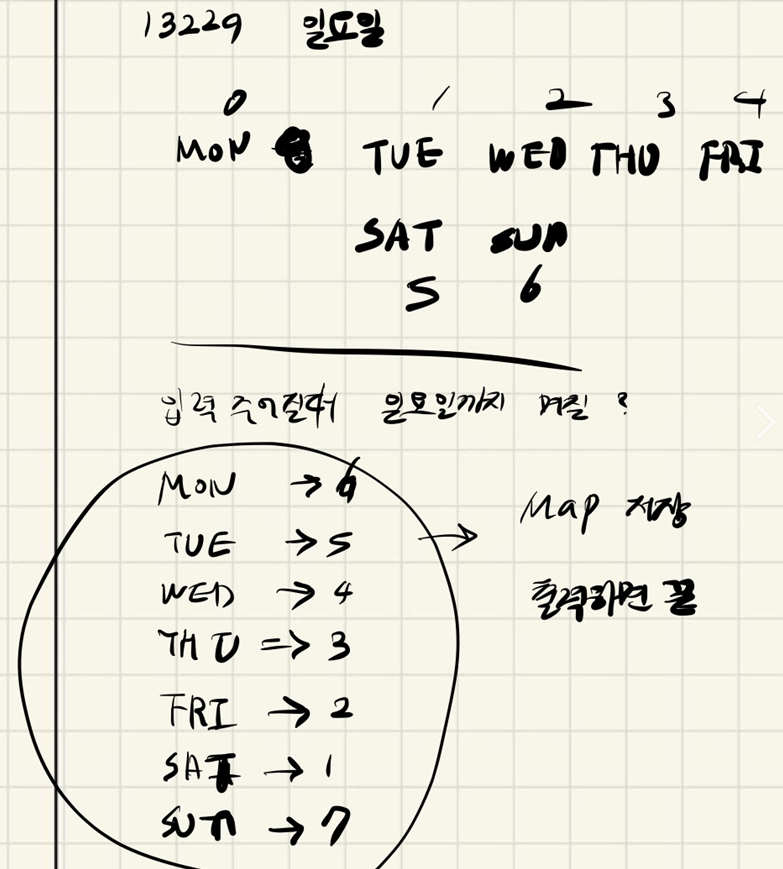

## 2021.12.09_13229일요일

## 소스코드

```c++
#include<iostream>
#include<string>
#include<map>
using namespace std;
map<string, int> week;
string s;
void saveWeek() {
	week["SAT"] = 1;
	week["FRI"] = 2;
	week["THU"] = 3;
	week["WED"] = 4;
	week["TUE"] = 5;
	week["MON"] = 6;
	week["SUN"] = 7;
}
void init() {
	s.clear();
	cin >> s;
}
int main(int argc, char** argv)
{
	int test_case;
	int T;
	cin >> T;
	saveWeek();
	for (test_case = 1; test_case <= T; ++test_case)
	{
		init();
		printf("#%d %d\n", test_case, week[s]);
	}
	return 0;//정상종료시 반드시 0을 리턴해야합니다.
}
```

## 설계



- map함수를 이용해서 그냥 지정해서 씀
- 그래도 되는 문제였기 때문 
- 하지만 왜 D3인지 모르겠음

## 실수

- 실수하기 너무 힘들었음
- 너무 과하게 코딩 한것 같긴함

## 문제링크

[13229일요일](https://swexpertacademy.com/main/code/problem/problemDetail.do?contestProbId=AX0SaDW6L2oDFASs&categoryId=AX0SaDW6L2oDFASs&categoryType=CODE&problemTitle=&orderBy=FIRST_REG_DATETIME&selectCodeLang=ALL&select-1=&pageSize=10&pageIndex=1)

## 원본

