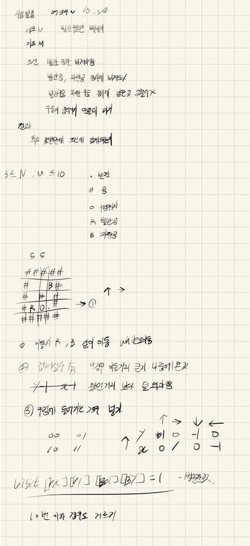

## 2021년09월01일_13460-구슬탈출2

## 소스코드

```c++
#include<stdio.h>
#include<iostream>
#include<queue>
#include<vector>
#include<string.h>
#define NMSIZE 11
using namespace std;
char board[NMSIZE][NMSIZE];// 구슬과 구멍 맵그려지는 곳
int chk[NMSIZE][NMSIZE][NMSIZE][NMSIZE];// 구슬 위치 체크하는 배열
int N, M;//가로 세로 크기입력 변수
int ret;//결과값 저장
int dy[] = { 0,1,0,-1 };// 상하좌우 이동 위한 배열
int dx[] = { 1,0,-1,0 };
void init();//초기화
void play();//시뮬레이션 시작

struct ballXY {
	int ry, rx;//빨간공 y,x
	int by, bx;//파란공 y,x
	int cnt;
};

int main(void) {
	int testcase = 1;
	for (int tc = 1; tc <= testcase; tc++) {
		init();
		play();
		//printf("#%d %d\n", tc, ret);
		printf("%d\n", ret);
	}
	return 0;
}
ballXY D;
void init() {
	N = M = 0;
	ret = 0x7fffffff;// 최소인 결과값 저장
	memset(board, 0, sizeof(board));
	memset(chk, 0, sizeof(chk));
	scanf("%d %d", &N, &M);
	for (int i = 0; i < N; i++) {
		for (int j = 0; j < M; j++) {
			scanf(" %c", &board[i][j]);
			if (board[i][j] == 'R') {
				board[i][j] = '.';
				D.ry = i;
				D.rx = j;
			}
			else if (board[i][j] == 'B') {
				board[i][j] = '.';
				D.by = i;
				D.bx = j;
			}
		}
	}
	D.cnt = 0;
}
void play() {
	queue<ballXY>q;
	q.push(D);// 공 시작 위치 저장
	chk[D.ry][D.rx][D.by][D.bx] = 1;
	while (!q.empty()) {
		D = q.front(); q.pop();

		if (D.cnt == 11) {
			break;
		}
		if (board[D.ry][D.rx] == 'O') {
			ret = D.cnt;// 결과값
			break;
		}
		for (int dir = 0; dir < 4; dir++) {
			ballXY N = D;
			int rcnt = 0;//몇번 이동했는지 확인
			while (1) {//빨간공 이동
				rcnt++;
				N.ry = N.ry + dy[dir];
				N.rx = N.rx + dx[dir];
				if (board[N.ry][N.rx] == '#') {//벽인 경우
					N.ry = N.ry - dy[dir];
					N.rx = N.rx - dx[dir];
					break;
				}
				if (board[N.ry][N.rx] == 'O') {//홀에 들어간경우

					break;
				}
			}
			int bcnt = 0;//몇번이동했는지 확인
			while (1) {
				bcnt++;
				N.by = N.by + dy[dir];
				N.bx = N.bx + dx[dir];
				if (board[N.by][N.bx] == '#')//벽인경우
				{
					N.by = N.by - dy[dir];
					N.bx = N.bx - dx[dir];
					break;
				}
				if (board[N.by][N.bx] == 'O') {//홀에 들어간 경우
					break;
				}
			}
			if (board[N.ry][N.rx] == 'O' && board[N.by][N.bx] == 'O' || board[N.ry][N.rx] == '.' && board[N.by][N.bx] == 'O') {// 정답이 되면 안되는 경우
				continue;
			}
			if (N.ry == N.by&&N.rx == N.bx) {//공이 겹쳐진 경우
				if (rcnt < bcnt) {//파란공이 나중에 온경우
					N.by = N.by - dy[dir]; N.bx = N.bx - dx[dir];
				}
				if (rcnt > bcnt) {//빨간공이 나중에 온경우
					N.ry = N.ry - dy[dir]; N.rx = N.rx - dx[dir];
				}
			}
			if (chk[N.ry][N.rx][N.by][N.bx] == 0) {//방문 체크
				chk[N.ry][N.rx][N.by][N.bx] = 1;
				N.cnt++;
				q.push(N);
			}
		}
	}
		if (0x7fffffff == ret) {
			ret = -1;
		}
	
}
```

## 설계



- 여기서 포인트는 기존 BFS를 알아야함

- 그리고 예외 경우가 있긴한데 두개의 예외 포인트를 잘 생각해야함

  - 파란공과 빨간공이 같은 위치에 있을때 가장 멀리서 온경우 한칸뒤로 가게 해야함

  ```c++
  			if (N.ry == N.by&&N.rx == N.bx) {//공이 겹쳐진 경우
  				if (rcnt < bcnt) {//파란공이 나중에 온경우
  					N.by = N.by - dy[dir]; N.bx = N.bx - dx[dir];
  				}
  				if (rcnt > bcnt) {//빨간공이 나중에 온경우
  					N.ry = N.ry - dy[dir]; N.rx = N.rx - dx[dir];
  				}
  			}
  ```

  - 빨간공과 파란공이 같이 한번에 구멍에 들어간 경우 잘 걸러줘야함

- 그리고 굳이 4차원 배열까지 사용할 필요 없지만 4차원 배열을 사용한다면 더 빠르게 구현 할 수 있음

[13460-구슬탈출2 링크](https://www.acmicpc.net/problem/13460)

