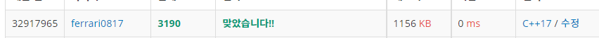

## 2021년09월02일_3190-뱀

```c++
#include<stdio.h>
#include<vector>
#include<string.h>
using namespace std;
#define SIZE 101 // 보드의 최대 크기
int N, K, L;//입력으로 주어지는 보드크기,사과의 개수, 뱀의 방향 변환 횟수
int board[SIZE][SIZE];
int dy[] = { 0,1,0,-1 };//방향
int dx[] = { 1,0,-1,0 };
void init();
void play();//게임 시작
struct info {
	int y, x, size, dir;
}snake;
int main(void) {
	int testCase = 1;
	for (int tc = 1; tc <= testCase; tc++) {
		init();
		play();
	}
	return 0;
}
void init() {
	memset(board, 0, sizeof(board));
}
bool safeZone(int y, int x) {
	return 1 <= y && y <= N && 1 <= x && x <= N;
}
void play() {
	snake.y = snake.x = snake.size = 1;
	snake.dir = 0;

	scanf("%d", &N);
	scanf("%d", &K);
	for (int k = 0; k < K; k++) {//사과 위치
		int y, x;
		scanf("%d %d", &y, &x);
		board[y][x] = -1;
	}
	scanf("%d", &L);
	int time = 0;
	board[1][1] = 1;
	for (int l = 0; l < L; l++) {
		int X; char  C;
		scanf("%d %c", &X, &C);
		while (1) {
			if (time == X) {//방향 변화
				if (C == 'D') {
					snake.dir++;
					if (snake.dir == 4) snake.dir = 0;

				}
				else {
					snake.dir--;
					if (snake.dir == -1) snake.dir = 3;
				}
				if (l != L - 1) {
					break;
				}
			}
			++time;
			snake.y += dy[snake.dir]; snake.x += dx[snake.dir];
			//사과인 조건
			if (-1==board[snake.y][snake.x]) {

				board[snake.y][snake.x] = 0;
				snake.size++;
			}
			//종료 조건
			int tail = time - snake.size ;
			if (!safeZone(snake.y, snake.x) || (board[snake.y][snake.x] != 0 && tail <= board[snake.y][snake.x])){
					while (l != L-1) {//남은것 소모
						l++;
						scanf("%d %c", &X, &C);
					}
				printf("%d\n", time);
				break;
			}
			board[snake.y][snake.x] = time;

		}
	}

}

```


- 뱀은 기본 시뮬레이션이고 저는 맵상에 time을 찍으면서 꼬리를 아래와 같이 표시
- time-snake.size 를 하면 현재 꼬리의 위치의 숫자를 알 수 있음 
- 여기서는 우선 포문이 끝났다고 끝나면 안됨 첫번째 중요 포인트
- 그리고 내가 잠깐 실수한 부분은 dir++ , dir-- 그러니까 방향 변화 시킬때 소스를 잘못 구현한 실수가 있었음
- 너무 어렵지는 않지만 그렇다고 너무 쉬운 문제는 아니다 이런 문제가 실제로 현장에서 한번 구현을 잘못하면
- 오래 걸리기때문이다. 



[뱀 백준 링크](https://www.acmicpc.net/status?user_id=ferrari0817&problem_id=3190&from_mine=1)