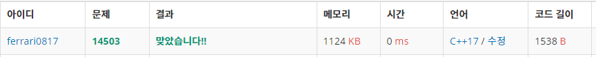

## 2021년09월04일_14503-로봇청소기

## 소스코드

```c++
#include<stdio.h>
#include<vector>
#include<string.h>
#define N_MAX_SIZE 51
#define M_MAX_SIZE 51
int N, M;
int board[N_MAX_SIZE][M_MAX_SIZE];
int dy[] = { -1,0,1,0 };
int dx[] = { 0,1,0,-1 };
struct posData {
	int y, x, dir;
}robot;
void init();
void init_test();
void cleanRoom();
int main(void) {
	int testCase = 1;
	for (int tc = 1; tc <= testCase; tc++) {
		init();
		cleanRoom();
	}
	return 0;
}
void init() {
	scanf("%d %d", &N, &M);
	scanf("%d %d %d", &robot.y, &robot.x, &robot.dir);
	for (int i = 0; i < N; i++) {
		for (int j =0; j < M; j++) {
			scanf("%d", &board[i][j]);
		}
	}
	//init_test();
}

void init_test() {
	for (int i = 0; i < N; i++) {
	for (int j = 0; j < M; j++) {
		printf("%d", board[i][j]);
	}
	printf("\n");
}
printf("%d %d %d %d %d\n", N, M, robot.y, robot.x, robot.dir);
}

void cleanRoom() {
	int time = 1;
	while (1) {
		if (0 == board[robot.y][robot.x]) { //1
			board[robot.y][robot.x] = ++time;
		}
		int i = 0;
		int copydir = robot.dir;
		for (; i < 4; i++) {
			copydir--;
			if (copydir == -1)copydir = 3;
			int ny = robot.y + dy[copydir]; int nx = robot.x + dx[copydir];
			if (board[ny][nx] == 0) {//왼쪽에 청소할 공간
				robot.y = ny; robot.x = nx;
				robot.dir = copydir;
				break;
			}
		}
		if (i == 4) {//4방향 모두 청소할 곳 없는경우
			int rny = robot.y - dy[robot.dir]; int rnx = robot.x - dx[robot.dir];
			if (board[rny][rnx] != 1) {//벽이 아닌경우
				robot.y = rny; 
				robot.x = rnx;
			}
			else {
				break;
			}
		}
	}
	printf("%d\n", time - 1);
}
```

## 설계


- 시뮬레이션 경우 설계를 제대로 하라는 방식으로 구현 하면된다.
- 이것의 경우에 포인트는 맵 상에 time을 찍으면서 청소를 하니까
- 1이 time이 찍히면 안된다 그렇게 되면 1이 벽이기 때문에 벽으로 인식을 하기 때문이다
- 그래서 2부터 찍힐 수 있게 해야지 정확히 값이 나오게 되므로, 이점만 주의하고
- 포문을 돌릴때 일반 포문 안에 int i해서 포문의 지역변수로 하지 않고 포문 밖의 지역 변수로 선언해서 
- 포문을 나오더라도 4방향에 청소할 곳이 없는것에 대해서 확인을 해줬음
  - i ==4 이면 포문을 전체 돌고 나온 경우 이기때문에 청소 포인트가 없는 것
- 그렇게 해서 잘 뒤로 가게 하고 뒤로 가려는 방향이 벽이면 이때 청소를 멈추면 된다.

## 실수

- ​	int rny = robot.y - dy[robot.dir]; int rnx = robot.x - dx[robot.dir];
- ​	int rny = robot.y - dy[robot.x]; int rnx = robot.x - dx[robot.y];
- 두번째 처럼 오타 실수 있었음
- dir -- 했을때 제대로 변경이 되지 않은 실수 와
- 포문에서 브레이크 전에 robot의 데이터를 대입해주는데 dir를 대입 안시켜줬었음



## 문제 사이트

[14503로봇청소기](https://www.acmicpc.net/problem/14503)