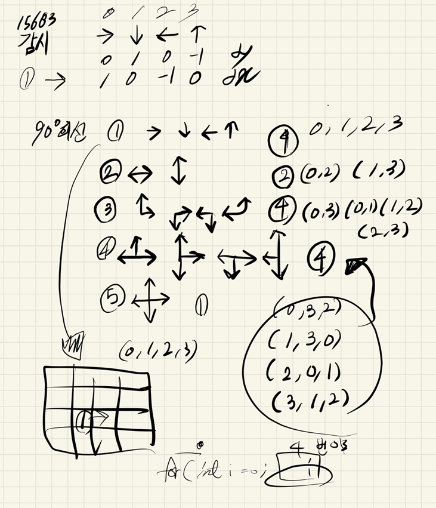
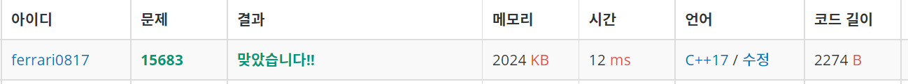

## 2021년09월06일_15683-감시

## 소스코드 

```c++
#include<stdio.h>
#include<iostream>
#include<vector>
#include<string.h>
using namespace std;
#define NSIZE 8
#define MSIZE 8
//model 
int N, M;
int board[NSIZE][MSIZE];
int cctvDir[] = { 4,2,4,4,1 };
int dy[] = { 0,1,0,-1 };
int dx[] = { 1,0,-1,0 };
int ret;
struct info {
	int y, x, num;
};
vector<info>CCTV;

//act
void init();
void dfs(int idx, int cnt);
int main(void) {
	int testCase = 1;
	for (int tc = 1; tc <= testCase; tc++) {
		init();
		dfs(0,0);
		printf("%d", ret);
	}
	return 0;
}
void init() {
	ret = 0x7fffffff;
	memset(board, 0, sizeof(board));
	N=M=0;
	scanf("%d %d", &N, &M);
	for (int i = 0; i < N; i++) {
		for (int j = 0; j < M; j++) {
			scanf("%d", &board[i][j]);
			if (0 != board[i][j]&&6!=board[i][j]) {
				CCTV.push_back({ i,j,board[i][j] });//CCTV정보저장
			}
		}
	}
}
void copyArr(int cArr[NSIZE][MSIZE], int Arr[NSIZE][MSIZE]) {
	for (int i = 0; i < N; i++) {
		for (int j = 0; j < M; j++) {
			cArr[i][j] = Arr[i][j];
		}
	}
}
bool safe(int y, int x) {
	return 0 <= y && y < N && 0 <= x && x < M;
}
void printArea(info cctv, int dir) {
	dir = dir % 4;
		info c = cctv;
		while (1) {
			info n;
			n.y = c.y + dy[dir]; n.x = c.x + dx[dir];
			if (!safe(n.y, n.x))break;
			if (board[n.y][n.x] != 6) {
				board[n.y][n.x] = 9;
			}
			else break;
			c.y = n.y; c.x = n.x;
		}
}
void dfs(int idx,int cnt) {
	if (cnt == CCTV.size()) {
		int count = 0;
		for (int i = 0; i < N; i++) {
			for (int j = 0; j < M; j++) {
				if (board[i][j] == 0) count++;
			}
		}
		ret = ret > count ? count : ret;
		return; 
	}
	int copyboard[NSIZE][MSIZE] = { 0, };
	for (int dir = 0; dir < cctvDir[CCTV[idx].num - 1]; dir++) {
		copyArr(copyboard, board);
		if (CCTV[idx].num == 1) {
			printArea(CCTV[idx], dir);
		}
		if (CCTV[idx].num == 2) {
			printArea(CCTV[idx], dir);
			printArea(CCTV[idx], dir+2);
		}
		if (CCTV[idx].num == 3) {
			printArea(CCTV[idx], dir);
			printArea(CCTV[idx], dir+3);
		}
		if (CCTV[idx].num == 4) {
			printArea(CCTV[idx], dir);
			printArea(CCTV[idx], dir+2);
			printArea(CCTV[idx], dir+3);
		}
		if (CCTV[idx].num == 5) {
			printArea(CCTV[idx], dir);
			printArea(CCTV[idx], dir + 1);
			printArea(CCTV[idx], dir + 2);
			printArea(CCTV[idx], dir + 3);
		}
		dfs(idx + 1, cnt + 1);
		copyArr(board, copyboard);
	}

}
```

## 설계



- 여기서 포인트는 dfs를 할 줄 아는지 
- 백트래킹 개념도 알아야함 
- 완전탐색의 완전 기초이기 때문에 잘 알아야하고 진짜 포인트는 CCTV 방향을 잘 계산해야하고 그배열에 감시 영역 찍을때 제대로 찍고 복원을 잘해야함

## 실수

- 딱히 실수 한것은 없지만 흠 이전에 풀었던 문제라 좀 설계를 어설프게 했던것?
- 감시경로 찍을때 찍는 함수는 하나만 만들면 되는데 그안에 여러개 만드려고 했던 것
- 진짜 가장 중요한것은 설계임, 문제를 제대로 이해하고 확신이 서야 제대로 문제를 풀고 구현 할 수 있음



## 문제 사이트

[15683-감시](https://www.acmicpc.net/problem/15683)