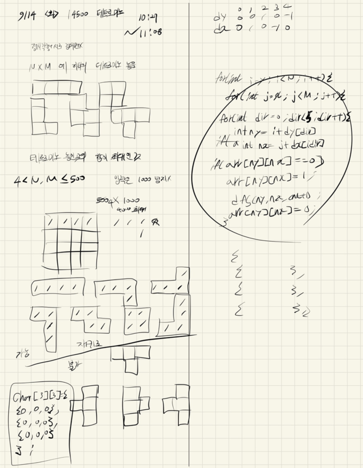

## 2021.09.14_14500-테트로미노

## 시간초과 소스

```c++
#include<stdio.h>
#include<iostream>
#include<vector>
#include<string.h>

using namespace std;
#define NS 1004
#define MS 1004
int N, M;//보드 입력으로 주는 가로 세로
int maxAnswer;//최대 결과값 저장

int board[NS][MS];// 테트로미노 놓는 보드
int arr[NS][MS];// 테트로미노 그리는 보드
int dy[] = { 0,1,0,-1 };
int dx[] = { 1,0,-1,0 };
char ah[4][3][3] = {
	{
	{1,1,1},
	{0,1,0},
	{0,0,0}
	},
	{
	{0,1,0},
	{1,1,0},
	{0,1,0}
	},
	{
	{0,1,0},
	{1,1,1},
	{0,0,0}
	},
	{
	{0,1,0},
	{0,1,1},
	{0,1,0}
	}
};

void init();//초기화
void play();//시뮬레이션 구현
void dfs(int i, int j, int cnt);// 테트로미노 만드는 함수
bool safe(int y, int x);// 범위 체크

//체크 함수
void checkBoard(int idx);//보드 체크

int main(void) {
	int testCase = 1;
	for (int tc = 1; tc <= testCase; tc++) {
		init();
		play();
		printf("%d\n", maxAnswer);
	}
	return 0;
}

void init() {
	N = M = 0;
	maxAnswer = 0x80000000;//최대값
	memset(board,-1, sizeof(board));
	scanf("%d %d", &N, &M);
	for (int i = 0; i < N; i++) {
		for (int j = 0; j < M; j++) {
			scanf("%d", &board[i][j]);
		}
	}
	//checkBoard(0);
}
bool safe(int y, int x) {
	return 0 <= y && y < N && 0 <= x && x < M;
}
void dfs(int i, int j, int cnt) {
	if (cnt == 3) {
		//checkBoard(1);
		//printf("\n");
		int cnt = 0;
		int ret = 0;
		for (int i = 0; i < N; i++) {
			for (int j = 0; j < M; j++) {
				if (arr[i][j] == 1) {
					cnt++;
					ret += board[i][j];
				}
				if (cnt == 4)break;
			}
			if (cnt == 4)break;
		}
		maxAnswer = maxAnswer < ret ? ret : maxAnswer;
		return;
	}
	for (int dir = 0; dir < 4; dir++) {
		int ny = i + dy[dir]; int nx = j + dx[dir];
		if (safe(ny, nx) && arr[ny][nx] == 0) {
			arr[ny][nx] = 1;
			dfs(ny, nx, cnt + 1);
			arr[ny][nx] = 0;
		}
	}
}

void play() {
	for (int i = 0; i < N; i++) {
		for (int j = 0; j < M; j++) {
			arr[i][j] = 1;
			dfs(i, j, 0);
			arr[i][j] = 0;
		}
	}
	//ㅏ,ㅓ,ㅗ ㅜ에 대해서 
	for (int i = 0; i < N; i++) {
		for (int j = 0; j < M; j++) {

			for (int k = 0; k < 4; k++) {
				int sum = 0;
				for (int ii = 0; ii < 3; ii++) {
					for (int jj = 0; jj < 3; jj++) {
						int ny = i + ii;
						int nx = j + jj;
						if (ah[k][ii][jj] == 1) {
							if (board[ny][nx] == -1) sum += -100;
							else sum += board[ny][nx];
						}
					}//jj
				}//ii
				maxAnswer = maxAnswer < sum ? sum : maxAnswer;
			}//k

		}//j
	}//i
}
void checkBoard(int idx) {
	if (idx == 0) {
		for (int i = 0; i < N; i++) {
			for (int j = 0; j < M; j++) {
				printf("%d ", board[i][j]);
			}
			printf("\n");
		}
	}
	else {
		for (int i = 0; i < N; i++) {
			for (int j = 0; j < M; j++) {
				printf("%d ", arr[i][j]);
			}
			printf("\n");
		}
	}
}


```

## 시간초과 해결 소스

```c++
#include<stdio.h>
#include<iostream>
#include<string.h>

using namespace std;
#define NS 504
#define MS 504
int N, M;//보드 입력으로 주는 가로 세로
int maxAnswer;//최대 결과값 저장

int board[NS][MS];// 테트로미노 놓는 보드
int arr[NS][MS];// 테트로미노 그리는 보드
int dy[] = { 0,1,0,-1 };
int dx[] = { 1,0,-1,0 };
int ah[4][3][3] = {
	{
	{1,1,1},
	{0,1,0},
	{0,0,0}
	},
	{
	{0,1,0},
	{1,1,0},
	{0,1,0}
	},
	{
	{0,1,0},
	{1,1,1},
	{0,0,0}
	},
	{
	{1,0,0},
	{1,1,0},
	{1,0,0}
	}
};

void init();//초기화
void play();//시뮬레이션 구현
void dfs(int i, int j, int cnt);// 테트로미노 만드는 함수
bool safe(int y, int x);// 범위 체크

//체크 함수
void checkBoard(int idx);//보드 체크

int main(void) {
	int testCase = 1;
	for (int tc = 1; tc <= testCase; tc++) {
		init();
		play();
		printf("%d\n", maxAnswer);
	}
	return 0;
}

void init() {
	N = M = 0;
	maxAnswer = 0x80000000;//최대값
	memset(board, -1, sizeof(board));
	scanf("%d %d", &N, &M);
	for (int i = 0; i < N; i++) {
		for (int j = 0; j < M; j++) {
			scanf("%d", &board[i][j]);
		}
	}
	//checkBoard(0);
}
bool safe(int y, int x) {
	return 0 <= y && y < N && 0 <= x && x < M;
}
void dfs(int i, int j, long long int sum, int cnt) {
	if (cnt == 3) {
		//checkBoard(1);
		//printf("\n");
		maxAnswer = maxAnswer < sum ? sum : maxAnswer;
		return;
	}
	for (int dir = 0; dir < 4; dir++) {
		int ny = i + dy[dir]; int nx = j + dx[dir];
		if (safe(ny, nx) && arr[ny][nx] == 0) {
			arr[ny][nx] = 1;
			dfs(ny, nx, sum + board[ny][nx], cnt + 1);
			arr[ny][nx] = 0;
		}
	}
}

void play() {
	for (int i = 0; i < N; i++) {
		for (int j = 0; j < M; j++) {
			arr[i][j] = 1;
			dfs(i, j, board[i][j], 0);
			arr[i][j] = 0;
		}
	}
	//ㅏ,ㅓ,ㅗ ㅜ에 대해서 
	for (int i = 0; i < N; i++) {
		for (int j = 0; j < M; j++) {

			for (int k = 0; k < 4; k++) {
				long long int sum = 0;
				for (int ii = 0; ii < 3; ii++) {
					for (int jj = 0; jj < 3; jj++) {
						int ny = i + ii;
						int nx = j + jj;
						if (ah[k][ii][jj] == 1) {
							sum += board[ny][nx];
						}
					}//jj
				}//ii
				maxAnswer = maxAnswer < sum ? sum : maxAnswer;
			}//k

		}//j
	}//i
}
void checkBoard(int idx) {
	if (idx == 0) {
		for (int i = 0; i < N; i++) {
			for (int j = 0; j < M; j++) {
				printf("%d ", board[i][j]);
			}
			printf("\n");
		}
	}
	else {
		for (int i = 0; i < N; i++) {
			for (int j = 0; j < M; j++) {
				printf("%d ", arr[i][j]);
			}
			printf("\n");
		}
	}
}


```

- 시간초과를 줄일 수 있었던 포인트는  딱하나

  - ​			dfs(ny, nx, sum + board[ny][nx], cnt + 1);
  - 합을 구하면서 넘겨서 마지막에 비교만 했기 때문 이거 정말 주의해서 풀이하기

- ```c++
  //81%에서 틀림	
  	{
  	{0,1,0},
  	{0,1,1},
  	{0,1,0}
  	}
  //100% 맞음
  	{
  	{1,0,0},
  	{1,1,0},
  	{1,0,0}
  	}
  ```

  - 설계에 의도치 않은 오류가 생김 이거 주의해서 항상 문제 풀이할것 

##  설계



## 문제 링크

[14500-테트로미노](https://www.acmicpc.net/problem/14500)

## 원본

