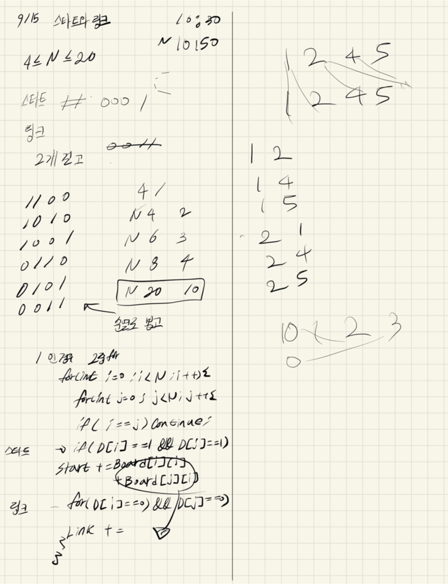

## 2021.09.15_14889-스타트와링크

## 소스코드

```c++
#include<stdio.h>
#include<iostream>
#include<vector>
#include<string.h>
using namespace std;
#define NS 21
int N;
int board[NS][NS];
int D[NS];
int answer;
void init();
void dfs(int idx, int cnt);

//체크
void checkD();
int main(void) {
	int testCase = 1;
	for (int tc = 1; tc <= testCase; tc++) {
		init();
		dfs(0, 0);
		printf("%d\n", answer);
	}
	return 0;
}
void init() {
	N = 0;
	answer = 0x7fffffff;
	memset(board, 0, sizeof(board));
	scanf("%d", &N);
	for (int i = 0; i < N; i++) {
		for (int j = 0; j < N; j++) {
			scanf("%d", &board[i][j]);
		}
	}
}
void dfs(int idx, int cnt) {
	if (idx > N)return;
	if (cnt == N / 2) {
		//checkD();
		int start = 0, link = 0;
		for (int i = 0; i < N; i++) {
			for (int j = i+1; j < N; j++) {
				if (i == j)continue;
				if (1 == D[i] && 1 == D[j]) {
					start += board[i][j] + board[j][i];
				}
				else if (0 == D[i] && 0 == D[j]) {
					link += board[i][j] + board[j][i];
				}
			}
		}
		start = abs(start - link);
		answer = answer >start ? start : answer;
		return;
	}
	D[idx] = 1;
	dfs(idx + 1, cnt + 1);
	D[idx] = 0;
	dfs(idx + 1, cnt);
}

void checkD() {
	for (int i = 0; i < N; i++) {
		printf("%d ", D[i]);
	}
	printf("\n");
}
```

## 설계



## 실수

- 바로 위에 이중포문을 잘못 설계함
- (1 2) (1 3) (1 4) (2 3) (2 4) (3 4) 이렇게 만 뽑아야하는데
  - (1 2) (1 3) (1 4) [-(2 1)-] (2 3) (2 4) [-(3 1)-] [-(3 2)-] (3 4)
  - 두번 더한 꼴이 되어서 2배되는 값이 나왔었음
  - 이점도 제대로 꼼꼼히 확인할것

## 문제링크

[14889-스타트와링크](https://www.acmicpc.net/problem/14889)

## 원본

