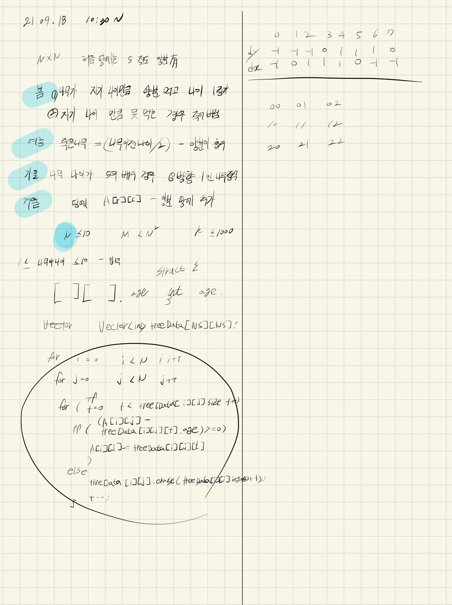

## 2021.09.18_16235-나무재테크

## 소스코드

```c++
#include<stdio.h>
#include<iostream>
#include<vector>
#include<string.h>
#include<algorithm>
using namespace std;
#define NS 11
int dy[] = { -1,-1,-1,0,1,1,1,0};
int dx[] = { -1,0,1,1,1,0,-1,-1};
int a[NS][NS];// 나무가 심어지는 땅
int a1[NS][NS];//로봇이 뿌릴 양분 저장된 땅
int dieTree[NS][NS];//죽은 나무 영양분 저장
int N, M, K, answer;
vector<int> treeData[NS][NS];

void init();
bool safeZone(int y,int x);

void spring();
void summer();
void fall();
void winter();
void treePlay();
int main(void) {
	int testCase = 1;
	for (int tc = 1; tc <= testCase; tc++) {
		init();
		treePlay();
		printf("%d\n", answer);
	}
	return 0;
}

void treePlay() {
	while (K--) {
		spring();
		summer();
		fall();
		winter();
	}
	for (int i = 0; i < N; i++) {
		for (int j = 0; j < N; j++) {
			answer += treeData[i][j].size();
		}
	}
}
void init() {
	for (int i = 0; i < NS; i++) {
		for (int j = 0; j < NS; j++) {
			treeData[i][j].clear();
		}
}
	N = M= K = answer = 0;
	scanf("%d %d %d", &N, &M, &K);
	for (int i = 0; i < N; i++) {// 양분 저장
		for (int j = 0; j < N; j++) {
			scanf("%d", &a1[i][j]);
			a[i][j] = 5;
		}
	}	for (int i = 0; i < M; i++) {//초기 나무 데이터 저장
		int y, x,age;
		scanf("%d %d %d", &y, &x,&age);
		treeData[y - 1][x - 1].push_back(age);
	}
}
void spring() {
	for (int i = 0; i < N; i++) {
		for (int j = 0; j < N; j++) {
			sort(treeData[i][j].begin(), treeData[i][j].end());// 정렬
			for (int t = 0; t < treeData[i][j].size(); t++) {
				if ((a[i][j] - treeData[i][j][t]) >= 0) {//양분 흡수 후 레벨업
					a[i][j] -= treeData[i][j][t];
					treeData[i][j][t]++;
				}
				else {//나무 삭제
					dieTree[i][j] += treeData[i][j][t] / 2;//영양분으로 반 흡수
					treeData[i][j].erase(treeData[i][j].begin() + t);
					t--;
				}
			}
		}
	}
}
void summer() {// 죽은 양분 저장
	for (int i = 0; i < N; i++) {
		for (int j = 0; j < N; j++) {
			if (dieTree[i][j] == 0)continue;
			a[i][j] += dieTree[i][j];
			dieTree[i][j] = 0;
		}
	}
}
void fall() {
	for (int i = 0; i < N; i++) {
		for (int j = 0; j < N; j++) {
			for (int t = 0; t < treeData[i][j].size(); t++) {
				if (treeData[i][j][t] % 5 == 0) {//번식 가능한 나무
					for (int dir=0; dir < 8; dir++) {
						int ny = i + dy[dir]; int nx = j + dx[dir];
						if (safeZone(ny, nx)) {
							treeData[ny][nx].push_back(1);//번식
						}
					 }
				}
			}
		}
	}
}
void winter() {
	for (int i = 0; i < N; i++) {
		for (int j = 0; j < N; j++) {
			a[i][j]+=a1[i][j];
		}
	}
}

bool safeZone(int y, int x) {
	return 0 <= y && y < N && 0 <= x && x < N;
}
```

## 설계



## 실수

- 실수한것은 너무 빠르게 하려다보니 age를 빼먹고 진행했던점 
- 그래서 1인 나무로만 데이터가 들어가서 제대로 답이 안나옴
- 항상 제대로 파악할것

## 문제링크

[16235-나무재테크](https://www.acmicpc.net/problem/16235)

## 원본

