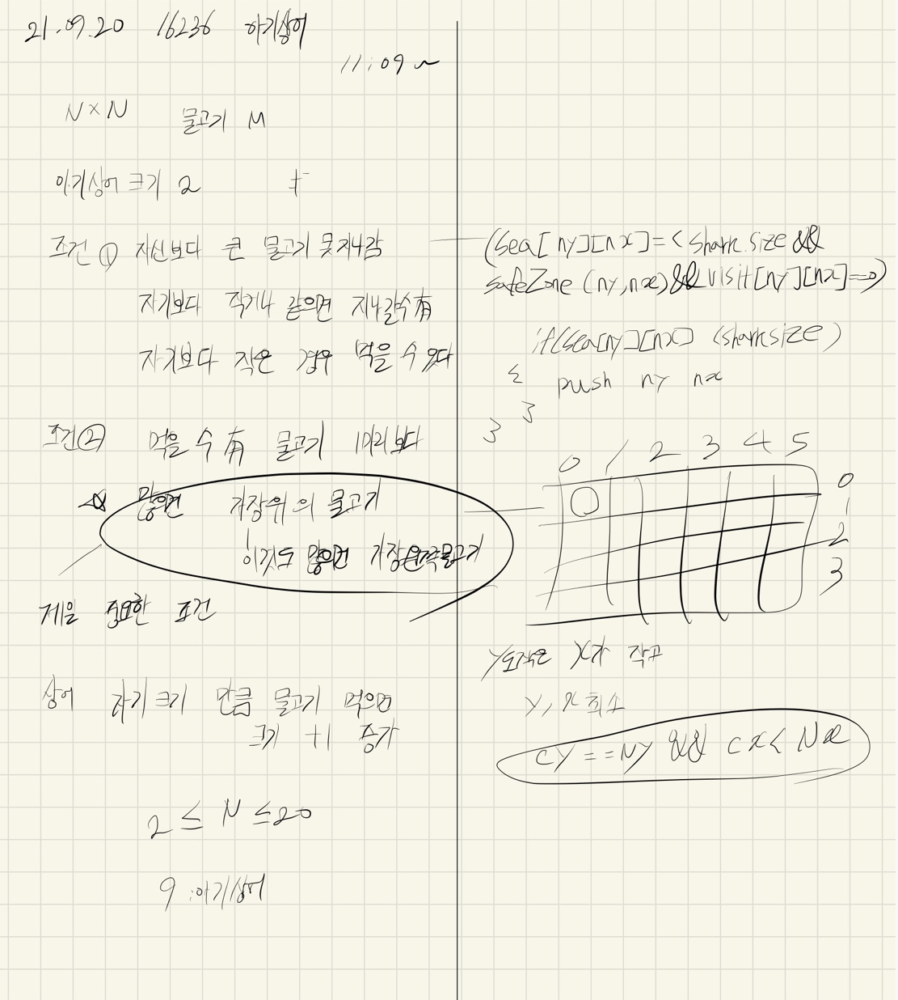

## 2021.09.20_16236-아기상어

## 소스코드

```c++
#include<stdio.h>
#include<vector>
#include<iostream>
#include<string.h>
#include<algorithm>
#include<queue>
using namespace std;
#define SIZE 21
int N;//배열의 크기, 물고기 숫자
int answer;//결과값

int sea[SIZE][SIZE];//바다의 정보 저장
int dy[] = { 0,1,0,-1 };
int dx[] = { 1,0,-1,0 };

struct Data {
	int y, x, size,cnt;
}shark;

void init();//초기화
void eatingShark();//실제 시뮬레이션 
bool safeZone(int y, int x);//범위 체크


int main(void) {
	int testCase = 1;
	for (int tc = 1; tc <= testCase; tc++) {
		init();
		eatingShark();
		printf("%d\n", answer);
	}
	return 0;
}
bool safeZone(int y, int x) {//범위 체크
	return 0 <= y && y < N && 0 <= x && x<N;
}
void eatingShark() {
	int eat = 0;
	while (1) {
		queue<Data>q;
		q.push(shark);
		int visit[SIZE][SIZE] = { 0, };
		visit[shark.y][shark.x] = 1;
		int minimunNumY = 0x7fffffff; int minimunNumX = 0x7fffffff;//최소 y,x
		int minimunCount = 0x7fffffff;
		while (!q.empty()) {
			Data c = q.front(); q.pop();

			if (sea[c.y][c.x]!=0&&sea[c.y][c.x] < shark.size) {//잡아 먹을 수 있는 물고기 기준 y,x 최소 산출
				if (minimunCount >= c.cnt) {//최소 범위
					minimunCount = c.cnt;
					if ((minimunNumY > c.y)||(minimunNumY == c.y&&minimunNumX > c.x)) {//위의 물고기가 많으면 x값이작은것 
							minimunNumY = c.y;
							minimunNumX = c.x;
						}
				}
			}

			for (int dir = 0; dir < 4; dir++) {
				Data n;
				n.y = c.y + dy[dir]; n.x = c.x + dx[dir]; n.cnt = c.cnt;
				if (safeZone(n.y, n.x) && sea[n.y][n.x] <= shark.size && 0 == visit[n.y][n.x]) {
					visit[n.y][n.x] = 1;
					n.cnt++;
					q.push(n);
				}//if safezone ...
			}//for(int dir dir 4 dir++)
		}//while(!.q.empty())
		//cout << minimunNumY << " " << minimunNumX<<" "<< minimunCount << endl;
		if (minimunNumX == 0x7fffffff)break;
		answer += minimunCount;
		eat++;
		if (eat == shark.size) {//성장
			shark.size++;
			eat = 0;
		}
		shark.y = minimunNumY;
		shark.x = minimunNumX;
		shark.cnt = 0;
		sea[shark.y][shark.x] = 0;
	}//while(1)
}

void init() {
	N  = answer = 0;
	memset(sea, 0, sizeof(sea));
	scanf("%d", &N);

	for (int i = 0; i < N; i++) {//입력 정보
		for (int j = 0; j < N; j++) {
			scanf("%d", &sea[i][j]);
			if (sea[i][j] == 9) {
				shark.y = i; shark.x = j; shark.size = 2, shark.cnt = 0;
				sea[i][j] = 0;
			}
		}
	}

}
```

## 설계



## 실수

## before

```c++
if (sea[c.y][c.x]!=0&&sea[c.y][c.x] < shark.size) {//잡아 먹을 수 있는 물고기 기준 y,x 최소 산출
				if (minimunCount > c.cnt) {//최소 범위
					minimunCount = c.cnt;
					if (minimunNumY > c.y) {//제일 위 물고기
						if (minimunNumY == c.y&&minimunNumX > c.x) {//위의 물고기가 많으면 x값이작은것 
							minimunNumY = c.y;
							minimunNumX = c.x;
						}
						else {
							minimunNumY = c.y;
							minimunNumX = c.x;
						}
					}
				}
			}
```

## after

```c++
if (sea[c.y][c.x]!=0&&sea[c.y][c.x] < shark.size) {//잡아 먹을 수 있는 물고기 기준 y,x 최소 산출
				if (minimunCount >= c.cnt) {//최소 범위
					minimunCount = c.cnt;
					if ((minimunNumY > c.y)||(minimunNumY == c.y&&minimunNumX > c.x)) {//위의 물고기가 많으면 x값이작은것 
							minimunNumY = c.y;
							minimunNumX = c.x;
						}
				}
			}
```

- 이부분은 가끔 실수 하는 부분 같다고 생각해도 아래 처럼해야 제대로 동작함
- 이부분은 잘 설계해야한다. 그냥 진짜 문제 그대로 구현하기 

## 문제 링크

[16236-아기상어](https://www.acmicpc.net/problem/16236)

## 원본

