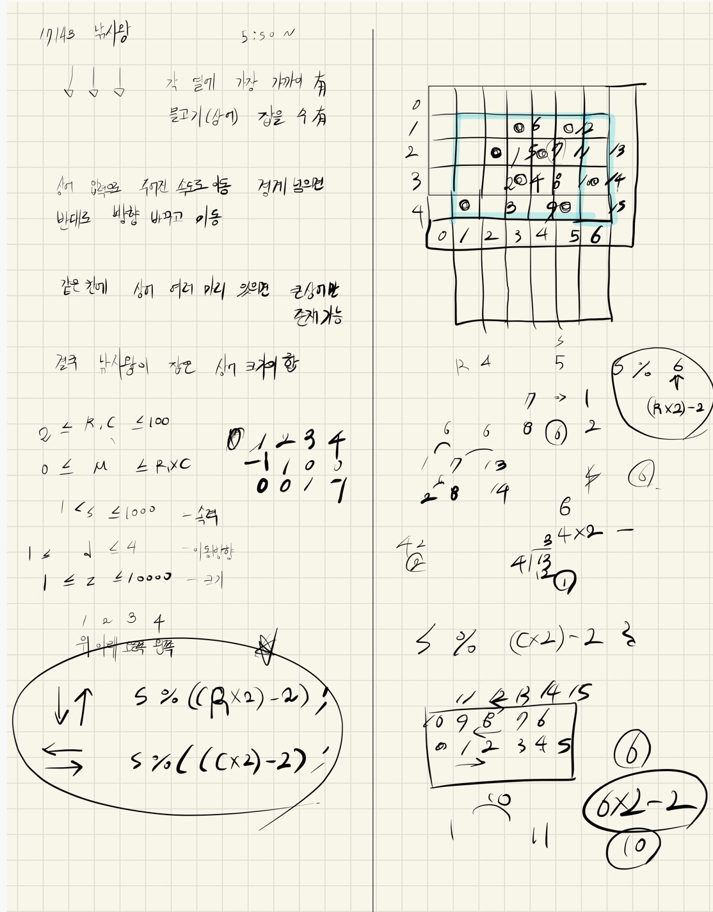

## 2021.09.23_17143-낚시왕

## 소스코드

```c++
#include<stdio.h>
#include<vector>
#include<iostream>
#include<string.h>
#include<algorithm>
using namespace std;
#define SIZE 101

struct Data {
	int y, x, speed, dir, size;
};

int R, C, M;//가로 세로 상어 수
int answer;//결과값

vector<Data>sea;
int dy[] = { 0,-1,1,0,0 };
int dx[] = { 0,0,0,1,-1 };

void init();//초기화
bool safeZone(int y, int x);// 범위 체크
void fishing();//낚시 시작
bool cmp(Data a, Data b) {//오름 차순 정렬
	if (a.y == b.y)return a.x < b.x;
	return a.y < b.y;
}
int main(void) {
	int testCase = 1;
	for (int tc = 1; tc <= testCase; tc++) {
		init();
		fishing();
		printf("%d\n", answer);
	}
	return 0;
}
void init() {
	R = C = M = answer = 0;
	sea.clear();
	scanf("%d %d %d", &R, &C, &M);

	Data current;
	for (int i = 0; i < M; i++) {
		scanf("%d %d %d %d %d", &current.y, &current.x, &current.speed, &current.dir, &current.size);
		if (current.dir == 1 || current.dir == 2) {
			current.speed = current.speed % ((R * 2) - 2);
		}
		else current.speed = current.speed % ((C * 2) - 2);
		sea.push_back({ current.y,current.x,current.speed,current.dir,current.size });
	}
}
bool safeZone(int y, int x) {
	return 1 <= y && y <= R && 1 <= x && x <= C;
}
void fishing() {
	for (int i = 1; i <= C; i++) {//낚시 가능 횟수
		if (sea.size() == 0)break;
		sort(sea.begin(), sea.end(), cmp);
		for (int j = 0; j < sea.size(); j++) {//낚시 부분
			if (sea.size() == 0)break;
			if (sea[j].x == i) {//바늘에 걸린 녀석
				answer += sea[j].size;
				sea.erase(sea.begin() + j);
				break;
			}
		}
		for (int j = 0; j < sea.size(); j++) {//상어 이동
			for (int s = 0; s < sea[j].speed; s++) {

				Data n;
				n.y = sea[j].y + dy[sea[j].dir]; n.x = sea[j].x + dx[sea[j].dir];
				if (safeZone(n.y, n.x)) {
					sea[j].y = n.y;
					sea[j].x = n.x;
				}
				else {
					if (sea[j].dir == 1)sea[j].dir = 2;
					else if (sea[j].dir == 2)sea[j].dir = 1;
					else if (sea[j].dir == 3)sea[j].dir = 4;
					else if (sea[j].dir == 4)sea[j].dir = 3;
					s--;
				}
			}
		}
		if (sea.size() == 0)break;
		sort(sea.begin(), sea.end(), cmp);
		for (int a = 0; a < sea.size() - 1; a++) {
			if (sea.size() == 0)break;
			int cnt = 0;//현재 몇개가 같은지 체크
			int maxSize = sea[a].size;
			Data cM;//맥스값 저장
			cM = sea[a];
			for (int b = a + 1; b < sea.size(); b++) {
				if (sea[a].y == sea[b].y&&sea[a].x == sea[b].x) {//같으면 종료
					if (maxSize < sea[b].size) {//가장큰 개체 선별하기
						maxSize = sea[b].size;
						cM = sea[b];
					}
					cnt++;
				}
				else break;//같지 않으면 종료
			}
			if (cnt != 0) {
				sea.erase(sea.begin() + a + 1, sea.begin() + a + cnt + 1);//상어 먹고
				sea[a] = cM;//제일 큰놈으로 대체
			}
		}

	}
}
```

## 설계



## 실수

### 틀린 제거 부분

```c++
		for (int j = 0; j < sea.size()-1; j++) {
			for (int k = j + 1; k < sea.size(); k++) {
				if (k < sea.size())break;
				int maxSize = sea[j].size;
				int maxIndex = -1;
				while (sea[j].y == sea[k].y&&sea[j].x == sea[k].x) {//같은 것 있다면
					if (maxSize < sea[k].size) {
						maxSize = sea[k].size;
						maxIndex = k;
					}
					else {
						maxIndex = j;
					}
					k++;
				}
				if (maxIndex != -1) {//중복된것이 있는경우
					sea[j].size = sea[maxIndex].size;
					sea[j].speed = sea[maxIndex].speed;
					sea[j].dir = sea[maxIndex].dir;
					sea.erase(sea.begin() + j + 1, sea.begin() + k);
					k--;
					k = j;
				}
			}
		}
```

### 맞은 제거 부분

```c++
		for (int a = 0; a < sea.size() - 1; a++) {
			if (sea.size() == 0)break;
			int cnt = 0;//현재 몇개가 같은지 체크
			int maxSize = sea[a].size;
			Data cM;//맥스값 저장
			cM = sea[a];
			for (int b = a + 1; b < sea.size(); b++) {
				if (sea[a].y == sea[b].y&&sea[a].x == sea[b].x) {//같으면 종료
					if (maxSize < sea[b].size) {//가장큰 개체 선별하기
						maxSize = sea[b].size;
						cM = sea[b];
					}
					cnt++;
				}
				else break;//같지 않으면 종료
			}
			if (cnt != 0) {
				sea.erase(sea.begin() + a + 1, sea.begin() + a + cnt + 1);//상어 먹고
				sea[a] = cM;//제일 큰놈으로 대체
			}
		}
```

- 이부분이 핵심인데 이부분을 제대로 지우지 못함 

- 이경우 좀 세부적으로 빠르게 구현하고 정확해야함 

- 그래야 실전에 제대로 맞출수 있음 연습할 것

- 설계로 약간의 오류가 존재 백턱배열로 할 필요없이 백터로 받아서 그냥 

  시뮬레이션을 돌리면 더 쉽다.

## 문제링크

[17143-낚시왕](https://www.acmicpc.net/problem/17143)

## 원본

