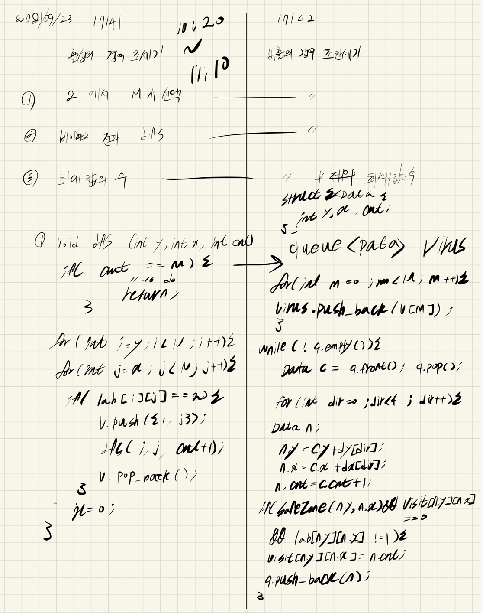

## 2021.09.23_17141-연구소2_17142-연구소3

## 소스코드 | 17141

```c++
#include<stdio.h>
#include<iostream>
#include<vector>
#include<string.h>
#include<algorithm>
#include<queue>
using namespace std;
#define SIZE 51
int N, M;// 배열크기, 바이러스 선택
int answer;//결과값
int lab[SIZE][SIZE];//바이러스 상태 표시
int dy[] = { 0,1,0,-1 };
int dx[] = { 1,0,-1,0 };
struct Data {
	int y, x, cnt;
};
vector<Data>v;

void init();//초기화
void dfs(Data c);
bool safeZone(int y, int x);//범위 체크
int main(void) {
	int testCase = 1;
	for (int tc = 1; tc <= testCase; tc++) {
		init();
		dfs({0,0,0});
		printf("%d\n", answer!=0x7fffffff?answer-1:-1);
	}
	return 0;
}
void init() {
	N = M = 0;
	answer = 0x7fffffff;
	scanf("%d %d", &N, &M);
	for (int i = 0; i < N; i++) {
		for (int j = 0; j < N; j++) {
			scanf("%d", &lab[i][j]);
		}
	}
}
void dfs(Data c) {
	if (c.cnt == M) {
		queue<Data>q;
		int visit[SIZE][SIZE] = { 0, };
		for (int m = 0; m < M; m++) {
			q.push(v[m]);
			visit[v[m].y][v[m].x] = 1;
		}
		while (!q.empty()) {
			Data current = q.front(); q.pop();
			for (int dir = 0; dir < 4; dir++) {
				Data next;
				next.y = current.y + dy[dir]; next.x = current.x + dx[dir];
				next.cnt = current.cnt + 1;
				if (safeZone(next.y, next.x) && visit[next.y][next.x] == 0 && lab[next.y][next.x] != 1) {
					visit[next.y][next.x] = next.cnt;
					q.push(next);
				}
			}
		}
		int maxSecond = 0x80000000;
		for (int i = 0; i < N; i++) {//17141 문제 해답
			for (int j = 0; j < N; j++) {
				if (visit[i][j] != 0) {
					maxSecond = max(maxSecond, visit[i][j]);
				}
				else if (visit[i][j] == 0 && lab[i][j] == 0)return;
			}
		}
		answer = min(answer, maxSecond);
;		return;
	}
	for (int i = c.y; i < N; i++) {
		for (int j = c.x; j < N; j++) {
			if (lab[i][j] == 2) {
				v.push_back({ i,j,1});
				dfs({ i,j+1,c.cnt+1 });
				v.pop_back();
			}
		}
		c.x = 0;
	}
}
bool safeZone(int y, int x) {
	return 0 <= y && y < N && 0 <= x && x < N;
}
```

## 소스코드 | 17142

```c++
#include<stdio.h>
#include<iostream>
#include<vector>
#include<string.h>
#include<algorithm>
#include<queue>
using namespace std;
#define SIZE 51
int N, M;// 배열크기, 바이러스 선택
int answer;//결과값
int lab[SIZE][SIZE];//바이러스 상태 표시
int dy[] = { 0,1,0,-1 };
int dx[] = { 1,0,-1,0 };
struct Data {
	int y, x, cnt;
};
vector<Data>v;

void init();//초기화
void dfs(Data c);
bool safeZone(int y, int x);//범위 체크
int main(void) {
	int testCase = 1;
	for (int tc = 1; tc <= testCase; tc++) {
		init();
		dfs({0,0,0});
		if (answer==0x80000000)answer = 1;
		printf("%d\n", answer!=0x7fffffff?answer-1:-1);
	}
	return 0;
}
void init() {
	N = M = 0;
	answer = 0x7fffffff;
	scanf("%d %d", &N, &M);
	for (int i = 0; i < N; i++) {
		for (int j = 0; j < N; j++) {
			scanf("%d", &lab[i][j]);
		}
	}
}
void dfs(Data c) {
	if (c.cnt == M) {
		queue<Data>q;
		int visit[SIZE][SIZE] = { 0, };
		for (int m = 0; m < M; m++) {
			q.push(v[m]);
			visit[v[m].y][v[m].x] = 1;
		}
		while (!q.empty()) {
			Data current = q.front(); q.pop();
			for (int dir = 0; dir < 4; dir++) {
				Data next;
				next.y = current.y + dy[dir]; next.x = current.x + dx[dir];
				next.cnt = current.cnt + 1;
				if (safeZone(next.y, next.x) && visit[next.y][next.x] == 0 && lab[next.y][next.x] != 1) {
					visit[next.y][next.x] = next.cnt;
					q.push(next);
				}
			}
		}
		int maxSecond = 0x80000000;
		//for (int i = 0; i < N; i++) {//17141 문제 해답
		//	for (int j = 0; j < N; j++) {
		//		if (visit[i][j] != 0) {
		//			maxSecond = max(maxSecond, visit[i][j]);
		//		}
		//		else if (visit[i][j] == 0 && lab[i][j] == 0)return;
		//	}
		//}
		for (int i = 0; i < N; i++) {//17142 문제 해답
			for (int j = 0; j < N; j++) {
				if (visit[i][j] != 0&&lab[i][j]!=2) {
					maxSecond = max(maxSecond, visit[i][j]);
				}
				else if (visit[i][j] == 0 && lab[i][j] == 0)return;
			}
		}
		answer = min(answer, maxSecond);
		return;
	}
	for (int i = c.y; i < N; i++) {
		for (int j = c.x; j < N; j++) {
			if (lab[i][j] == 2) {
				v.push_back({ i,j,1});
				dfs({ i,j+1,c.cnt+1 });
				v.pop_back();
			}
		}
		c.x = 0;
	}
}
bool safeZone(int y, int x) {
	return 0 <= y && y < N && 0 <= x && x < N;
}
```

## 비교

		for (int i = 0; i < N; i++) {//17141 문제 해답
			for (int j = 0; j < N; j++) {
				if (visit[i][j] != 0) {
					maxSecond = max(maxSecond, visit[i][j]);
				}
				else if (visit[i][j] == 0 && lab[i][j] == 0)return;
			}
		}
		
		for (int i = 0; i < N; i++) {//17142 문제 해답
			for (int j = 0; j < N; j++) {
				if (visit[i][j] != 0&&lab[i][j]!=2) {
					maxSecond = max(maxSecond, visit[i][j]);
				}
				else if (visit[i][j] == 0 && lab[i][j] == 0)return;
			}
		}

- 다른점은 딱하나 비활성인것을 초에 포함하는지 안하는지 차이임

## 설계



## 실수 

```
4 2
1 1 1 1
1 2 2 1
1 1 1 1 
1 1 1 1
```

- 위의 경우 결과값을 제대로 처리를 안하는 실수를 함
- 이경우 정말 실전에서 만나게 되면 왜 틀린지 모르고 실수하는 부분이니 참고하기

## 문제링크

[17141-연구소2](https://www.acmicpc.net/problem/17141)

[17142-연구소3](https://www.acmicpc.net/problem/17142)

## 원본

