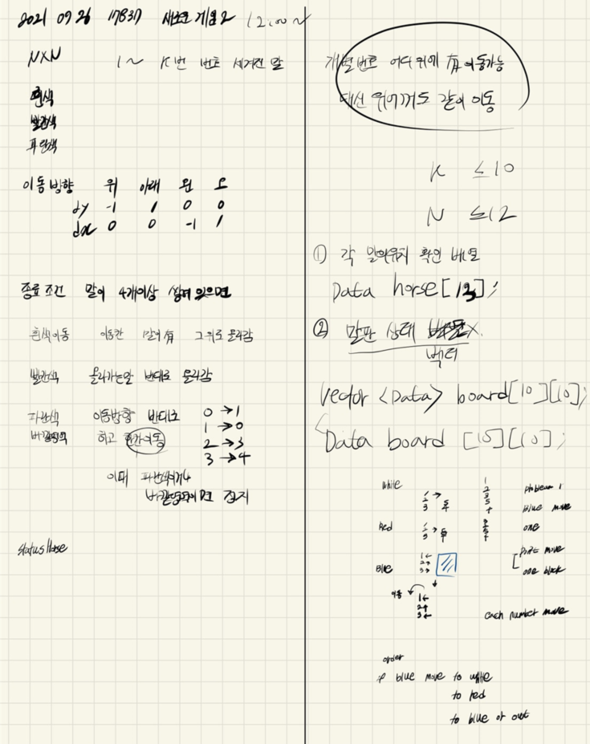

## 2021.09.26_17837-새로운게임2

## 소스코드

```c++
#include<stdio.h>
#include<iostream>
#include<string.h>
#include<vector>
using namespace std;
#define SIZE 13
#define WHITE 0
#define RED 1
#define BLUE 2
struct Data {
	int y, x, dir;
};

int colorBoard[SIZE][SIZE];
int dy[] = { 0,0,-1,1 };
int dx[] = { 1,-1,0,0 };
Data horse[13];
vector<int>board[SIZE][SIZE];

int N, K;//배열의 크기, 말의 개수
int answer;//결과값

bool safeZone(int y, int x);//범위 체크

void init();//초기화
void gameStart();//시뮬레이션 시작
int white(int number, int y, int x, int dir);//흰색블록
int red(int number, int y, int x, int dir);//빨간블록
int blue(int number, int y, int x, int dir);//파란블록
int chk() {
	
	for (int i = 0; i < N; i++) {
		for (int j = 0; j < N; j++) {
			if (board[i][j].size() >= 4) {
				return 1;
			}
		}
	}
	return 0;
}
int main(void) {
	int testCase = 1;
	for (int tc = 1; tc <= testCase; tc++) {
		init();
		gameStart();
		printf("%d\n", answer);
	}
	return 0;
}

void init() {
	N = K = answer = 0;
	memset(colorBoard, 0, sizeof(colorBoard));
	memset(horse, 0, sizeof(horse));
	for (int i = 0; i < SIZE; i++) {
		for (int j = 0; j < SIZE; j++) {
			board[i][j].clear();
		}
	}
	scanf("%d %d", &N, &K);
	for (int i = 0; i < N; i++) {
		for (int j = 0; j < N; j++) {
			scanf("%d", &colorBoard[i][j]);
		}
	}
	for (int k = 1; k <= K; k++) {
		scanf("%d %d %d", &horse[k].y, &horse[k].x, &horse[k].dir);
		horse[k].dir--;
		board[--horse[k].y][--horse[k].x].push_back(k);
	}
}
bool safeZone(int y, int x) {
	return 0 <= y && y < N && 0 <= x && x < N;
}
void gameStart() {
	int flag = 0;
	while(1) {
		answer++;
		if (answer == 1001) {
			answer = -1;
			break;
		}
		for (int k = 1; k <= K; k++) {
			Data n;
			n.y = horse[k].y + dy[horse[k].dir];
			n.x = horse[k].x + dx[horse[k].dir];
			if (!safeZone(n.y,n.x)||colorBoard[n.y][n.x] == BLUE) {
				if (blue(k, horse[k].y, horse[k].x, horse[k].dir)) {
					flag = 1;
					break;
				}
			}
			
			else if (colorBoard[n.y][n.x] == RED) {
				if(red(k, horse[k].y, horse[k].x, horse[k].dir)) {
				flag = 1;
				break;
				}
			}
			else if(colorBoard[n.y][n.x] == WHITE) {
				if (white(k, horse[k].y, horse[k].x, horse[k].dir)) {
					flag = 1;
					break;
				}
			}
			if (flag)break;
			if (chk())break;
		}
		if (chk())break;
		if (flag)break;
	}
}
int white(int number, int y, int x, int dir) {
	Data n;
	n.y = y + dy[dir];
	n.x = x + dx[dir];
	int flag = 0;
	for (int i = 0; i < board[y][x].size(); i++) {
		if (board[y][x][i] == number || flag) {
			flag = 1;
			board[n.y][n.x].push_back(board[y][x][i]);//변경
			horse[board[y][x][i]].y = n.y;
			horse[board[y][x][i]].x = n.x;
			board[y][x].erase(board[y][x].begin()+i); //삭제
			i--;
		}
	}
	if (board[n.y][n.x].size() >= 4)return 1;
	return 0;
}
int red(int number, int y, int x, int dir) {
	Data n;
	n.y = y + dy[dir];
	n.x = x + dx[dir];
	if (board[n.y][n.x].size() >= 4)return 1;
	int flag = 0;
	vector<int>num;
	for (int i = 0; i < board[y][x].size(); i++) {
		if(board[y][x].size()==0)break;
		if (board[y][x][i] == number || flag) {
			flag = 1;
			num.push_back(board[y][x][i]);//번호저장
			horse[board[y][x][i]].y = n.y;
			horse[board[y][x][i]].x = n.x;
			board[y][x].erase(board[y][x].begin()+i); //삭제
			i--;
		}
	}
	for (int i = num.size() - 1; i >= 0; i--) {
		board[n.y][n.x].push_back(num[i]);//변경
	}
	if (board[n.y][n.x].size() >= 4)return 1;
	return 0;
}
int blue(int number, int y, int x, int dir) {
	Data n;
	if (0 == dir)dir = 1;
	else if (1 == dir)dir = 0;
	else if (2 == dir)dir = 3;
	else if (3 == dir) dir = 2;
	n.y = y + dy[dir];
	n.x = x + dx[dir];
	horse[number].dir = dir;//방향 변경
	if (!safeZone(n.y, n.x) || colorBoard[n.y][n.x] == BLUE) {
		return 0;
	}
	if (colorBoard[n.y][n.x] == RED)red(number, y, x, dir);
	else if (colorBoard[n.y][n.x] == WHITE)white(number, y, x, dir);
	return 0;
}

```

## 설계



## 실수

- 실수한 부분 제거할때 그위치의 벡터값을 지워야하는데 제대로 안지움
- 혹시나 항상 벡터 지울때 실수하는것은 사이즈가 0인경우 포문을 돌지 못하게해야함 
  - 간혹 이것때문에 에러생김
- 13%에서 계속 틀렸는데 문제는 전체적으로 나왔을때 4개 이상인 경우가 있는데 이것을 체크 안하고 넘어가서 생기는 오류였음
- 다행히 설계상 오류는 없었음

## 문제링크

[17837-새로운게임2](https://www.acmicpc.net/problem/17837)

## 원본

