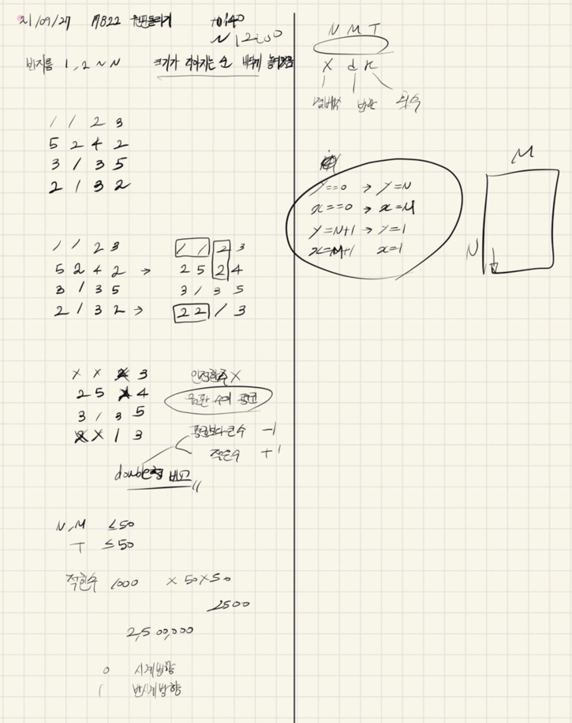

## 2021.09.27_17822-원판돌리기

## 소스코드

```c++
#include<stdio.h>
#include<iostream>
#include<vector>
#include<string.h>
using namespace std;
#define SIZE 51
int N, M, T;//입력 N,M, 테스트 수
int answer;//결과값
int dy[] = { 0,1,0,-1 };
int dx[] = { 1,0,-1,0 };
int circle[SIZE][SIZE];
int visit[SIZE][SIZE];//방문체크
void init();//초기화 부분
void play();//시뮬레이션 부분
void clock(int num, int cnt);//시계방향 
void clockReverse(int num, int cnt);//반시계방향
void dfs(int y, int x, int num);

int main(void) {
	int testCase = 1;
	for (int tc = 1; tc <= testCase; tc++) {
		init();
		play();
		printf("%d\n", answer);
	}
	return 0;
}
void init() {
	scanf("%d %d %d", &N, &M, &T);
	memset(circle, 0, sizeof(circle));
	for (int i = 1; i <= N; i++) {
		for (int j = 1; j <= M; j++) {
			scanf("%d", &circle[i][j]);
		}
	}
}
int flag = 0;
void dfs(int y, int x, int num) {
	for (int dir = 0; dir < 4; dir++) {
		int ny = y + dy[dir];
		int nx = x + dx[dir];
		if (ny == 0)continue;
		else if (ny == N + 1)continue;
		else if (nx == 0)nx = M;
		else if (nx == M + 1)nx = 1;
		if (visit[ny][nx] == 0 && circle[ny][nx] == num) {
			flag = 1;
			visit[ny][nx] = 1;
			dfs(ny, nx, num);
		}
	}
}
void play() {
	for (int t = 1; t <= T; t++) {
		int x, d, k;
		scanf("%d %d %d", &x, &d, &k);
		if (d == 0) {
			clock(x, k);


		}
		else if (d == 1) {
			clockReverse(x, k);

		}
		memset(visit, 0, sizeof(visit));
		for (int i = 1; i <= N; i++) {
			for (int j = 1; j <= M; j++) {
				if (visit[i][j] == 0&&circle[i][j]!=0) {
					flag = 0;
					visit[i][j] = 1;
					dfs(i, j, circle[i][j]);
					if (flag == 0) visit[i][j] = 0;
				}
			}
		}

		double sum = 0;
		int cnt = 0;
		for (int i = 1; i <= N; i++) {
			for (int j = 1; j <= M; j++) {
				if (visit[i][j] == 1) {
					flag = 1;
					circle[i][j] = 0;
				}
				if (circle[i][j] != 0) {
					sum += circle[i][j];
					cnt++;
				}
			}
		}
		if (flag == 0) {
			double avgNumber = sum / cnt;
			for (int i = 1; i <= N; i++) {
				for (int j = 1; j <= M; j++) {
					if (circle[i][j] != 0) {
						if (circle[i][j] < sum / cnt) circle[i][j]++;
						else if (circle[i][j] > sum / cnt)circle[i][j]--;
					}
				}
			}
		}//if
	}
	for (int i = 1; i <= N; i++) {
		for (int j = 1; j <= M; j++) {
			answer += circle[i][j];
		}
	}
}
void clock(int num, int cnt) {
	for (int n = 1; n <= N; n++) {
		if (n%num == 0) {
			for (int c = 0; c < cnt; c++) {
				int saveNum = circle[n][M];
				for (int i = M; i >= 2; i--) {
					circle[n][i] = circle[n][i - 1];
				}
				circle[n][1] = saveNum;
			}
		}
	}
}
void clockReverse(int num, int cnt) {
	for (int n = 1; n <= N; n++) {
		if (n%num == 0) {
			for (int c = 0; c < cnt; c++) {
				int saveNum = circle[n][1];
				for (int i = 1; i <= M - 1; i++) {
					circle[n][i] = circle[n][i + 1];
				}
				circle[n][M] = saveNum;
			}
		}
	}
}
```

## 설계



## 실수

- 여러번 회전 시키지 않은점
- 그리고 여기서는 가장 중요한것은 double sum으로 데이터 저장해서 개수로 나눠서 평균을 구해야 제대로 데이터가 들어감


- 저렇게 double형으로 안하고 나누면 3.0인가 나와서 결과가 달라지는데 이때 다들 당황할듯
  - 설계는 제대로 하고 저기 자료형 때문에 틀리면 억울하니 잘 알아둘것

## 문제링크

[17822-원판돌리기](https://www.acmicpc.net/problem/17822)

## 원본


