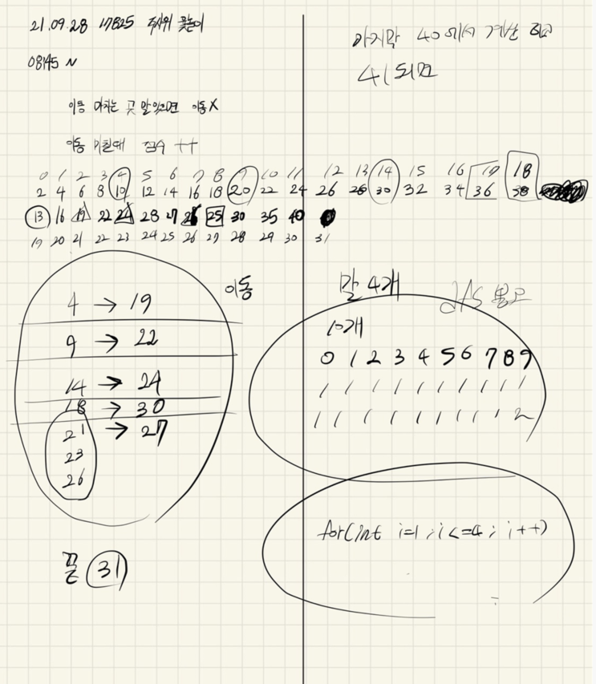

## 2021.09.28_17825_주사위윷놀이

## 소스코드

```c++
#include<stdio.h>
#include<iostream>
#include<string.h>
#include<vector>
#include<algorithm>
using namespace std;
#define S 10
int cube[S];//주사위나온 수 저장 배열
int ret;//결과값 저장변수
int D[S];//1번말 부터 4번말 까지 존재
int B[33] = { 0,2,4,6,8,10,12,14,16,18,20,22,24,26,28,30,32,34,36,38,40,-1,
			13,16,19,25,22,24,28,27,26,30,35 };//보드의 값 저장
struct Data {
	int idx, pidx;//현재의 인덱스 값과 이전의 인덱스값
};
void init_input() {//초기화 및 초기 입력
	//초기화
	ret = 0x80000000;//최소값 저장
	memset(cube, 0, sizeof(cube));
	memset(D, 0, sizeof(D));
	//초기 입력
	for (int i = 0; i < 10; i++) {
		scanf("%d", &cube[i]);
	}
}
void dfs(int idx, int cnt) {//1. 순열 로 말의 순서 정하기(o)
	if (cnt == 10) {
		int sum = 0;//값 저장
		Data horse_info[5] = { 0, };
		for (int i = 0; i < 10; i++) {//말의 순서대로 시작
			int num = D[i];//말의 숫자
			for (int j = 0; j < cube[i]; j++) {//말의 이동시작
				//3. 마지막칸 도착시 말이동 정지 시키기
				if (horse_info[num].pidx == -1)continue;
				if (horse_info[num].pidx != 0) {//위치 이동 시키기 특수한 칸에서
					horse_info[num].idx = horse_info[num].pidx;//위치 이동
					horse_info[num].pidx = 0;
				}
				else if (horse_info[num].pidx != -1) {//+1씩 가도되는 칸에서의 이동
					horse_info[num].idx++;
				}
				if (horse_info[num].idx == 27)horse_info[num].pidx = 25;//24->25
				else if (horse_info[num].idx == 30)horse_info[num].pidx = 25;//26->25
				else if (horse_info[num].idx == 25)horse_info[num].pidx = 31;//25->30
				else if (horse_info[num].idx == 32) horse_info[num].pidx = 20;//35->40
				else if (horse_info[num].idx == 21)	horse_info[num].pidx = -1;//40->도착

			}
			//2. 이동의 마지막에 말이 있는지 확인해서 그 경우의 전체를 리턴할지 그말만 리턴할지생각
			for (int h = 1; h <= 4; h++) {
				if (h!=num&&horse_info[num].idx != 0 && horse_info[num].pidx != -1 &&
					horse_info[h].idx == horse_info[num].idx) {
					return;//전체 리턴시키기
				}
			}
			if(horse_info[num].pidx!=-1) sum += B[horse_info[num].idx];//점수 저장

			//파란 부분에 멈추면 그방향으로 이동 시키기 위함 
			if (horse_info[num].idx == 5) horse_info[num].pidx = 22;//10->13
			else if (horse_info[num].idx == 10)horse_info[num].pidx = 26;//20->22
			else if (horse_info[num].idx == 15) horse_info[num].pidx = 28;//30->28

		}
		//4. 시뮬 종료시 점수의 최대값 비교해서 ret 에 저장하기
		ret = max(ret, sum);
		return;
	}
	for (int i = 1; i <= 4; i++) {
		if (D[idx] == 0) {
			D[idx] = i;
			dfs(idx + 1, cnt + 1);
			D[idx] = 0;
		}
	}

}
void play() {
	dfs(0, 0);
}
int main(void) {
	int T = 1;//테스트 케이스 개수
	//scanf("%d", &T);
	for (int tc = 1; tc <= T; tc++) {
		init_input();//초기화 및 초기 입력
		play();//게임 시작
		//출력
		printf("%d\n", ret); //printf("#%d %d\n", tc, ret);
	}
	return 0;
}
```

## 설계



## 실수

- 설계 실수 
- 마지막 값에 대해서 어떻게 처리 할지에 대해서 
- 변수명 실수 
- 이문제의 경우 복잡하기 보다는 설계를 할것이 많아서 실수 하기 쉽다 다시 풀어볼것

## 문제링크

[17825-주사위윷놀이](https://www.acmicpc.net/problem/17825)

## 원본

