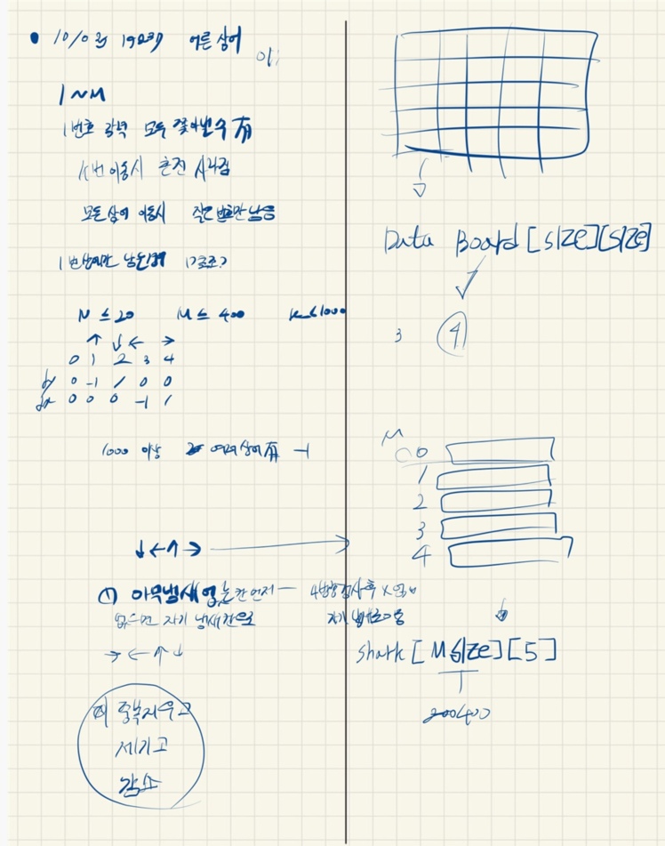

## 2021.10.03_19237-어른상어

## 소스코드

```c++
#include<stdio.h>
#include<iostream>
#include<vector>
#include<string.h>
using namespace std;
#define NSIZE 21
#define MSIZE 401

struct Data {
	int num,cnt;
};
struct Pos {
	int y, x,dir;
};
int answer;//결과값 저장
int N, M, K;
int board[NSIZE][NSIZE];
Data boardInfo[NSIZE][NSIZE];//상태 확인
int dy[] = { 0,-1,1,0,0 };
int dx[] = { 0,0,0,-1,1 };
int sharkDir[MSIZE][5][5];//상어 각 방향 정보 저장
Pos shark[MSIZE];
bool chkOne();
void init();//초기화 및 초기 입력
void moveShark();//상어 이동
bool safeZone(int y, int x);//범위 체크
int main(void) {
	int testCase = 1;
	for (int tc = 1; tc <= testCase; tc++) {
		init();
		moveShark();
		if (answer == 1001)answer = -1;
		printf("%d\n", answer);
	}
	return 0;
}
bool safeZone(int y, int x) {
	return 0 <= y && y < N && 0 <= x && x < N;
}
bool chkOne() {
	int cnt = 0;
	for (int num = 1; num <= M; num++) {
		if (shark[num].dir == -1)cnt++;
	}
	return cnt == M-1 ? 1 : 0;
}
void moveShark() {
	while (answer <= 1000) {
		answer++;
		for (int num = 1; num <= M; num++) {
			if (shark[num].dir == -1) {
				continue;
			}
			int flag = 0;
			for (int dir = 1; dir <= 4; dir++) {
				
				Pos n;
				n.dir = sharkDir[num][shark[num].dir][dir];
				n.y = shark[num].y + dy[n.dir];
				n.x = shark[num].x + dx[n.dir];
				if (safeZone(n.y, n.x) && boardInfo[n.y][n.x].num == 0) {// 비어있는 공간으로 이동
					flag = 1;
					boardInfo[shark[num].y][shark[num].x].num = num;
					boardInfo[shark[num].y][shark[num].x].cnt = K;
					shark[num] = n;
					break;
				}
			}
			if (flag == 0) {//자기 냄새흔적으로 가기
				for (int dir = 1; dir <= 4; dir++) {
					Pos n;
					n.dir = sharkDir[num][shark[num].dir][dir];
					n.y = shark[num].y + dy[n.dir];
					n.x = shark[num].x + dx[n.dir];
					if (safeZone(n.y, n.x) && boardInfo[n.y][n.x].num ==num) {//냄새 확인
						boardInfo[shark[num].y][shark[num].x].num = num;
						boardInfo[shark[num].y][shark[num].x].cnt = K;
						shark[num] = n;
						break;
					}
				}
			}
		}

		for (int i = 1; i <= M - 1; i++) {
			for (int j = i + 1; j <= M; j++) {
				if (shark[j].dir != -1 && shark[i].y == shark[j].y&&shark[i].x == shark[j].x) {
					shark[j] = { -1,-1,-1 };
				}
			}
		}
		for (int i =  1; i <= M; i++) {
			if (boardInfo[shark[i].y][shark[i].x].cnt != -1) {
				boardInfo[shark[i].y][shark[i].x].cnt = M;
				boardInfo[shark[i].y][shark[i].x].num = i;
			}

		}
		for (int i = 0; i < N; i++) {//향기 축소
			for (int j = 0; j < N; j++) {
				if (boardInfo[i][j].num != 0) {
					boardInfo[i][j].cnt--;
					if (boardInfo[i][j].cnt == 0)boardInfo[i][j].num = 0;
				}
			}
		}

		if (chkOne())break;

	}
}
void init() {
	N = M = answer = 0;
	memset(board, 0, sizeof(board));
	memset(sharkDir, 0, sizeof(sharkDir));
	
	scanf("%d %d %d", &N, &M, &K);
	for (int i = 0; i < N; i++) {
		for (int j = 0; j < N; j++ ) {
			scanf("%d", &boardInfo[i][j].num);
			if (boardInfo[i][j].num != 0) {
				shark[boardInfo[i][j].num].y = i;
				shark[boardInfo[i][j].num].x = j;
			}
		}
	}
	for (int m = 1; m <= M; m++) {//방향 정보입력
		scanf("%d", &shark[m].dir);
	}
	for (int num = 1; num <= M; num++) {
		for (int i = 1; i <= 4; i++) {
			for (int j = 1; j <= 4; j++) {
				scanf("%d", &sharkDir[num][i][j]);
			}
		}
	}
}
```

## 설계



## 실수

- 우선 돌아가게 한다음에 거기서 상어의 데이터를 입력하지 않고 따로 같은 위치에 있는 것을 지우고
  - 입력하고 그 흔적을 1씩 지워야 했음
  - 이부분을 제대로 하지 않아 오래 걸릴뻔함
- 이런 감소하는 문제에서는 순서가 무조건 중요한 그래서 잘 체크해야함

## 문제 링크

[19237-어른상어](https://www.acmicpc.net/problem/19237)

## 원본

