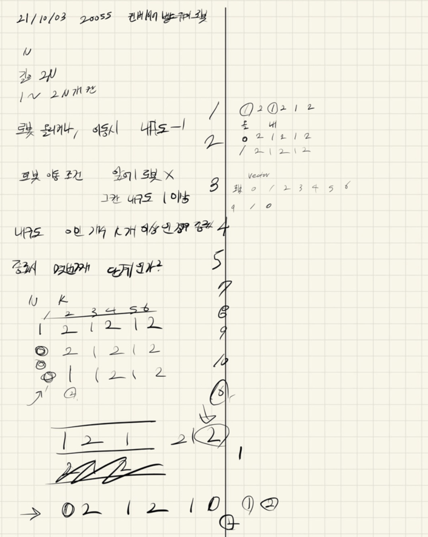

## 2021.10.04_20055-컨베이어벨트위의로봇

## 소스코드

```c++
#include<stdio.h>
#include<iostream>
#include<string.h>
#include<queue>
#include<vector>
using namespace std;
#define SIZE 201
int N, K, A[SIZE];
int answer;
void init();
void moveRobot();
int main(void) {
	int testCase = 1;
	for (int tc = 1; tc <= testCase; tc++) {
		init();
		moveRobot();
		printf("%d\n", answer);
	}
}
void moveRobot() {
	//queue<int>robot;
	int robot[200 * 1000];
	int front = 0, back = 0;
	int zeroCnt = 0;
	while(zeroCnt<K){//	내구도가 0인 칸의 개수가 K개 이상이라면 과정을 종료한다.그렇지 않다면 1번으로 돌아간다.

		answer++;
		//벨트가 각 칸 위에 있는 로봇과 함께 한 칸 회전한다.
		int temp = A[(2 * N)-1];
		for (int i = (2 * N) - 1; i >= 1; i--) {
			A[i] = A[i - 1];
		}
		A[0] = temp;
		for (int i = front; i < back; i++) {
			robot[i]++;
			if (robot[i] == N - 1) {
				front++;
			}
		}
		//	가장 먼저 벨트에 올라간 로봇부터, 벨트가 회전하는 방향으로 한 칸 이동할 수 있다면 이동한다.만약 이동할 수 없다면 가만히 있는다.
		for (int i = front; i < back; ++i) {
			int next = robot[i] + 1;
			if (A[next] == 0 || (i != front && robot[i - 1] == next)) {
				continue;
			}
			robot[i] = next;
			if (robot[i] == N - 1) {
				++front;
			}
			A[next]--;
			if (A[next] == 0) {
				zeroCnt++;
			}
		}
		
		//	로봇이 이동하기 위해서는 이동하려는 칸에 로봇이 없으며, 그 칸의 내구도가 1 이상 남아 있어야 한다.
		//	올리는 위치에 있는 칸의 내구도가 0이 아니면 올리는 위치에 로봇을 올린다.
		if (A[0] > 0 && (back == 0 || robot[back - 1] != 0)) {
			robot[back++] = 0;
			A[0]--;
			if (A[0] == 0) {
				zeroCnt++;
			}
		}
	}
}
void init() {
	N = K = answer = 0;
	memset(A, 0, sizeof(A));
	scanf("%d %d", &N, &K);
	for (int i = 0; i < N*2; i++) {
		scanf("%d", &A[i]);
	}
}
```

## 설계



## 문제 링크

[20055-컨베이어벨트위의로봇](https://www.acmicpc.net/problem/20055)

## 원본

