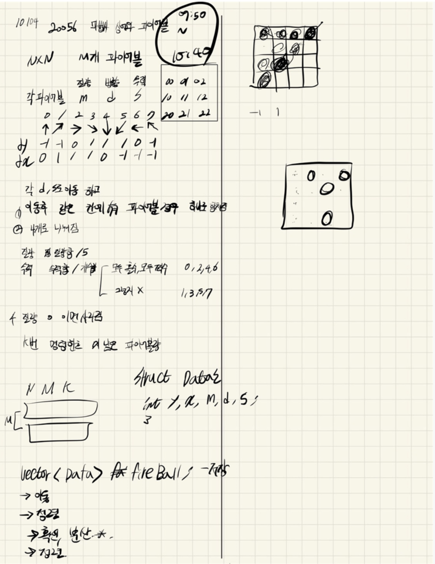

## 2021.10.05_20056-마법사상어와파이어볼

## 소스코드1

```
#include<stdio.h>
#include<iostream>
#include<vector>
#include<string.h>
#include<algorithm>
using namespace std;
#define SIZE 51
struct Data {
	int y, x, m, d, s;
};
vector<Data>fireBall;
int N, M, K, answer;
int dy[] = { -1,-1,0,1,1,1,0,-1 };
int dx[] = { 0,1,1,1,0,-1,-1,-1 };
void init();//초기화 및 초기입력
void moveFireBall();//파이어볼 이동
void solve();//결과값 산출
bool cmp(Data a, Data b) {
	if (a.y == b.y)return a.x < b.x;
	return a.y < b.y;
}
int main(void) {
	int testCase = 1;
	for (int tc = 1; tc <= testCase; tc++) {
		init();
		moveFireBall();
		printf("%d\n", answer);
	}
	return 0;
}

void init() {
	N = M = K = answer = 0;
	fireBall.clear();
	scanf("%d %d %d", &N, &M, &K);
	for (int m = 0; m < M; m++) {
		Data c;
		scanf("%d %d %d %d %d", &c.y, &c.x, &c.m, &c.s, &c.d);
		c.y--;
		c.x--;
		fireBall.push_back(c);
	}
}

void solve() {
	for (int i = 0; i < fireBall.size(); i++) {
		answer += fireBall[i].m;
	}
}
void moveFireBall() {
	while (K--) {
		for (int i = 0; i < fireBall.size(); i++) {//파이어볼 이동
			Data c = fireBall[i];
			Data n = c;
			n.y = (c.y + (dy[c.d] * c.s%N) + N) % N;
			n.x = (c.x + (dx[c.d] * c.s%N) + N) % N;
			fireBall[i] = n;
		}
		//for (int i = 0; i < fireBall.size(); ++i) {
		//	int dir = fireBall[i].d;
		//	int speed = (fireBall[i].s % N);
		//	int ny = (fireBall[i].y + (dy[dir] * speed) + N) % N;
		//	int nx = (fireBall[i].x + (dx[dir] * speed) + N) % N;
		//	fireBall[i].y = ny;
		//	fireBall[i].x = nx;
		//}
		vector < int > map[50][50];

		for (int i = 0; i < fireBall.size(); i++) {
			map[fireBall[i].y][fireBall[i].x].push_back(i);
		}

		int flag = 0;
		//sort(fireBall.begin(), fireBall.end(), cmp);//정렬
		vector<Data>copyfire;

		vector < Data > new_ball;
		for (int y = 0; y < N; ++y) {
			for (int x = 0; x < N; ++x) {
				if (map[y][x].size() == 0) {
					continue;
				}
				if (map[y][x].size() == 1) {
					int index = map[y][x][0];
					new_ball.push_back(fireBall[index]);
					continue;
				}
				int sum_m = 0,
					sum_s = 0;
				bool odd = true,
					even = true;
				for (int i = 0; i < map[y][x].size(); ++i) {
					int index = map[y][x][i];
					sum_m += fireBall[index].m;
					sum_s += fireBall[index].s;
					if (fireBall[index].d % 2 == 0) {
						odd = false;
					}
					else {
						even = false;
					}
				}
				if (sum_m / 5 == 0) {
					continue;
				}
				int cur_m = sum_m / 5;
				int cur_s = sum_s / map[y][x].size();
				for (int i = 0; i < 4; ++i) {
					if (odd || even) {
						new_ball.push_back({
							y,
							x,
							cur_m,
							i * 2,
							cur_s
							});
					}
					else {
						new_ball.push_back({
							y,
							x,
							cur_m,
							i * 2 + 1,
							cur_s
							});
					}
				}
			}
		}
		fireBall = new_ball;

	}
	solve();
}
```


## 소스코드 2

```c++
#include<stdio.h>
#include<iostream>
#include<vector>
#include<string.h>
#include<algorithm>
using namespace std;
#define SIZE 51
struct Data {
	int y, x, m, d, s;
};
vector<Data>fireBall;
int N, M, K, answer;
int dy[] = { -1,-1,0,1,1,1,0,-1 };
int dx[] = { 0,1,1,1,0,-1,-1,-1 };
void init();//초기화 및 초기입력
void moveFireBall();//파이어볼 이동
void solve();//결과값 산출
bool cmp(Data a, Data b) {
	if (a.y == b.y)return a.x < b.x;
	return a.y < b.y;
}
int main(void) {
	int testCase = 1;
	for (int tc = 1; tc <= testCase; tc++) {
		init();
		moveFireBall();
		printf("%d\n", answer);
	}
	return 0;
}

void init() {
	N = M = K = answer = 0;
	fireBall.clear();
	scanf("%d %d %d", &N, &M, &K);
	for (int m = 0; m < M; m++) {
		Data c;
		scanf("%d %d %d %d %d", &c.y, &c.x, &c.m, &c.s, &c.d);
		c.y--;
		c.x--;
		fireBall.push_back(c);
	}
}

void solve() {
	for (int i = 0; i < fireBall.size(); i++) {
		answer += fireBall[i].m;
	}
}
void moveFireBall() {
	while (K--) {
		for (int i = 0; i < fireBall.size(); i++) {//파이어볼 이동
			Data c = fireBall[i];
			Data n = c;
			n.y = (c.y + (dy[c.d] * c.s%N) + N) % N;
			n.x = (c.x + (dx[c.d] * c.s%N) + N) % N;
			fireBall[i] = n;
		}
		int flag = 0;
		sort(fireBall.begin(), fireBall.end(), cmp);//정렬
		vector<Data>copyfire;

		int size = fireBall.size();
		for (int i = 0; i < fireBall.size() - 1; i++) {
			flag = 0;
			if (fireBall.size() == 0)break;
			for (int j = i + 1; j < fireBall.size(); j++) {
				if (fireBall.size() == 0)break;
				int cnt = 1;
				int odd = 0, even = 0;//홀 짝
				if (fireBall[i].d % 2 == 0)even++;
				else odd++;
				Data saveData = fireBall[i];
				while (j != fireBall.size() && fireBall[i].y == fireBall[j].y&&fireBall[i].x == fireBall[j].x) {
					if (fireBall.size() == 0)break;
					flag = 1;
					saveData.m += fireBall[j].m;
					saveData.s += fireBall[j].s;
					if (fireBall[j].d % 2 == 0)even++;//짝 , 홀 검증
					else odd++;

					cnt++;
					fireBall.erase(fireBall.begin() + j);
				}
				if (cnt != 1) {
					fireBall.erase(fireBall.begin() + i);
					i--;
					Data c = saveData;
					int sM = c.m / 5;
					int sS = c.s / cnt;
					if (sM != 0) {
						Data n;
						if (odd == cnt || even == cnt) {//방향 0,2,4,6
							for (int dir = 0; dir <= 6; dir += 2) {
								copyfire.push_back({ c.y,c.x,sM,dir,sS });
							}
						}
						else {//방향 1,3,5,7
							for (int dir = 1; dir <= 7; dir += 2) {
								copyfire.push_back({ c.y,c.x,sM,dir,sS });
							}
						}
					}
					break;
				}
				if (flag == 0)break;
			}
		}//2개이상 걸러주기
		while (!copyfire.empty()) {// 다시 저장
			fireBall.push_back({ copyfire.front() }); copyfire.erase(copyfire.begin());
		}

	}
	solve();
}
```


## 설계



## 실수

- 속도차이가 많이 나는데 지우고 하는 부분을 좀더 정확한 방법으로 구현해야겠다.
- 이문제에서 실수 한것은 단계가 무조건 4개가 퍼지는것이 아니고 우선 4개가 한군데 있다가 
  - move에서만 움직일 수 있음, 단지 저장만 해야함
- 그리고 속도를 N의 크기만큼 %N해서 바꿨는데 이부분이 에러가 있었음 무조건 바꾸지 말고 계산 할때만 사용할것
- 제일 중요한것은 중복 위치에 있을때 어떻게 빠르게 구현할지가 포인트

## 문제링크

[20056-마법사상어와파이어볼](https://www.acmicpc.net/problem/20056)

## 원본

