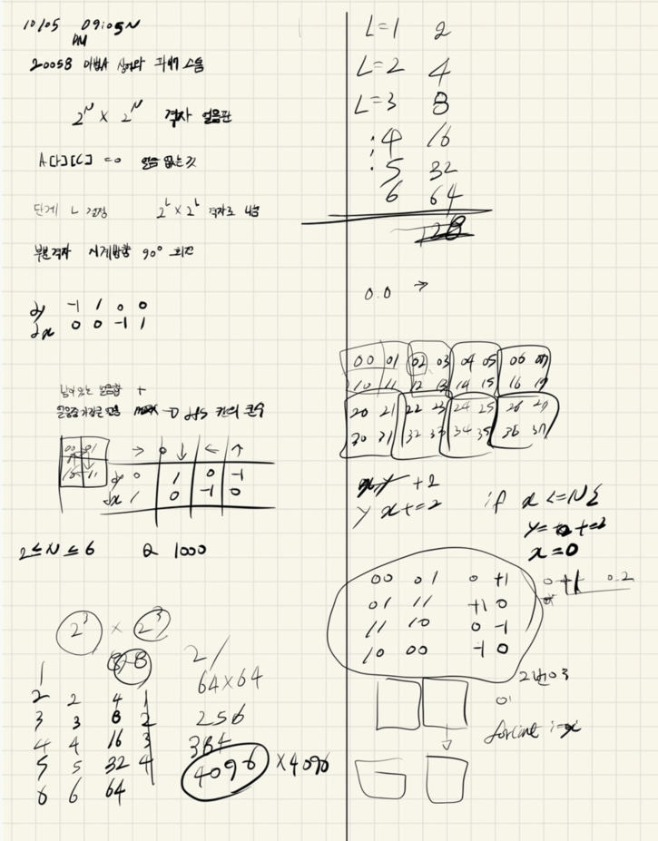
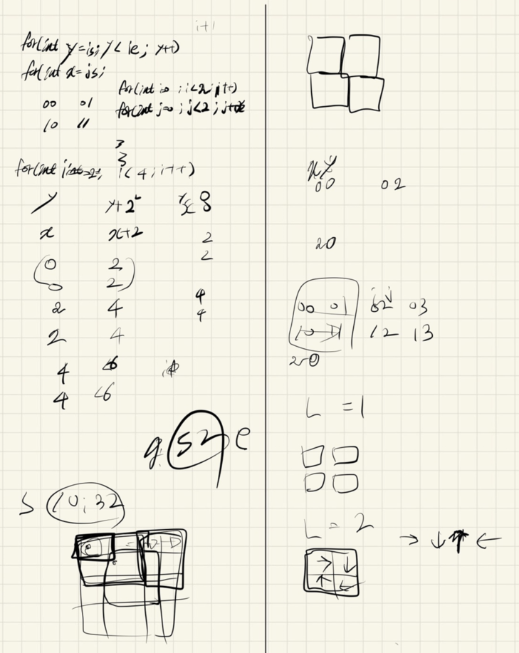
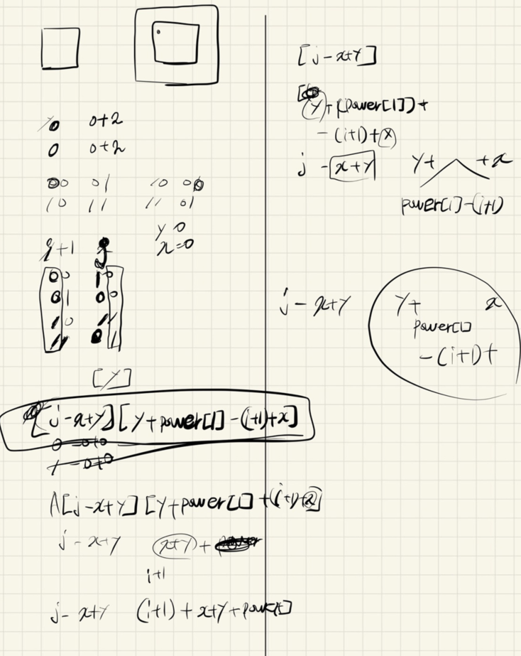

## 2021.10.05_20058-마법사상어와파이어스톰

## 소스코드

```c++
#include<stdio.h>
#include<iostream>
#include<vector>
#include<string.h>
#include<algorithm>
using namespace std;
#define SIZE 64
int N, Q, answer,sum;
int A[SIZE][SIZE];
int power[] = { 1,2,4,8,16,32,64,128,256,512 };
void init();//초기화 및 초기 입력
bool safe(int y, int x);// 범위 체크
void fire();// 파이어 스톰
void melt();// 녹이기
void dfs(int y, int x, int cnt);// 범위체크

int dy[] = { -1,1,0,0 };
int dx[] = { 0,0,-1,1 };
int visit[SIZE][SIZE];//방문체크
int main(void) {
	int testCase = 1;
	for (int tc = 1; tc <= testCase; tc++) {
		init();
		fire();
		printf("%d\n%d\n", sum,answer!=0x80000000?answer+1:0);
	}
	return 0;
}
bool safe(int y, int x) {
	return 0 <= y && y < power[N] && 0 <= x && x < power[N];
}
void rotate(int y, int x, int l) {
	int tempA[SIZE][SIZE]; // 기존 2^L * 2^L 격자 복사
	for (int i = y; i < y + power[l]; i++) {
		for (int j = x; j < x + power[l]; j++) {
			tempA[i][j] = A[i][j];
		}
	} // 회전시키는 알고리즘 
	for (int i = y; i < y + power[l]; i++) {
		for (int j = x; j < x + power[l]; j++) {
			A[j - x + y][y + power[l] - (i + 1) + x] = tempA[i][j];

		}
	}
}
void melt() {
	int tempA[SIZE][SIZE] = { 0, }; // 기존 2^L * 2^L 격자 복사
	for (int i = 0; i < power[N]; i++) {
		for (int j = 0; j < power[N]; j++) {
			if (A[i][j] == 0)continue;
			int cnt = 0;
			for (int dir = 0; dir < 4; dir++) {
				int y = i + dy[dir];
				int x = j + dx[dir];
				if (safe(y, x) && A[y][x] !=0) {
					cnt++;
				}
			}
			if (cnt < 3)tempA[i][j]--;
		}
	}
	for (int i = 0; i < power[N]; i++) {
		for (int j = 0; j < power[N]; j++) {
			A[i][j] += tempA[i][j];
			if (A[i][j] <= 0)A[i][j] = 0;
		}
	}
}
int c = 0;
void dfs(int y, int x, int cnt) {
	for (int dir = 0; dir < 4; dir++) {
		int ny = y + dy[dir]; int nx = x + dx[dir];
		if (safe(ny, nx) && visit[ny][nx] == 0 && A[ny][nx] != 0) {
			c++;
			visit[ny][nx] =cnt;
			dfs(ny, nx, cnt);
		}
	}

}
void fire() {

	for (int q = 1; q <= Q; q++) {
		int L = 0;
		scanf("%d", &L);
		for (int y = 0; y < power[N]; y += power[L]) {
			for (int x = 0; x < power[N]; x += power[L]) {
				rotate(y, x, L);
			}
		}
		melt();
	}
	memset(visit, 0, sizeof(visit));
	for (int i = 0; i < power[N]; i++) {
		for (int j = 0; j < power[N]; j++) {
			if (visit[i][j] == 0 && A[i][j] != 0) {
				visit[i][j] = 1;
				dfs(i, j, 1);
				answer = max(answer, c);
				c = 0;
			}
			sum += A[i][j];
		}
	}

}
void init() {
	N = Q = 0;
	sum = 0;
	answer = 0x80000000;
	memset(A, 0, sizeof(A));
	scanf("%d %d", &N, &Q);
	for (int i = 0; i < power[N]; i++) {
		for (int j = 0; j < power[N]; j++) {
			scanf("%d", &A[i][j]);
		}
	}
}
```

## 설계







## 실수

- 이문제의 포인트는 배열을 돌리는 것이다. 진짜 어렵긴한데 이부분만 해결하면 어려운 부분은 아닌것 같다.
- 배열을 돌리는 부분을 제대로 구현할 수 있도록 연습이 필요
- dfs돌릴때 안에서 최대값 구하려고 하지말고 나중에 빠져 나왔을때 최대값을 구하지 않아 잠깐 실수
- 그리고 마지막 출력시 0x80000000일때 0이 나오게 해야하는데 0x7fffffff로 해서 45%에서 틀림
- 이부분 항상 실수 하지 말것

## 문제 링크

[20058-마법사상어와파이어스톰](https://www.acmicpc.net/problem/20058)

## 원본

