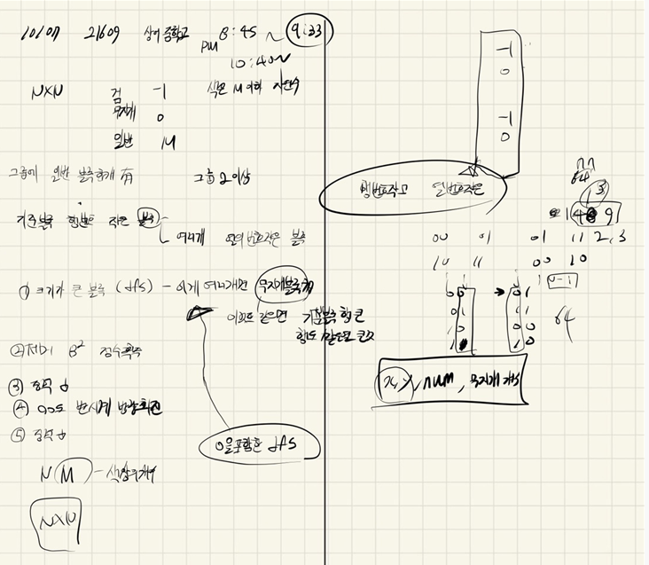

## 2021.10.07_21609-상어중학교

## 소스코드1

```c++
#include<stdio.h>
#include<iostream>
#include<vector>
#include<algorithm>
#include<string.h>
#include<queue>
using namespace std;
#define SIZE 21
int N, M,answer;
int bnum = 1;
int B[SIZE][SIZE];
int visit[SIZE][SIZE] = { 0, };
int raindow, blockCnt;
int dy[] = { 0,1,0,-1 };
int dx[] = { 1,0,-1,0 };
struct Data {
	int y, x, cnt,num,bnum;
};
vector<Data>block;
bool cmp(Data a, Data b) {
	if (a.cnt == b.cnt) {
		if (a.num == b.num) {
			if (a.y == b.y) {
				return a.x > b.x;
			}
			else return a.y > b.y;
		}
		else return a.num > b.num;
	}else return a.cnt > b.cnt;
}
void init();//초기화 및 초기입력
void autoGame();//자동 게임 시작
bool safeZone(int y, int x);
void dfs(int i, int j, int cnt, int num);
void one();//덩어리선택
void two();//제거
//void three();//중력
//void four();//90도 반시계회전

int main(void) {
	int testCase = 1;
	for (int tc = 1; tc <= testCase; tc++) {
		init();
		autoGame();
		printf("%d\n", answer);
	}
	return 0;
}
bool safeZone(int y, int x) {
	return 0 <= y && y < N && 0 <= x && x< N;
}
void dfs(int i, int j, int cnt, int num) {

	for (int dir = 0; dir < 4; dir++) {
		Data n;
		n.y = i + dy[dir]; n.x = j + dx[dir];
		n.cnt = cnt + 1;
		if (safeZone(n.y,n.x)&&visit[n.y][n.x]==0&&(B[n.y][n.x] == -2 || B[n.y][n.x] == num)) {
			if (B[n.y][n.x] ==-2)raindow++;
			blockCnt++;
			visit[n.y][n.x] = bnum;
			dfs(n.y, n.x, n.cnt, num);
		}
	}
}
void one() {
	block.clear();
	for (int i = 0; i < N; i++) {
		for (int j = 0; j < N; j++) {
			memset(visit, 0, sizeof(visit));
			if (B[i][j]!=0&&visit[i][j] == 0 && B[i][j] != -1 && B[i][j] !=-2) {
				raindow = 0; blockCnt = 1;
				bnum++;

				visit[i][j] = bnum;

				dfs(i, j, 1, B[i][j]);
				if (blockCnt == 1) {
					bnum--;
					visit[i][j] = 0;
				}
				if (blockCnt > 1)block.push_back({ i,j,blockCnt,raindow,bnum});
			}
		}
	}
	sort(block.begin(), block.end(), cmp);
}
void two() {
	memset(visit, 0, sizeof(visit));
	bnum = block[0].bnum;
	dfs(block[0].y, block[0].x,1, B[block[0].y][block[0].x]);
	for (int i = 0; i < N; i++) {
		for (int j = 0; j < N; j++) {
			if (visit[i][j] == block[0].bnum) {
				B[i][j] =0;
			}
		}
	}
	answer += block[0].cnt*block[0].cnt;
}
void three() {
	for (int j = 0; j < N; j++) {
		deque<int>q;
		for (int i = 0; i < N; i++) {
			if (B[i][j] != 0 && B[i][j] != -1) {
				q.push_back(B[i][j]);
				B[i][j] = 0;
			}
			if (B[i][j] == -1 ) {
				int ci = i;
				while (!q.empty()) {
					B[--ci][j] = q.back(); q.pop_back();
				}
			}
		}
		int i = N - 1;
		while (!q.empty()) {
			B[i--][j] = q.back(); q.pop_back();
		}
	}
}
void four() {
	int C[SIZE][SIZE] = { 0, };
	for (int i = 0; i <N; i++) {
		for (int j = 0; j < N; j++) {
			C[i][j] = B[i][j];
		}
	}
	for (int i = 0; i < N; i++) {
		for (int j = 0; j < N; j++) {
			B[i][j] = C[j][N - i-1];
		}
	}
}
void autoGame() {
	while(1) {
		one();
		if (block.size() == 0)break;
		two();
		three();
		four();
		three();
	}
}
void init() {
	N = M = answer = 0;
	bnum = 1;
	memset(B, 0, sizeof(B));
	scanf("%d %d", &N, &M);
	for (int i = 0; i < N; i++) {
		for (int j = 0; j < N; j++) {
			scanf("%d", &B[i][j]);
			if (B[i][j] == 0)B[i][j] = -2;
		}
	}
}
```

## 소스코드2

```c++
#include<stdio.h>
#include<iostream>
#include<vector>
#include<algorithm>
#include<string.h>
#include<queue>
using namespace std;
#define SIZE 21
int N, M,answer;
int bnum = 1;
int B[SIZE][SIZE];
int visit[SIZE][SIZE] = { 0, };
int raindow, blockCnt;
int dy[] = { 0,1,0,-1 };
int dx[] = { 1,0,-1,0 };
struct Data {
	int y, x, cnt,num,bnum;
};
vector<Data>block;
bool cmp(Data a, Data b) {
	if (a.cnt == b.cnt) {
		if (a.num == b.num) {
			if (a.y == b.y) {
				return a.x > b.x;
			}
			else return a.y > b.y;
		}
		else return a.num > b.num;
	}else return a.cnt > b.cnt;
}

void init();//초기화 및 초기입력
void autoGame();//자동 게임 시작
bool safeZone(int y, int x);
void dfs(int i, int j, int cnt, int num);
void one();//덩어리선택
void two();//제거
void three();//중력
void four();//90도 반시계회전

int main(void) {
	int testCase = 1;
	for (int tc = 1; tc <= testCase; tc++) {
		init();
		autoGame();
		printf("%d\n", answer);
	}
	return 0;
}
bool safeZone(int y, int x) {
	return 0 <= y && y < N && 0 <= x && x< N;
}
void dfs(int i, int j, int cnt, int num) {

	for (int dir = 0; dir < 4; dir++) {
		Data n;
		n.y = i + dy[dir]; n.x = j + dx[dir];
		n.cnt = cnt + 1;
		if (safeZone(n.y,n.x) && visit[n.y][n.x]==0&&(B[n.y][n.x] == -2 || B[n.y][n.x] == num)) {
			
			if (B[n.y][n.x] ==-2)raindow++;
			blockCnt++;
			if (B[n.y][n.x] == -2)visit[n.y][n.x] = -6;
			else visit[n.y][n.x] = bnum;
			dfs(n.y, n.x, n.cnt, num);
		}
	}
}

void one() {
	memset(visit, 0, sizeof(visit));
	block.clear();
	for (int i = 0; i < N; i++) {
		for (int j = 0; j < N; j++) {
			if (B[i][j]!=0&&visit[i][j] == 0 && B[i][j] != -1 && B[i][j] !=-2) {
				raindow = 0; blockCnt = 1;
				bnum++;

				visit[i][j] = bnum;

				dfs(i, j, 1, B[i][j]);
				if (blockCnt == 1) {
					bnum--;
					visit[i][j] = 0;
				}
				for (int i = 0; i < N; i++) {
					for (int j = 0; j < N; j++) {
						if (visit[i][j] == -6)visit[i][j] = 0;
					}
				}
				if (blockCnt > 1)block.push_back({ i,j,blockCnt,raindow,bnum});
			}
		}
	}
	sort(block.begin(), block.end(), cmp);
}
void two() {
	memset(visit, 0, sizeof(visit));
	bnum = block[0].bnum;
	dfs(block[0].y, block[0].x, 1, B[block[0].y][block[0].x]);
	for (int i = 0; i < N; i++) {
		for (int j = 0; j < N; j++) {
			if (visit[i][j]!=0) {
				B[i][j] = 0;
			}
		}
	}
	answer += block[0].cnt*block[0].cnt;
}
void three() {
	for (int j = 0; j < N; j++) {
		deque<int>q;
		for (int i = 0; i < N; i++) {
			if (B[i][j] != 0 && B[i][j] != -1) {
				q.push_back(B[i][j]);
				B[i][j] = 0;
			}
			if (B[i][j] == -1 ) {
				int ci = i;
				while (!q.empty()) {
					B[--ci][j] = q.back(); q.pop_back();
				}
			}
		}
		int i = N - 1;
		while (!q.empty()) {
			B[i--][j] = q.back(); q.pop_back();
		}
	}
}
void four() {
	int C[SIZE][SIZE] = { 0, };
	for (int i = 0; i <N; i++) {
		for (int j = 0; j < N; j++) {
			C[i][j] = B[i][j];
		}
	}
	for (int i = 0; i < N; i++) {
		for (int j = 0; j < N; j++) {
			B[i][j] = C[j][N - i-1];
		}
	}

}
void autoGame() {
	while(1) {
		one();
		if (block.size() == 0)break;
		two();
		three();
		four();
		three();
	}
}
void init() {
	N = M = answer = 0;
	bnum = 1;
	memset(B, 0, sizeof(B));
	scanf("%d %d", &N, &M);
	for (int i = 0; i < N; i++) {
		for (int j = 0; j < N; j++) {
			scanf("%d", &B[i][j]);
			if (B[i][j] == 0)B[i][j] = -2;
		}
	}
}
```

## 설계



## 실수


## 문제 링크

[21609-상어중학교](https://www.acmicpc.net/problem/21609)

## 원본