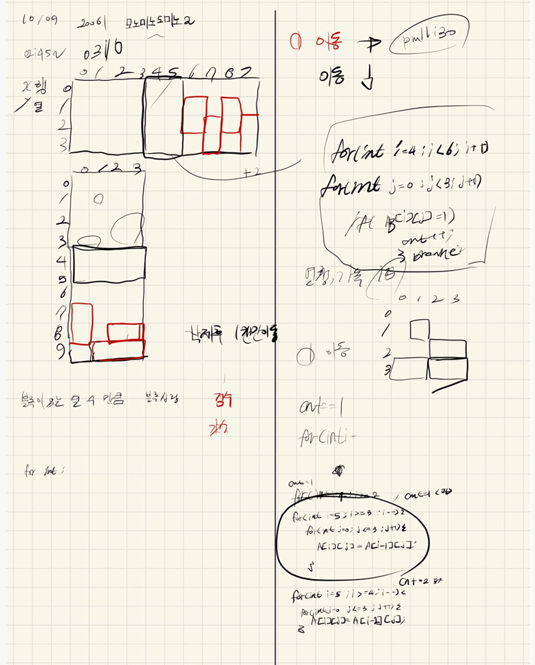

## 2021.10.09_20061-모노미노도미노2

## 소스코드

```c++
#include<stdio.h>
#include<iostream>
#include<vector>
#include<string.h>
using namespace std;
#define SIZE 10
int blue[4][SIZE];
int green[SIZE][4];
int N;
int t, x, y;
int score, finalCnt;
void init();//초기화 및 초기 입력
void gamePlay();//게임 시작
int main(void) {
	int testCase = 1;
	for (int tc = 1; tc <= testCase; tc++) {
		init();
		gamePlay();
		printf("%d\n%d\n", score, finalCnt);
	}
	return 0;
}
void redZone(int t, int y, int x) {
	if (t == 1) {
		blue[y][x] = green[y][x] = 1;
	}
	else if (t == 2) {
		blue[y][x] = green[y][x] = blue[y][x + 1] = green[y][x + 1];
	}
	else if (t == 3) {
		blue[y][x] = green[y][x] = blue[y + 1][x] = green[y + 1][x];
	}
}
bool greenSafeZone(int y, int x) {
	return 0 <= y && y < 10 && 0 <= x && x < 4;
}
void moveGreenZone(int t, int y, int x) {
	int y1, x1, y2, x2;
	if (t == 1) {
		y1 = y; x1 = x;
		while (greenSafeZone(y1, x1) && green[y1][x1] == 0) {//범위 안넘고 블럭 없으면
			y1++;
		}
		y1--;
		green[y1][x1] = 1;
	}
	else if (t == 2) {
		y1 = y; x1 = x;
		y2 = y; x2 = x + 1;
		while (greenSafeZone(y1, x1) && greenSafeZone(y2, x2)
			&& green[y1][x1] == 0 && green[y2][x2] == 0) {
			y1++;
			y2++;
		}
		y1--; y2--;
		green[y1][x1] = green[y2][x2] = 1;
	}
	else if (t == 3) {
		y2 = y + 1; x2 = x;
		while (greenSafeZone(y2, x2)
			&& green[y2][x2] == 0) {
			y2++;
		}
		y2--;
		green[y2 - 1][x2] = green[y2][x2] = 1;
	}
}
bool blueSafeZone(int y, int x) {
	return 0 <= y && y < 4 && 0 <= x && x < 10;
}
void moveBlueZone(int t, int y, int x) {
	int y1, x1, y2, x2;
	if (t == 1) {
		y1 = y; x1 = x;
		while (blueSafeZone(y1, x1) && blue[y1][x1] == 0) {//범위 안넘고 블럭 없으면
			x1++;
		}
		x1--;
		blue[y1][x1] = 1;
	}
	else if (t == 2) {
		y2 = y; x2 = x + 1;
		while (blueSafeZone(y2, x2)
			&& blue[y2][x2] == 0) {
			x2++;
		}
		x2--;
		blue[y2][x2 - 1] = blue[y2][x2] = 1;
	}
	else if (t == 3) {
		y1 = y; x1 = x;
		y2 = y + 1; x2 = x;
		while (blueSafeZone(y1, x1) && blueSafeZone(y2, x2)
			&& blue[y1][x1] == 0 && blue[y2][x2] == 0) {
			x1++;
			x2++;
		}
		x1--;
		x2--;
		blue[y1][x1] = blue[y2][x2] = 1;
	}
}
void removeFourGreenBlock() {
	while (1) {
		int flag = 1;
		for (int y = 9; y >= 6; y--) {
			if (green[y][0] == 1 && green[y][1] == 1 && green[y][2] == 1 && green[y][3] == 1) {
				green[y][0] = green[y][1] = green[y][2] = green[y][3] = 0;
				flag = 0;
				score++;
				for (int y2 = y; y2 >= 3; y2--) {
					green[y2][0] = green[y2 - 1][0];
					green[y2][1] = green[y2 - 1][1];
					green[y2][2] = green[y2 - 1][2];
					green[y2][3] = green[y2 - 1][3];
				}
			}
		}
		if (flag == 1)break;
	}
}
void removeFourBlueBlock() {
	while (1) {
		int flag = 1;
		for (int x = 9; x >= 6; x--) {
			if (blue[0][x] == 1 && blue[1][x] == 1 && blue[2][x] == 1 && blue[3][x] == 1) {
				blue[0][x] = blue[1][x] = blue[2][x] = blue[3][x] = 0;
				flag = 0;
				score++;
				for (int x2 = x; x2 >= 3; x2--) {
					blue[0][x2] = blue[0][x2 - 1];
					blue[1][x2] = blue[1][x2 - 1];
					blue[2][x2] = blue[2][x2 - 1];
					blue[3][x2] = blue[3][x2 - 1];
				}
			}
		}
		if (flag == 1)break;
	}
}
void removeSpecialGreen() {
	int cnt = 0;
		if (green[4][0] == 1 || green[4][1] == 1 || green[4][2] == 1 || green[4][3] == 1)cnt++;
		if (green[5][0] == 1 || green[5][1] == 1 || green[5][2] == 1 || green[5][3] == 1)cnt++;
		if (cnt != 0) {
			for (int y = 9; y >= 2; y--) {
				green[y][0] = green[y - cnt][0];
				green[y][1] = green[y - cnt][1];
				green[y][2] = green[y - cnt][2];
				green[y][3] = green[y - cnt][3];
			}
		}
}
void removeSpecialBlue() {
	int cnt = 0;
		if (blue[0][4] == 1 || blue[1][4] == 1 || blue[2][4] == 1 || blue[3][4] == 1)cnt++;
		if (blue[0][5] == 1 || blue[1][5] == 1 || blue[2][5] == 1 || blue[3][5] == 1)cnt++;
		if (cnt != 0) {
			for (int x = 9; x >= 2; x--) {
				blue[0][x] = blue[0][x - cnt];
				blue[1][x] = blue[1][x - cnt];
				blue[2][x] = blue[2][x - cnt];
				blue[3][x] = blue[3][x - cnt];
			}
		}
}
void sumBlock() {
	for (int y = 0; y <= 3; y++) {
		for (int x = 4; x <= 9; x++) {
			if (blue[y][x] == 1)finalCnt++;
		}
	}
	for (int y = 4; y <= 9; y++) {
		for (int x = 0; x <= 3; x++) {
			if (green[y][x] == 1)finalCnt++;
		}
	}
}
void gamePlay() {
	for (int n = 0; n < N; n++) {
		scanf("%d %d %d", &t, &y, &x);
		//redZone(t, y, x);	
		moveGreenZone(t, y, x);
		moveBlueZone(t, y, x);
		removeFourGreenBlock();
		removeFourBlueBlock();
		removeSpecialBlue();
		removeSpecialGreen();
	}
	sumBlock();
}
void init() {
	t = y = x = score = finalCnt = 0;
	memset(blue, 0, sizeof(blue));
	memset(green, 0, sizeof(green));
	scanf("%d", &N);
}
```

## 설계



## 실수

- 4개 블록 지울때 4개가 더이상 없는지 확인까지 했어야했는데 그점을 빼먹었다. 
- 블록을 지우는것도 너무 비효율적으로 한것 같지만 설계자체는 완벽했음

## 문제 링크

[20061-모노미노도미노 2](https://www.acmicpc.net/problem/20061)

## 원본