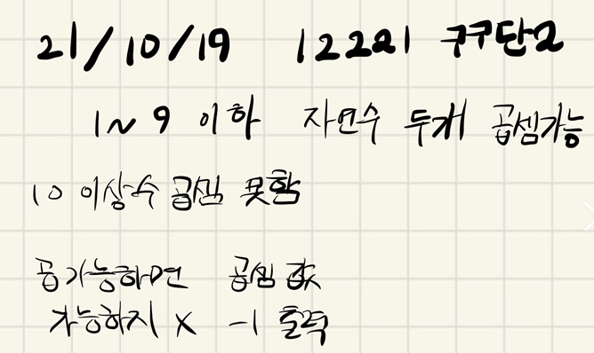

## 21.10.19_12221-구구단2

## 소스코드

``` c++
#include<iostream>
#include<stdio.h>
using namespace std;
int A, B, answer;
void init();//초기화 및 초기 입력
void nineNine2();//구구단2
int main(int argc, char** argv)
{
	int test_case;
	int T;

	scanf("%d", &T);
	/*
	   여러 개의 테스트 케이스가 주어지므로, 각각을 처리합니다.
	*/
	for (test_case = 1; test_case <= T; ++test_case)
	{
		init();
		nineNine2();
		printf("#%d %d\n", test_case, answer);
	}
	return 0;//정상종료시 반드시 0을 리턴해야합니다.
}
void init() {
	A = B = answer = 0;
	scanf("%d %d", &A, &B);
}
void nineNine2() {
	if (A >= 10 || B >= 10) {
		answer = -1;
	}
	else {
		answer = A * B;
	}
}
```

## 설계



- 이문제의 포인트는 입력으로 10이 주어지면 -1을 출력해라 임
- 이점만 잘 파악하면 쉽게 풀 수 있음

## 실수

- 단순 구구단이라기 보다는 10이상인것만 잘체크해주면 쉽다 이점을 잘 기억하면될듯

## 문제 링크

[12221-구구단2](https://swexpertacademy.com/main/code/problem/problemDetail.do?problemLevel=3&contestProbId=AXpz3dravpQDFATi&categoryId=AXpz3dravpQDFATi&categoryType=CODE&problemTitle=&orderBy=FIRST_REG_DATETIME&selectCodeLang=ALL&select-1=3&pageSize=10&pageIndex=1)

## 원본

