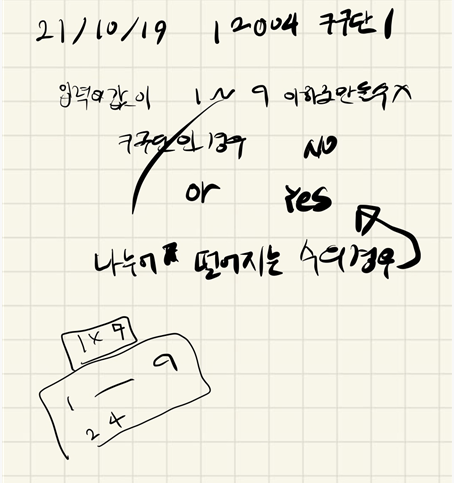

## 2021.10.19_12004-구구단1

## 소스코드

```c++
#include<iostream>
#include<stdio.h>
#include<string.h>
using namespace std;
int A, answer;
int num[82];
void init();//초기화 및 초기 입력
void nineNine1();//구구단1
int main(int argc, char** argv)
{
	int test_case;
	int T;

	scanf("%d", &T);
	/*
	   여러 개의 테스트 케이스가 주어지므로, 각각을 처리합니다.
	*/
	for (test_case = 1; test_case <= T; ++test_case)
	{
		init();
		nineNine1();
		printf("#%d %s\n", test_case, answer==-1?"No":"Yes");
	}
	return 0;//정상종료시 반드시 0을 리턴해야합니다.
}
void init() {
	A = answer = 0;
	memset(num, 0, sizeof(num));
	scanf("%d", &A);
}
void nineNine1() {
	int flag = 0;
	for (int i = 1; i <= 9; i++) {
		for (int j = 1; j<= 9; j++) {
			num[i*j] = 1;
		}
	}
	if (num[A] == 0)answer = -1;
	else answer = 0;
}
```

## 설계



- 구구단 자체를 배열에  기입해놓고 들어오는 숫자가 없으면 NO를 출력하는 식으로 구현

## 실수

- 처음에 너무 쉽다고 생각 쉽긴했지만,  구구단 2를 풀고 나서 1를 해서 그냥 입력으로 주어지는 숫자에 10이상인 수가 있으면 그래야하는줄 알았는데 그게 아니였음
- 그냥 그래서 일단 배열 자체에 숫자를 다 넣고 체크하는식으로 문제 풀이 진행

##  문제 링크

[12004-구구단1](https://swexpertacademy.com/main/code/problem/problemDetail.do?problemLevel=3&contestProbId=AXkcWgFa8sADFAS8&categoryId=AXkcWgFa8sADFAS8&categoryType=CODE&problemTitle=&orderBy=FIRST_REG_DATETIME&selectCodeLang=ALL&select-1=3&pageSize=10&pageIndex=1)

## 원본

