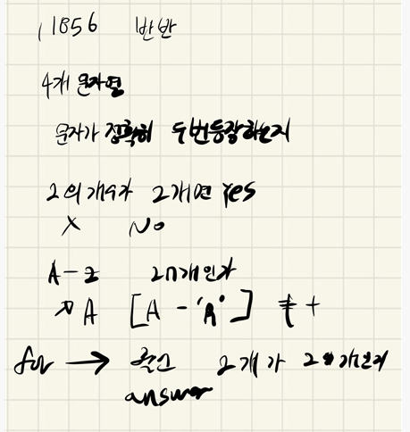

## 2021.10.20_11856-반반

## 소스코드 

```c++
#include<iostream>
#include<stdio.h>
#include<string.h>
using namespace std;
int alphabet[27];
int answer;//결과 값 저장
void init();//초기화 및 초기입력

int main(int argc, char** argv)
{
	int test_case;
	int T;
	scanf("%d", &T);

	for (test_case = 1; test_case <= T; ++test_case)
	{
		init();
		printf("#%d %s\n", test_case, answer == 2 ? "Yes" : "No");
	}
	return 0;//정상종료시 반드시 0을 리턴해야합니다.
}

void init() {
	answer = 0;
	memset(alphabet, 0, sizeof(alphabet));
	for (int i = 0; i < 4; i++) {
		char alpha;
		scanf(" %c", &alpha);
		alphabet[alpha - 'A']++;
	}
	//cout << 'Z' - 'A' << endl;
	for (int i = 0; i < 27; i++) {
		if (alphabet[i] == 2) {
			answer++;
		}
	}
}
```

##  설계



- 진짜 어려운것 없이 이렇게 하는게 효율적인지는 모르겠지만
- 26개인가 알파벳이 있으면 그것을 그냥 배열에 담는다 
  - 담을때 A가 0인 인덱스가 될수 있도록 -'A'를 빼주면 된다. 
  - 그렇게 해서 문자열을 숫자로 변환 할 수 있는지 포인트를 주면 좋을것 같다
- 결과의 경우 그냥 2개인 수가 2개가 있는지 판별하면 된다.
  - 이경우 입력으로 주어지는 값이  작기 때문에 완전 탐색으로 전부 확인해도 상관 없음

## 실수

- 출력이 Yes, No인데 YES, NO라고 해서 한번 틀림
- 이런 경우는 팁은 그냥 출력으로 주어지는거 화면에서 복붙하면 틀리는 경우 없음
- 사람이 습관적으로 익숙한 단어가 나오면 자기가 편한걸 치기 때문에 조심해야함

## 문제 링크

[11856-반반](https://swexpertacademy.com/main/code/problem/problemDetail.do?problemLevel=3&contestProbId=AXjS1GXqZ8gDFATi&categoryId=AXjS1GXqZ8gDFATi&categoryType=CODE&problemTitle=&orderBy=FIRST_REG_DATETIME&selectCodeLang=ALL&select-1=3&pageSize=10&pageIndex=1)

## 원본

