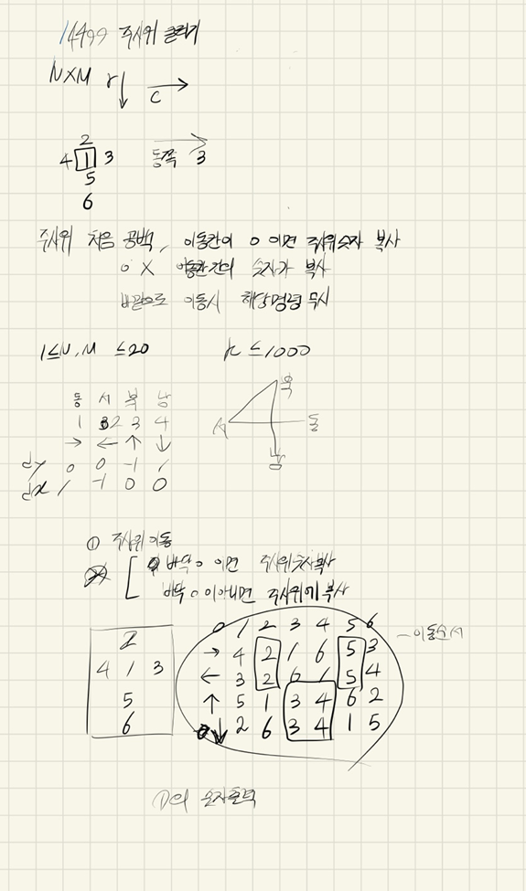
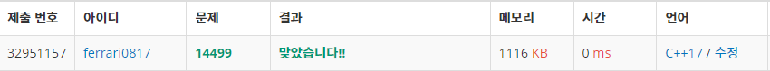

## 2021년09월03일_14499주사위굴리기

```c++
#include<stdio.h>
#include<vector>
#include<string.h>
using namespace std;
#define S 21
struct pos {
	int y, x, dir;
}cube;
int N, M, K;
int cubeNum[7];
int map[S][S];
int dy[] = {0,0,0,-1,1 };
int dx[] = {0,1,-1,0,0 };
bool safe(int y, int x);
void init();
void init_test();
void moveCube(int dir);
void play();
int main(void) {
	init();
	play();
	return 0;
}
void play() {
	for (int k = 0; k < K; k++) {
		int dir;
		scanf("%d", &dir);
		if (!safe(cube.y + dy[dir], cube.x + dx[dir]))continue;
		moveCube(dir);
		if (map[cube.y + dy[dir]][cube.x + dx[dir]] == 0) {
			map[cube.y + dy[dir]][cube.x + dx[dir]] = cubeNum[6];
		}
		else if (map[cube.y + dy[dir]][cube.x + dx[dir]] != 0) {//숫자가 있는 경우
			cubeNum[6] = map[cube.y + dy[dir]][cube.x + dx[dir]];
			map[cube.y + dy[dir]][cube.x + dx[dir]] = 0;
		}
		printf("%d\n", cubeNum[1]);
		cube.y += dy[dir], cube.x += dx[dir];
	}
}
void init() {
	memset(cubeNum, 0, sizeof(cubeNum));
	memset(map, 0, sizeof(map));
	scanf("%d %d %d %d %d",&N,&M,&cube.y,&cube.x,&K);
	for (int i = 0; i < N; i++) {
		for (int j = 0; j < M; j++) {
			scanf("%d", &map[i][j]);
		}
	}
	//init_test();
}
bool safe(int y, int x) {
	return 0 <= y && y < N && 0 <= x && x < M;
}
void moveCube(int dir) {
	if (dir == 1) {
		int copyNum = cubeNum[1];
		cubeNum[1] = cubeNum[4];
		cubeNum[4] = cubeNum[6];
		cubeNum[6] = cubeNum[3];
		cubeNum[3] = copyNum;
	}
	if (dir == 2) {
		int copyNum = cubeNum[1];
		cubeNum[1] = cubeNum[3];
		cubeNum[3] = cubeNum[6];
		cubeNum[6] = cubeNum[4];
		cubeNum[4] = copyNum;
	}
	if (dir == 3) {
		int copyNum = cubeNum[1];
		cubeNum[1] = cubeNum[5];
		cubeNum[5] = cubeNum[6];
		cubeNum[6] = cubeNum[2];
		cubeNum[2] = copyNum;
	}
	if (dir == 4) {
		int copyNum = cubeNum[1];
		cubeNum[1] = cubeNum[2];
		cubeNum[2] = cubeNum[6];
		cubeNum[6] = cubeNum[5];
		cubeNum[5] = copyNum;
	}
}
void init_test() {
	if (N != 4||M!=2||cube.y!=0||cube.x!=0||K!=8) {
		printf("틀림\n");
	}
	int testMap[4][2] = {
		{0,2},{3,4},{5,6},{7,8}
	};
	for (int i = 0; i < 4; i++) {
		for (int j = 0; j < 2; j++) {
			if (map[i][j] != testMap[i][j])
			{
				printf("틀림\n");

			}
		}
	}
}
```

## 설계 과정



- 주사위를 평면도로 어떻게 할지와 동그라미 부분이 포인트 주사위 이동시 어떻게 바뀌는지 
- 이번에 실수 한 것은 오타실수가 있었음
- 그것 말고는 설계를 완벽히 함 
- 시뮬레이션은 정말  하라는대로 해야하고 내 생각이 개입되면 안됨 
- 정말 중요함



[백준주사위던지기](https://www.acmicpc.net/problem/14499)

